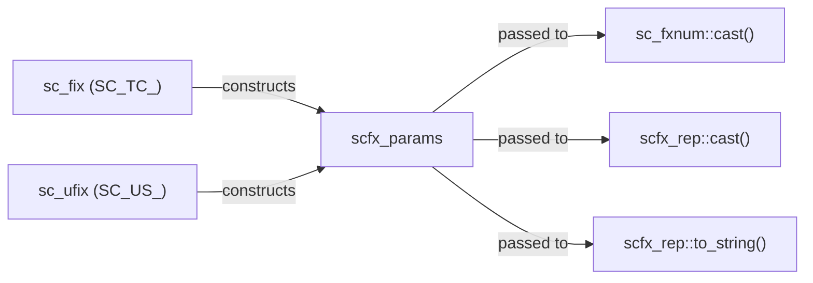

# scfx_params.h -- 組合參數類別

## 概述

`scfx_params` 將 `sc_fxtype_params`（型別參數）、`sc_enc`（編碼方式）和 `sc_fxcast_switch`（cast 開關）三者打包成一個**統一的參數物件**，供 `sc_fxnum` 和 `scfx_rep` 在量化和溢位處理中使用。

## 日常類比

如果 `sc_fxtype_params` 是「相機設定」，`sc_enc` 是「底片類型」，`sc_fxcast_switch` 是「自動對焦開關」，那 `scfx_params` 就是把這三樣東西打包成一個「拍照配置檔」，方便一次性傳遞給拍照函式。

## 類別詳情

### 成員變數

| 成員 | 型別 | 說明 |
|------|------|------|
| `m_type_params` | `sc_fxtype_params` | wl, iwl, q_mode, o_mode, n_bits |
| `m_enc` | `sc_enc` | SC_TC_ (二補數) 或 SC_US_ (無號) |
| `m_cast_switch` | `sc_fxcast_switch` | SC_ON 或 SC_OFF |

### 建構函式

```cpp
scfx_params(const sc_fxtype_params& type_params,
            sc_enc enc,
            const sc_fxcast_switch& cast_sw);
```

建構時會檢查：如果編碼是無號 (`SC_US_`) 且溢位模式是 `SC_WRAP_SM`，則報錯。因為 sign magnitude wrap-around 對無號數沒有意義。

### 快捷存取方法

| 方法 | 等效於 | 說明 |
|------|--------|------|
| `wl()` | `type_params().wl()` | 總位寬 |
| `iwl()` | `type_params().iwl()` | 整數位寬 |
| `fwl()` | `wl() - iwl()` | 小數位寬 |
| `q_mode()` | `type_params().q_mode()` | 量化模式 |
| `o_mode()` | `type_params().o_mode()` | 溢位模式 |
| `n_bits()` | `type_params().n_bits()` | 飽和位數 |
| `enc()` | -- | 編碼方式 |
| `cast_switch()` | -- | cast 開關 |

## 使用場景



`scfx_params` 是定點數系統內部傳遞參數的標準方式。它在 `sc_fxnum` 建構時被組裝，並在所有需要參數的操作中被使用。

## 相關檔案

- `sc_fxtype_params.h` -- 型別參數
- `sc_fxdefs.h` -- `sc_enc` 列舉
- `sc_fxcast_switch.h` -- cast 開關
- `sc_fxnum.h` -- 使用 `scfx_params` 作為成員
- `scfx_rep.h` -- 在量化/溢位中使用 `scfx_params`
