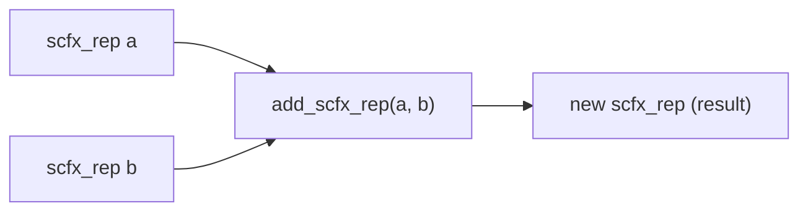

# scfx_rep.h / .cpp -- 任意精度定點數內部表示

## 概述

`scfx_rep` 是 SystemC 定點數的**任意精度核心引擎**。它使用類似科學記號的方式儲存數值：一個可變長度的尾數 (mantissa) 配合一個位元級的指數。所有 `sc_fxval` 和 `sc_fxnum` 的任意精度版本都依賴這個類別。

## 日常類比

想像你在一張格子紙上記錄一個很大或很小的數字。格子紙的每一格可以寫一個數字。如果數字很大，你就多用幾格；如果很小，你就在前面加小數點。`scfx_rep` 就是這張格子紙 -- 它可以動態地增減格數來容納任意大小的數字。

## 核心成員

| 成員 | 型別 | 說明 |
|------|------|------|
| `m_mant` | `scfx_mant` | 尾數（位元陣列） |
| `m_wp` | `int` | word point -- 小數點在哪個 word |
| `m_sign` | `int` | 符號（1 或 -1） |
| `m_state` | `state` | 狀態：normal / infinity / not_a_number |
| `m_msw` | `int` | 最高有效 word 的索引 |
| `m_lsw` | `int` | 最低有效 word 的索引 |
| `m_r_flag` | `bool` | 進位旗標 |

### state 列舉

```cpp
enum state { normal, infinity, not_a_number };
```

## 數值表示方式

```
m_mant:  [word_0] [word_1] [word_2] ... [word_n]
              ↑
           m_wp (word point position)
```

值 = m_sign * (m_mant 解讀為整數) * 2^(m_wp * bits_in_word)

## 輔助類別：`scfx_index`

```cpp
class scfx_index {
    int m_wi;  // word index
    int m_bi;  // bit index within word
};
```

`calc_indices(n)` 將位元位置 `n` 轉換為 `(word_index, bit_index)` 對。

## 建構函式

支援從以下型別建構：

- `int`, `unsigned int`, `long`, `unsigned long`
- `double`
- `const char*`（字串，支援各種進制前綴）
- `int64`, `uint64`
- `sc_signed`, `sc_unsigned`

## 算術操作（友元函式）

所有算術都通過友元函式實作，返回堆積分配的新 `scfx_rep` 物件：

| 函式 | 操作 |
|------|------|
| `neg_scfx_rep()` | 取反 |
| `mult_scfx_rep()` | 乘法 |
| `div_scfx_rep()` | 除法 |
| `add_scfx_rep()` | 加法 |
| `sub_scfx_rep()` | 減法 |
| `lsh_scfx_rep()` | 左移 |
| `rsh_scfx_rep()` | 右移 |
| `cmp_scfx_rep()` | 比較 |



## 量化與溢位

`cast()` 方法是定點數行為的核心：

```cpp
void cast(const scfx_params& params, bool& q_flag, bool& o_flag);
```

內部呼叫 `quantization()` 和 `overflow()`，根據 `scfx_params` 中的設定來截斷/進位和處理溢位。

### 量化輔助方法

| 方法 | 說明 |
|------|------|
| `q_bit()` | 取得量化位（決定是否進位） |
| `q_clear()` | 清除量化位以下的位元 |
| `q_incr()` | 量化位進位 |
| `q_odd()` | 判斷最低保留位是否為奇數 |
| `q_zero()` | 判斷量化位以下是否全為零 |

### 溢位輔助方法

| 方法 | 說明 |
|------|------|
| `o_extend()` | 符號延伸 |
| `o_bit_at()` | 取得溢位判斷位 |
| `o_zero_left/right()` | 判斷左/右側是否全零 |
| `o_set_low/high()` | 設定為最小/最大值 |
| `o_set()` | 設定溢位後的值 |
| `o_invert()` | 反轉位元 |

## 字串轉換

```cpp
const char* to_string(sc_numrep, int, sc_fmt, const scfx_params*) const;
void from_string(const char*, int);
```

支援二進位、八進位、十進位、十六進位和 CSD 格式的雙向轉換。

## 記憶體管理

`scfx_rep` 覆寫了 `operator new` 和 `operator delete`，可能使用自訂的記憶體池來提升頻繁建立/銷毀的效能（算術運算會大量產生暫時物件）。

## 相關檔案

- `scfx_mant.h` -- 尾數儲存類別
- `scfx_params.h` -- 量化/溢位的參數
- `scfx_string.h` -- 字串轉換用的字串類別
- `sc_fxval.h` -- 使用 `scfx_rep` 作為內部表示
- `sc_fxnum.h` -- 使用 `scfx_rep` 作為內部表示
