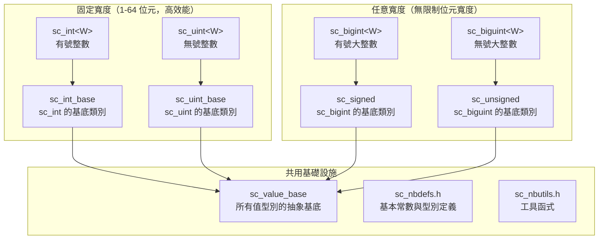
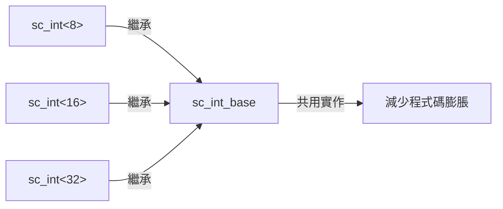

# SystemC 整數型別子系統 - 完整的硬體整數資料型別庫

## 概述

`datatypes/int/` 目錄實作了 SystemC 中所有整數相關的資料型別。這些型別是硬體建模的基石，讓軟體工程師能夠精確控制整數的位元寬度、有號/無號特性，以及算術行為。

### 日常生活類比

想像你在超市購物：
- **C++ 原生 `int`**：就像一個固定大小的購物袋，只有 32 位元或 64 位元兩種尺寸
- **SystemC 整數型別**：就像可以客製化大小的容器——你可以要求一個剛好裝 7 個蘋果的盒子（7 位元），或者一個能裝 128 個蘋果的大箱子（128 位元）

在硬體設計中，每一個位元都佔用實際的電路面積和功耗，所以精確控制位元寬度非常重要。

## 型別體系總覽



## 如何選擇正確的型別

| 型別 | 位元寬度 | 有號/無號 | 效能 | 適用場景 |
|------|----------|-----------|------|----------|
| `sc_int<W>` | 1-64 | 有號 | 最高 | 一般暫存器、計數器 |
| `sc_uint<W>` | 1-64 | 無號 | 最高 | 位址、旗標 |
| `sc_bigint<W>` | 任意 | 有號 | 較低 | 大數運算、DSP |
| `sc_biguint<W>` | 任意 | 無號 | 較低 | 大數運算、密碼學 |
| `sc_signed` | 執行期決定 | 有號 | 最低 | 動態寬度需求 |
| `sc_unsigned` | 執行期決定 | 無號 | 最低 | 動態寬度需求 |

## 檔案結構

### 核心型別檔案
| 檔案 | 說明 |
|------|------|
| [sc_int_base.md](sc_int_base.md) | `sc_int_base` — 有號固定寬度整數基底類別 |
| [sc_int.md](sc_int.md) | `sc_int<W>` — 有號固定寬度整數模板類別 |
| [sc_uint_base.md](sc_uint_base.md) | `sc_uint_base` — 無號固定寬度整數基底類別 |
| [sc_uint.md](sc_uint.md) | `sc_uint<W>` — 無號固定寬度整數模板類別 |
| [sc_signed.md](sc_signed.md) | `sc_signed` — 任意精度有號整數 |
| [sc_unsigned.md](sc_unsigned.md) | `sc_unsigned` — 任意精度無號整數 |
| [sc_bigint.md](sc_bigint.md) | `sc_bigint<W>` — 編譯期寬度的任意精度有號整數 |
| [sc_biguint.md](sc_biguint.md) | `sc_biguint<W>` — 編譯期寬度的任意精度無號整數 |

### 支援檔案
| 檔案 | 說明 |
|------|------|
| [sc_nbdefs.md](sc_nbdefs.md) | 基本常數與型別定義 |
| [sc_nbutils.md](sc_nbutils.md) | 共用工具函式 |
| [sc_big_ops.md](sc_big_ops.md) | 大整數運算子實作 |
| [sc_int_ids.md](sc_int_ids.md) | 錯誤報告識別碼 |
| [sc_length_param.md](sc_length_param.md) | 長度參數型別 |
| [sc_int32_mask.md](sc_int32_mask.md) | 32 位元遮罩查找表 |
| [sc_int64_mask.md](sc_int64_mask.md) | 64 位元遮罩查找表 |
| [sc_int64_io.md](sc_int64_io.md) | 64 位元 I/O 支援 |
| [sc_vector_utils.md](sc_vector_utils.md) | 向量運算工具 |

## 設計理念

### 為什麼需要兩層架構（Base + Template）？



- **Base 類別**（如 `sc_int_base`）：包含所有與位元寬度無關的邏輯，只編譯一次
- **Template 類別**（如 `sc_int<W>`）：只是一個薄包裝，加上編譯期寬度檢查
- 這種設計避免了 C++ 模板為每個不同寬度重複產生完整的程式碼

### RTL 背景知識

在 Verilog/VHDL 中，宣告訊號時必須指定精確的位元寬度：
```
// Verilog
reg [7:0] counter;    // 8-bit register
wire [31:0] address;  // 32-bit wire
```

SystemC 的整數型別對應了這個概念：
```cpp
sc_int<8> counter;     // same as reg [7:0]
sc_uint<32> address;   // same as wire [31:0]
```

## 相關目錄

- [../misc/](../misc/_index.md) — `sc_value_base` 和 `sc_concatref` 等基礎類別
- `../bit/` — 位元向量型別（`sc_bv`, `sc_lv`）
- `../fx/` — 定點數型別
