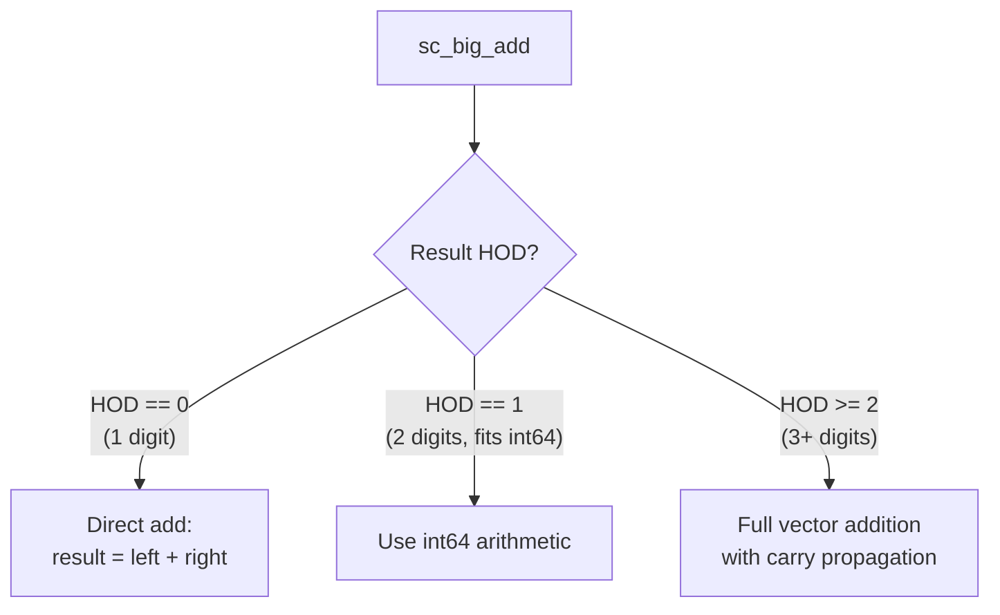

# sc_big_ops.h — 大整數運算子實作

## 概述

`sc_big_ops.h` 實作了 `sc_bigint<W>` 和 `sc_biguint<W>` 之間所有算術和位元運算的 inline 函式。這些運算直接操作二補數的 digit 向量，是大整數運算的效能核心。

**源檔案：**
- `ref/systemc/src/sysc/datatypes/int/sc_big_ops.h`

## 日常類比

想像你在做大數的直式加法。`sc_big_ops.h` 就是那套「直式計算的規則」：
- 從最低位開始
- 逐位相加
- 處理進位
- 最後處理符號

不同的是，這裡的「每一位」是 32 位元的 `sc_digit`，而不是十進位的 0~9。

## 核心運算

### 1. 加法（sc_big_add）

```cpp
template<typename RESULT, typename LEFT, typename RIGHT>
inline void sc_big_add( RESULT& result, const LEFT& left, const RIGHT& right );
```

加法的策略根據運算元的大小分級最佳化：



- **1 個 digit**：直接用 32 位元加法
- **2 個 digits**：轉成 64 位元整數做加法
- **3+ digits**：逐個 digit 加，處理進位鏈

### 2. 其他運算

同樣的分級最佳化策略也應用於：
- **減法**（`sc_big_sub`）
- **乘法**（`sc_big_mul`）
- **除法**（`sc_big_div`）
- **取餘**（`sc_big_mod`）
- **位元運算**（AND、OR、XOR）

### 3. 輔助巨集

```cpp
#define SC_BIG_MAX(LEFT,RIGHT) ( (LEFT) > (RIGHT) ? (LEFT) : (RIGHT) )
#define SC_BIG_MIN(LEFT,RIGHT) ( (LEFT) < (RIGHT) ? (LEFT) : (RIGHT) )
```

用於在編譯期計算結果所需的位元寬度。

### 4. 除錯工具

```cpp
inline void vector_dump( int source_hod, sc_digit* source_p );
```

將 digit 向量以十六進位格式輸出到標準輸出，方便除錯。

## 為什麼這個檔案必須最後載入？

`sc_big_ops.h` 需要 `sc_bigint`、`sc_biguint`、`sc_signed`、`sc_unsigned` 等所有型別的完整定義才能編譯。因此它必須在所有其他 `int` 標頭檔之後才能被 `#include`。

## 相關檔案

- [sc_bigint.md](sc_bigint.md) — `sc_bigint<W>` 型別定義
- [sc_biguint.md](sc_biguint.md) — `sc_biguint<W>` 型別定義
- [sc_vector_utils.md](sc_vector_utils.md) — 向量運算的型別資訊工具
- [sc_nbutils.md](sc_nbutils.md) — 底層向量操作函式
