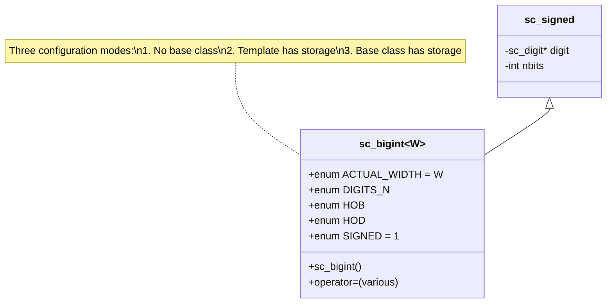
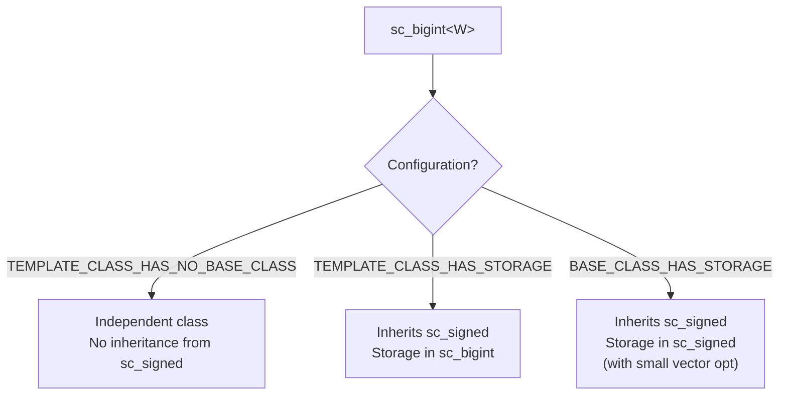

# sc_bigint\<W\> — 編譯期寬度的任意精度有號整數

## 概述

`sc_bigint<W>` 是一個模板類別，提供編譯期（compile-time）位元寬度的任意精度有號整數。它結合了 `sc_signed` 的任意精度能力和模板參數 `W` 帶來的編譯期型別安全。

**源檔案：**
- `ref/systemc/src/sysc/datatypes/int/sc_bigint.h`
- `ref/systemc/src/sysc/datatypes/int/sc_bigint_inlines.h`

## 日常類比

如果 `sc_signed` 是一台「位數無限、執行期調整」的計算機，那 `sc_bigint<W>` 就是一台「出廠時就固定位數」的特製計算機。例如 `sc_bigint<128>` 就是一台 128 位元計算機。

**關鍵差異：**
- `sc_signed`：「老闆，我需要一台計算機，但我還不知道要幾位數，到時候再告訴你」
- `sc_bigint<128>`：「老闆，我要一台 128 位數的計算機」

## 類別架構



## 核心概念

### 1. 三種配置模式

`sc_bigint<W>` 支援三種記憶體配置策略，透過巨集選擇：



- **NO_BASE_CLASS**：`sc_bigint` 是獨立類別，不繼承 `sc_signed`
- **TEMPLATE_CLASS_HAS_STORAGE**：繼承 `sc_signed`，但 digit 陣列儲存在模板類別中
- **BASE_CLASS_HAS_STORAGE**：繼承 `sc_signed`，digit 陣列由基底類別管理（含小型向量最佳化）

### 2. 編譯期常數

```cpp
enum {
    ACTUAL_WIDTH = W,                   // actual bit width
    DIGITS_N     = SC_DIGIT_COUNT(W),   // number of 32-bit digits needed
    HOB          = SC_BIT_INDEX(W-1),   // bit index within highest digit
    HOD          = SC_DIGIT_INDEX(W-1), // index of highest digit
    SIGNED       = 1,                   // this is a signed type
    WIDTH        = W                    // width parameter
};
```

這些 `enum` 值在編譯期就確定，讓編譯器可以進行大量最佳化，包括：
- 迴圈展開（loop unrolling）
- 直接計算需要的 digit 數量
- 在 `sc_big_ops.h` 中選擇最佳化的運算路徑

### 3. 建構子

`sc_bigint<W>` 提供了從各種型別轉換的建構子：

```cpp
sc_bigint<128> a;                // default: 0
sc_bigint<128> b(42);            // from integer
sc_bigint<128> c(some_signed);   // from sc_signed
sc_bigint<128> d("0xABCD...");   // from string
sc_bigint<128> e(some_biguint);  // from sc_biguint (different width OK)
```

### 4. sc_bigint_inlines.h

包含需要在所有標頭檔載入後才能定義的 inline 函式，通常涉及 `sc_unsigned`、`sc_biguint` 等前向宣告的型別。

## 使用範例

```cpp
// DSP: 128-bit accumulator
sc_bigint<128> accumulator = 0;
sc_bigint<64> sample;
accumulator += sample;

// Cryptography
sc_bigint<256> hash_value;
sc_bigint<512> product = hash_value * hash_value;

// Cross-width operations
sc_bigint<32> small = 100;
sc_bigint<64> big = 200;
sc_bigint<65> result = small + big;  // auto width expansion
```

## 何時使用 sc_bigint 而非 sc_int？

| 條件 | 建議使用 |
|------|----------|
| 位元寬度 <= 64 | `sc_int<W>`（效能最好） |
| 位元寬度 > 64 | `sc_bigint<W>`（唯一選擇） |
| 寬度在執行期決定 | `sc_signed`（動態寬度） |

## 相關檔案

- [sc_signed.md](sc_signed.md) — 基底類別 `sc_signed`
- [sc_biguint.md](sc_biguint.md) — 無號版本 `sc_biguint<W>`
- [sc_big_ops.md](sc_big_ops.md) — 大整數運算子實作
- [sc_int.md](sc_int.md) — 64 位元以內的替代方案
