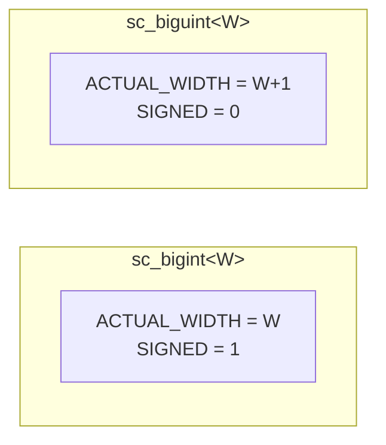

# sc_biguint\<W\> — 編譯期寬度的任意精度無號整數

## 概述

`sc_biguint<W>` 是 `sc_bigint<W>` 的無號版本，提供編譯期位元寬度的任意精度無號整數。它繼承自 `sc_unsigned`，與 `sc_bigint<W>` 是鏡像設計。

**源檔案：**
- `ref/systemc/src/sysc/datatypes/int/sc_biguint.h`
- `ref/systemc/src/sysc/datatypes/int/sc_biguint_inlines.h`

## 日常類比

`sc_biguint<W>` 就像一台「超大型里程表」，出廠時就確定了位數。`sc_biguint<256>` 是一台 256 位元的里程表，可以計數到 2^256 - 1 這個天文數字（比宇宙中的原子數還多）。

## 核心概念

### 1. 與 sc_bigint\<W\> 的關鍵差異



注意 `ACTUAL_WIDTH = W+1`！這是因為 `sc_biguint<W>` 需要一個額外的位元來表示「符號位為 0」，與 `sc_unsigned` 的語意保持一致。

### 2. 編譯期常數

```cpp
enum {
    ACTUAL_WIDTH = W+1,                 // one extra bit for sign=0
    DIGITS_N     = SC_DIGIT_COUNT(W+1), // digits needed
    HOB          = SC_BIT_INDEX(W),     // high order bit index
    HOD          = SC_DIGIT_INDEX(W),   // high order digit index
    SIGNED       = 0,                   // unsigned type
    WIDTH        = W                    // user-specified width
};
```

### 3. 三種配置模式

與 `sc_bigint<W>` 相同，支援三種記憶體配置策略：
- `SC_BIGINT_CONFIG_TEMPLATE_CLASS_HAS_NO_BASE_CLASS`
- `SC_BIGINT_CONFIG_TEMPLATE_CLASS_HAS_STORAGE`
- `SC_BIGINT_CONFIG_BASE_CLASS_HAS_STORAGE`

### 4. 建構子

```cpp
sc_biguint<256> a;                  // default: 0
sc_biguint<256> b(42u);             // from unsigned int
sc_biguint<256> c(some_unsigned);   // from sc_unsigned
sc_biguint<256> d("0xABCD...");     // from string
sc_biguint<256> e(true);            // from bool (0 or 1)
```

注意有一個特殊的 `bool` 建構子，這在 `sc_bigint<W>` 中沒有。

## 使用範例

```cpp
// Large address space
sc_biguint<128> ipv6_address;

// Cryptographic key
sc_biguint<2048> rsa_key;

// Hash value
sc_biguint<256> sha256_hash;

// Mixed operations with signed types
sc_biguint<128> a = 100;
sc_bigint<128> b = -50;
sc_bigint<129> result = a + b;  // result is signed (mixed operation)
```

## 相關檔案

- [sc_unsigned.md](sc_unsigned.md) — 基底類別 `sc_unsigned`
- [sc_bigint.md](sc_bigint.md) — 有號版本 `sc_bigint<W>`
- [sc_big_ops.md](sc_big_ops.md) — 大整數運算子實作
- [sc_uint.md](sc_uint.md) — 64 位元以內的替代方案
