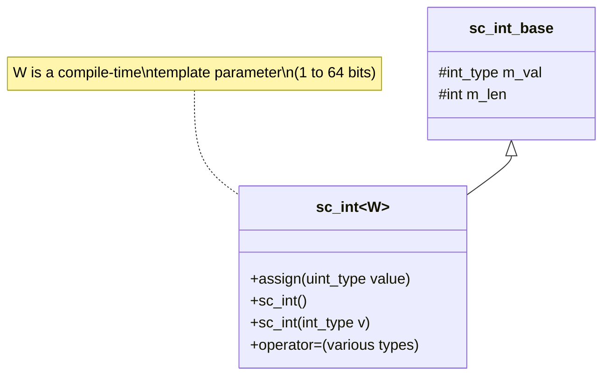

# sc_int\<W\> — 有號固定寬度整數模板類別

## 概述

`sc_int<W>` 是使用者直接使用的有號整數型別，`W` 是位元寬度（1 到 64）。它繼承自 `sc_int_base`，主要工作是：
1. 在編譯期記住位元寬度 `W`
2. 確保所有賦值操作都正確進行符號擴展
3. 提供型別安全的建構子和賦值運算子

**源檔案：**
- `ref/systemc/src/sysc/datatypes/int/sc_int.h`
- `ref/systemc/src/sysc/datatypes/int/sc_int_inlines.h`

## 日常類比

如果 `sc_int_base` 是一台「可調節位數的計算機」，那 `sc_int<W>` 就是「出廠時已經固定位數的計算機」。比如 `sc_int<8>` 就是一台只能顯示 -128 到 127 的計算機，而 `sc_int<16>` 可以顯示 -32768 到 32767。

## 類別結構



## 核心機制

### 1. 符號擴展（Sign Extension）

`sc_int<W>` 最重要的方法是 `assign()`，它確保值被正確截斷並進行符號擴展：

```cpp
void assign( uint_type value )
{
    m_val = ( value & (1ull << (W-1)) ) ?
        value | (~UINT64_ZERO << (W-1)) :   // negative: extend sign
        value & ( ~UINT_ZERO >> (SC_INTWIDTH-W) );  // positive: mask
}
```

**類比解釋：** 想像你有一個 4 位元的數字 `1011`（二進位）：
- 最高位是 `1`，表示這是負數
- 要把它放進 64 位元空間，就得在前面全部填上 `1`
- 結果是 `1111...1011`，這就是 `-5` 的 64 位元二補數表示

### 2. 建構子家族

`sc_int<W>` 提供了大量建構子，可以從幾乎任何 SystemC 數值型別轉換：

```cpp
sc_int<8> a;              // default: value is 0
sc_int<8> b(42);          // from int
sc_int<8> c(some_signed); // from sc_signed
sc_int<8> d("0xFF");      // from string
sc_int<8> e(bv);          // from sc_bv_base (bit vector)
```

### 3. 賦值運算子

每個賦值運算子都會呼叫 `assign()` 來確保符號擴展正確：

```cpp
sc_int<8>& operator = ( int_type v )
    { assign(v); return *this; }

sc_int<8>& operator = ( const sc_int_base& a )
    { assign( a ); return *this; }
```

### 4. sc_int_inlines.h 的角色

`sc_int_inlines.h` 包含了一些需要在其他標頭檔完整定義之後才能實作的 inline 函式。這是因為 C++ 的標頭檔互相依賴問題——某些函式需要用到 `sc_signed` 或 `sc_unsigned`，但這些類別定義在不同的標頭檔中。

## 使用範例

```cpp
// Basic usage
sc_int<8> counter = 0;
counter++;
if (counter == 127) counter = -128;  // wraps around like hardware

// Bit operations
sc_int<16> reg = 0xABCD;
bool flag = reg[15];           // read MSB
reg.range(7,0) = 0xFF;        // modify lower byte

// Mixed operations
sc_int<8> a = 10;
sc_int<16> b = 20;
sc_int<17> result = a + b;     // result has enough bits
```

## 設計原理

### 為什麼 `sc_int<W>` 這麼「薄」？

`sc_int<W>` 幾乎所有邏輯都委託給 `sc_int_base`。它存在的唯一理由是：

1. **編譯期型別安全**：`sc_int<8>` 和 `sc_int<16>` 是不同型別，編譯器可以檢查型別匹配
2. **自動符號擴展**：每次賦值都會根據 `W` 自動截斷和擴展
3. **RTL 語意**：對應硬體中固定寬度暫存器的行為

### RTL 對應

```
// Verilog
reg signed [7:0] my_reg;
assign my_reg = some_value;  // auto truncation to 8 bits

// SystemC equivalent
sc_int<8> my_reg;
my_reg = some_value;  // assign() handles truncation
```

## 相關檔案

- [sc_int_base.md](sc_int_base.md) — 基底類別，包含所有實作邏輯
- [sc_uint.md](sc_uint.md) — 無號版本 `sc_uint<W>`
- [sc_bigint.md](sc_bigint.md) — 超過 64 位元時使用的替代方案
