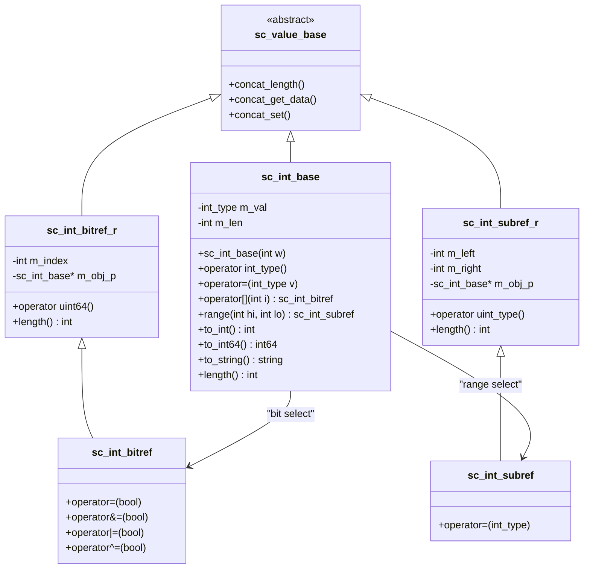

# sc_int_base — 有號固定寬度整數的基底類別

## 概述

`sc_int_base` 是 `sc_int<W>` 模板類別的基底類別，實作了所有與位元寬度無關的功能。它代表一個長度在 1 到 64 位元之間的有號整數，內部使用 C++ 原生的 64 位元整數（`int64`）來儲存值，因此效能接近原生型別。

**源檔案：**
- `ref/systemc/src/sysc/datatypes/int/sc_int_base.h`
- `ref/systemc/src/sysc/datatypes/int/sc_int_base.cpp`

## 日常類比

想像 `sc_int_base` 是一個「可調節寬度的數字顯示器」：
- 你可以設定它顯示 1 到 64 位數字
- 它是「有號」的，所以最高位代表正負號（就像溫度計可以顯示零下溫度）
- 當你存入超過顯示範圍的數字時，它會自動截斷（就像里程表超過 99999 會歸零）

## 類別結構



## 核心概念

### 1. 值儲存與符號擴展

`sc_int_base` 內部只有兩個成員變數：

```cpp
int_type m_val;  // 64-bit signed integer, stores the actual value
int      m_len;  // bit width (1-64)
```

當你將一個 8 位元有號整數設定為 `-3` 時，它實際上在 64 位元變數中儲存的是 `-3` 的 64 位元二補數表示，但只有低 8 位元是「有效的」。

### 2. 位元選取（Bit Selection）

```cpp
sc_int<8> x = 0b10110100;
bool b = x[3];   // returns sc_int_bitref_r, reads bit 3 (value: 0)
x[0] = 1;        // returns sc_int_bitref, writes bit 0
```

`sc_int_bitref_r` 是「唯讀」的代理物件，`sc_int_bitref` 是「可讀寫」的代理物件。這使用了 C++ 的 proxy pattern，讓 `operator[]` 可以同時支援讀取和寫入。

### 3. 範圍選取（Range / Part Selection）

```cpp
sc_int<16> x = 0xABCD;
sc_int_subref r = x.range(11, 4);  // extracts bits [11:4] = 0xBC
x.range(7, 0) = 0xFF;              // sets lower 8 bits
```

這對應 Verilog 中的 `x[11:4]` 語法。

### 4. 串接支援（Concatenation）

`sc_int_base` 透過繼承自 `sc_value_base` 的虛擬方法來支援串接操作：

```cpp
sc_int<8> a = 0xAB;
sc_int<8> b = 0xCD;
sc_int<16> result = (a, b);  // result = 0xABCD
```

內部透過 `concat_get_data()`、`concat_set()` 等方法實作。

### 5. 運算子

支援完整的算術和位元運算子：
- **算術**：`+`, `-`, `*`, `/`, `%`
- **位元**：`&`, `|`, `^`, `~`, `<<`, `>>`
- **比較**：`==`, `!=`, `<`, `<=`, `>`, `>=`
- **賦值**：`=`, `+=`, `-=`, `*=`, `/=`, `%=`, `&=`, `|=`, `^=`, `<<=`, `>>=`

所有運算都在 64 位元原生型別上執行，效能非常高。

## 設計原理

### 為什麼基底類別不是模板？

如果 `sc_int_base` 也是模板 `sc_int_base<W>`，那麼每個不同的 `W` 值都會產生一份完整的程式碼副本。將共用邏輯放在非模板基底類別中，大幅減少了二進位檔案大小。

### RTL 對應

| SystemC | Verilog | 說明 |
|---------|---------|------|
| `sc_int<8> x` | `reg signed [7:0] x` | 8 位元有號暫存器 |
| `x[3]` | `x[3]` | 位元選取 |
| `x.range(7,4)` | `x[7:4]` | 部分選取 |
| `(a, b)` | `{a, b}` | 串接 |

## 相關檔案

- [sc_int.md](sc_int.md) — 模板子類別 `sc_int<W>`
- [sc_uint_base.md](sc_uint_base.md) — 無號版本 `sc_uint_base`
- [sc_nbdefs.md](sc_nbdefs.md) — `int_type` 等基本型別定義
- [../misc/sc_value_base.md](../misc/sc_value_base.md) — 串接支援的基底類別
