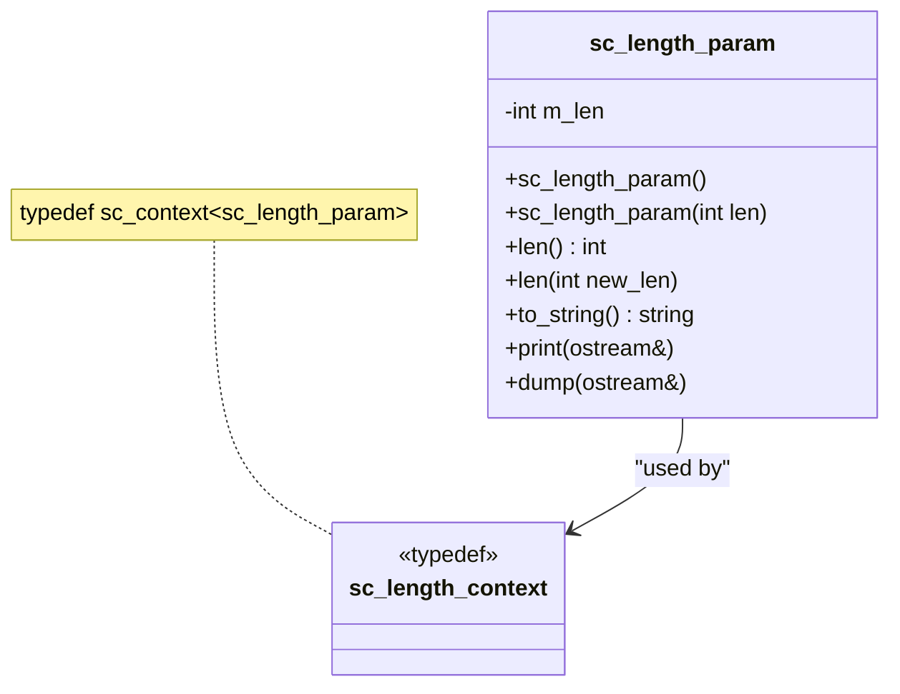

# sc_length_param — 長度參數型別

## 概述

`sc_length_param` 是一個用於管理整數型別位元寬度參數的類別。它與 SystemC 的 context 機制配合使用，允許在特定作用域內設定預設的位元寬度。主要用於定點數（fixed-point）系統與整數型別的交互。

**源檔案：**
- `ref/systemc/src/sysc/datatypes/int/sc_length_param.h`
- `ref/systemc/src/sysc/datatypes/int/sc_length_param.cpp`

## 日常類比

想像你在印刷廠設定紙張大小。你可以：
1. 每次印刷時都指定紙張大小（直接傳參數）
2. 設定一個「預設紙張大小」，之後不指定就用預設的（context 機制）

`sc_length_param` 就是那個「紙張大小設定」，而 `sc_length_context` 就是管理預設值的機制。

## 類別結構



## 核心概念

### 1. 建構方式

```cpp
sc_length_param();                  // use default from context
sc_length_param(int len);           // explicit length
sc_length_param(sc_without_context); // no context lookup
```

### 2. Context 機制

```cpp
// Set default length to 16 for this scope
sc_length_context ctx(sc_length_param(16));

// Now sc_length_param() without argument will default to 16
sc_length_param p;  // p.len() == 16
```

### 3. 驗證

建構時會呼叫 `SC_CHECK_WL_()` 巨集來驗證長度值的合法性。

## 相關檔案

- [sc_int_base.md](sc_int_base.md) — 使用長度參數的類別
- [sc_uint_base.md](sc_uint_base.md) — 使用長度參數的類別
- [sc_nbdefs.md](sc_nbdefs.md) — 相關常數定義
