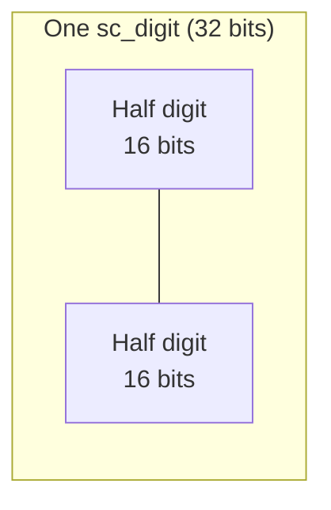
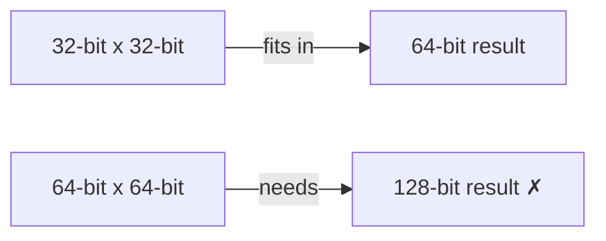

# sc_nbdefs.h — 整數子系統的基本常數與型別定義

## 概述

`sc_nbdefs.h` 定義了整個整數子系統（`datatypes/int/`）共用的基本常數、型別別名和巨集。它是所有整數型別的「基石」——幾乎每個檔案都會直接或間接地 `#include` 它。

**源檔案：**
- `ref/systemc/src/sysc/datatypes/int/sc_nbdefs.h`

## 日常類比

`sc_nbdefs.h` 就像一本「度量衡標準手冊」。當所有人都同意「1 公尺 = 100 公分」時，整個系統才能協同工作。這個檔案定義了整數子系統的「度量衡」：
- 一個「digit」是 32 位元
- 一個「half digit」是 16 位元
- 最大的原生整數是 64 位元
- 以此類推...

## 關鍵定義

### 1. 基本型別別名

```cpp
typedef int64_t   int64;     // 64-bit signed
typedef uint64_t  uint64;    // 64-bit unsigned
typedef int64     int_type;  // native signed type for sc_int
typedef uint64    uint_type; // native unsigned type for sc_uint
```

### 2. Digit 相關常數



| 常數 | 值 | 說明 |
|------|-----|------|
| `BITS_PER_DIGIT` | 32 | 每個 sc_digit 的位元數 |
| `BITS_PER_HALF_DIGIT` | 16 | 半個 digit 的位元數 |
| `DIGIT_MASK` | `0xFFFFFFFF` | digit 遮罩 |
| `HALF_DIGIT_MASK` | `0xFFFF` | 半 digit 遮罩 |

### 3. 整數寬度常數

| 常數 | 值 | 說明 |
|------|-----|------|
| `SC_INTWIDTH` | 64 | `sc_int`/`sc_uint` 最大寬度 |
| `INT64_ZERO` | `0LL` | 64 位元有號零 |
| `UINT64_ZERO` | `0ULL` | 64 位元無號零 |

### 4. Digit 計算巨集

```cpp
#define SC_DIGIT_COUNT(BIT_WIDTH) (((BIT_WIDTH)+BITS_PER_DIGIT-1)/BITS_PER_DIGIT)
#define SC_DIGIT_INDEX(BIT_INDEX) ((BIT_INDEX)/BITS_PER_DIGIT)
#define SC_BIT_INDEX(BIT_INDEX)   ((BIT_INDEX)%BITS_PER_DIGIT)
```

- `SC_DIGIT_COUNT(100)` = 4（100 位元需要 4 個 32 位元 digit）
- `SC_DIGIT_INDEX(65)` = 2（第 65 位元在第 2 個 digit 中）
- `SC_BIT_INDEX(65)` = 1（第 65 位元是 digit 中的第 1 位）

### 5. 符號型別

```cpp
typedef int small_type;
#define SC_POS   1   // positive
#define SC_ZERO  0   // zero
#define SC_NEG  -1   // negative
```

### 6. BigInt 配置

三個互斥的巨集定義了 `sc_bigint`/`sc_biguint` 的記憶體管理策略：

| 巨集 | 說明 |
|------|------|
| `SC_BIGINT_CONFIG_TEMPLATE_CLASS_HAS_NO_BASE_CLASS` | 模板類別不繼承基底類別 |
| `SC_BIGINT_CONFIG_TEMPLATE_CLASS_HAS_STORAGE` | 模板類別自行管理儲存 |
| `SC_BIGINT_CONFIG_BASE_CLASS_HAS_STORAGE` | 基底類別管理儲存（含小型向量最佳化） |

### 7. 串接支援

```cpp
#define SC_DT_MIXED_COMMA_OPERATORS
```

啟用混合型別的逗號運算子串接，例如 `(sc_int_value, sc_uint_value)`。

## 設計原理

### 為什麼 digit 是 32 位元而不是 64 位元？

乘法是關鍵原因。兩個 32 位元數字相乘的結果最多 64 位元，剛好可以用原生 `uint64` 儲存。如果 digit 是 64 位元，乘法結果需要 128 位元，大多數處理器沒有原生支援。



## 相關檔案

- [sc_signed.md](sc_signed.md) — 使用這些定義的主要類別
- [sc_unsigned.md](sc_unsigned.md) — 使用這些定義的主要類別
- [sc_nbutils.md](sc_nbutils.md) — 基於這些定義的工具函式
- [sc_int_base.md](sc_int_base.md) — 使用 `int_type`/`uint_type` 的類別
