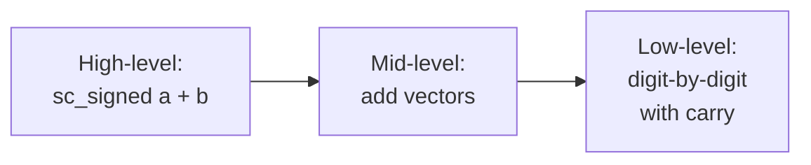

# sc_nbutils — 任意精度整數的共用工具函式

## 概述

`sc_nbutils.h/.cpp` 提供了 `sc_signed` 和 `sc_unsigned` 共用的低階工具函式。這些函式處理最基本的操作：字串解析、向量運算、型別轉換、進位處理等。

**源檔案：**
- `ref/systemc/src/sysc/datatypes/int/sc_nbutils.h`
- `ref/systemc/src/sysc/datatypes/int/sc_nbutils.cpp`

## 日常類比

如果 `sc_signed` 和 `sc_unsigned` 是兩家麵包店，`sc_nbutils` 就是它們共用的「麵粉工廠」。兩家店都需要和麵、發酵、烘烤，這些基本工序是相同的，所以放在工廠裡共用。

## 核心函式分類

### 1. 字串解析

```cpp
void parse_binary_bits(const char* src_p, int dst_n,
                       sc_digit* data_p, sc_digit* ctrl_p=0);

void parse_hex_bits(const char* src_p, int dst_n,
                    sc_digit* data_p, sc_digit* ctrl_p=0);
```

將字串格式的數字（如 `"0b1010"` 或 `"0xFF"` ）轉換成 digit 向量。`ctrl_p` 參數用於四態邏輯（`sc_lv`）的控制位。

### 2. Digit 操作工具

```cpp
// Concatenate two half-digits into one digit
inline sc_digit concat(sc_digit h, sc_digit l)
{
    return ((h << BITS_PER_HALF_DIGIT) | l);
}

// Create a number with n 1's: (2^n - 1)
inline sc_carry one_and_ones(int n)
{
    return (((sc_carry) 1 << n) - 1);
}

// Create a number with one 1 and n 0's: 2^n
inline sc_carry one_and_zeros(int n)
{
    return ((sc_carry) 1 << n);
}
```

### 3. 型別轉換

```cpp
// Copy unsigned value into digit vector
template<class Type>
inline void from_uint(int ulen, sc_digit* u, Type v);
```

將 C++ 原生整數型別（`unsigned long`、`uint64` 等）轉換成 digit 向量表示。

### 4. 向量算術

底層的加法、減法、比較等運算，直接操作 `sc_digit` 陣列：



## 設計原理

### 為什麼獨立成一個檔案？

`sc_signed` 和 `sc_unsigned` 的大部分底層操作完全相同——差異只在於符號處理。將這些操作提取到 `sc_nbutils` 中，可以：

1. **消除重複程式碼**：同一份實作服務兩個類別
2. **獨立測試**：可以單獨測試這些底層操作
3. **效能集中最佳化**：最佳化一處，兩個類別同時受益

## 相關檔案

- [sc_signed.md](sc_signed.md) — 使用這些工具的有號整數類別
- [sc_unsigned.md](sc_unsigned.md) — 使用這些工具的無號整數類別
- [sc_nbdefs.md](sc_nbdefs.md) — 基本型別和常數定義
- [sc_vector_utils.md](sc_vector_utils.md) — 更高階的向量運算工具
