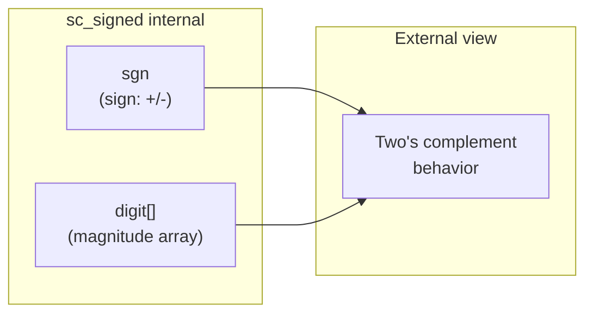

# sc_signed — 任意精度有號整數

## 概述

`sc_signed` 是 SystemC 中任意精度有號整數的核心類別，也是 `sc_bigint<W>` 的基底類別。與 `sc_int_base` 限制在 64 位元不同，`sc_signed` 可以表示任意寬度的有號整數。內部使用 sign-magnitude（符號-量值）表示法，但對外保證二補數（two's complement）的行為。

**源檔案：**
- `ref/systemc/src/sysc/datatypes/int/sc_signed.h`
- `ref/systemc/src/sysc/datatypes/int/sc_signed.cpp`
- `ref/systemc/src/sysc/datatypes/int/sc_signed_inlines.h`
- `ref/systemc/src/sysc/datatypes/int/sc_signed_ops.h`
- `ref/systemc/src/sysc/datatypes/int/sc_signed_friends.h`

## 日常類比

如果 `sc_int_base` 是一台「最多 64 位數的計算機」，那 `sc_signed` 就是一台「位數無限的計算機」。想像你在做天文學計算，需要處理幾百位數的數字——普通計算機放不下，但 `sc_signed` 可以。

另一個類比：
- `sc_int<W>` 像是固定長度的紙條，寫滿就沒空間了
- `sc_signed` 像是一卷可以撕的收銀紙，需要多長就撕多長

## 類別結構

```mermaid
classDiagram
    class sc_value_base {
        <<abstract>>
    }

    class sc_signed {
        -sc_digit* digit
        -int nbits
        -int ndigits
        -small_type sgn
        +sc_signed(int nb)
        +operator=(various)
        +operator[](int i) sc_signed_bitref
        +range(int hi, int lo) sc_signed_subref
        +to_int() int
        +to_int64() int64
        +to_uint64() uint64
        +to_string() string
        +length() int
        +is_neg() bool
    }

    class sc_signed_bitref_r {
        -int m_index
        -sc_signed* m_obj_p
    }

    class sc_signed_bitref {
        +operator=(bool)
    }

    class sc_signed_subref_r {
        -int m_left
        -int m_right
    }

    class sc_signed_subref {
        +operator=(various)
    }

    sc_value_base <|-- sc_signed
    sc_value_base <|-- sc_signed_bitref_r
    sc_signed_bitref_r <|-- sc_signed_bitref
    sc_value_base <|-- sc_signed_subref_r
    sc_signed_subref_r <|-- sc_signed_subref
    sc_signed <|-- sc_bigint_W["sc_bigint&lt;W&gt;"]
```

## 核心概念

### 1. 內部表示法：Sign-Magnitude



- **符號**（`sgn`）：`SC_POS`（正）、`SC_NEG`（負）、`SC_ZERO`（零）
- **量值**（`digit[]`）：一個 `sc_digit`（32 位元無號整數）的陣列，儲存絕對值

為什麼選擇 sign-magnitude 而非直接用二補數？
- **算術效能更好**：加法、乘法等運算可以先處理量值，再決定符號
- **二補數的缺點**：對任意寬度數字做加法時，進位鏈（carry chain）處理更複雜

### 2. Digit 向量

每個 `sc_digit` 是 32 位元（`unsigned int`），多個 `sc_digit` 串接起來表示一個大數：

```
Number: 0x1234567890ABCDEF

digit[0] = 0x90ABCDEF  (lowest 32 bits)
digit[1] = 0x12345678  (next 32 bits)
```

### 3. 小型向量最佳化（Small Vector Optimization）

當配置為 `SC_BIGINT_CONFIG_BASE_CLASS_HAS_STORAGE` 時，`sc_signed` 內建一個小型固定大小的 digit 陣列。只有當數值超過這個大小時，才需要動態記憶體配置（malloc）。這類似 C++ `std::string` 的 SSO（Small String Optimization）。

### 4. 檔案分工

| 檔案 | 職責 |
|------|------|
| `sc_signed.h` | 類別宣告、代理類別、運算子宣告 |
| `sc_signed.cpp` | 核心實作（建構、轉換、I/O） |
| `sc_signed_inlines.h` | 需要延遲定義的 inline 函式 |
| `sc_signed_ops.h` | 算術與位元運算的實作 |
| `sc_signed_friends.h` | friend 運算子宣告（供編譯器前向宣告） |

### 5. 運算語意

根據 VSIA 標準：有號與無號混合運算的結果是**有號**的：

```cpp
sc_signed a(8);   // signed
sc_unsigned b(8); // unsigned
// a + b returns sc_signed (not sc_unsigned)
```

這與 C/C++ 不同（C/C++ 中 signed + unsigned = unsigned）。

## 運算子支援

```cpp
// Unary operators
sc_signed operator + (const sc_signed& u);   // unary plus
sc_signed operator - (const sc_signed& u);   // unary minus
sc_signed operator - (const sc_unsigned& u); // negate unsigned -> signed
sc_signed operator ~ (const sc_signed& u);   // bitwise NOT

// Binary arithmetic (+, -, *, /, %) with all combinations:
// sc_signed op sc_signed
// sc_signed op sc_unsigned
// sc_signed op int/long/int64/uint64/...
// ... and all reverse combinations
```

## RTL 背景

在 Verilog 中，任意寬度的有號運算需要手動管理：

```
// Verilog: manually managing wide signed values
reg signed [127:0] big_value;
reg signed [255:0] result;

// SystemC: natural C++ syntax
sc_signed big_value(128);
sc_signed result(256);
result = big_value * big_value;  // just works
```

## 相關檔案

- [sc_bigint.md](sc_bigint.md) — 模板子類別 `sc_bigint<W>`
- [sc_unsigned.md](sc_unsigned.md) — 無號版本 `sc_unsigned`
- [sc_nbutils.md](sc_nbutils.md) — 底層向量運算工具函式
- [sc_nbdefs.md](sc_nbdefs.md) — `sc_digit`、`small_type` 等型別定義
- [sc_vector_utils.md](sc_vector_utils.md) — 向量運算型別工具
