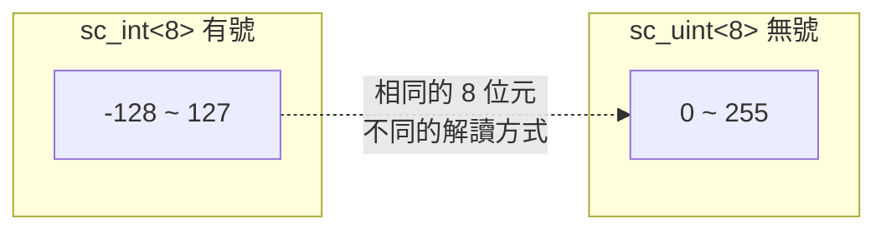

# sc_uint\<W\> — 無號固定寬度整數模板類別

## 概述

`sc_uint<W>` 是使用者直接使用的無號整數型別，`W` 是位元寬度（1 到 64）。它繼承自 `sc_uint_base`，與 `sc_int<W>` 是鏡像設計，但處理的是無號數值。

**源檔案：**
- `ref/systemc/src/sysc/datatypes/int/sc_uint.h`
- `ref/systemc/src/sysc/datatypes/int/sc_uint_inlines.h`

## 日常類比

`sc_uint<W>` 就像一個固定位數的「里程表」。`sc_uint<8>` 是一個 3 位數里程表（0~255），超過 255 就自動歸零。與 `sc_int<8>` 不同的是，里程表永遠不會顯示負數。

## 核心機制

### 1. 與 sc_int\<W\> 的對比



同樣的 8 位元 `11111111`：
- `sc_int<8>` 解讀為 `-1`
- `sc_uint<8>` 解讀為 `255`

### 2. 賦值截斷

```cpp
void assign( uint_type value )
{
    m_val = value & ( ~UINT_ZERO >> (SC_INTWIDTH-W) );
}
```

與 `sc_int<W>` 的符號擴展不同，`sc_uint<W>` 只是簡單地把高位遮罩掉。就像里程表，99999 之後就是 00000。

### 3. sc_uint_inlines.h 的角色

與 `sc_int_inlines.h` 類似，包含需要延遲定義的 inline 函式，因為它們依賴其他尚未完整定義的型別（如 `sc_signed`、`sc_unsigned`）。

## 使用範例

```cpp
// Address bus
sc_uint<32> addr = 0x80000000;

// Bit field extraction
sc_uint<8> status_reg = read_register();
bool error_flag = status_reg[7];
sc_uint<4> error_code = status_reg.range(6, 3);

// Counter with wrap-around
sc_uint<4> counter = 15;
counter++;  // becomes 0 (wrap around)
```

## RTL 對應

```
// Verilog (unsigned by default)
reg [31:0] addr;
wire [7:0] status_reg;
wire error_flag = status_reg[7];
wire [3:0] error_code = status_reg[6:3];

// SystemC
sc_uint<32> addr;
sc_uint<8> status_reg;
bool error_flag = status_reg[7];
sc_uint<4> error_code = status_reg.range(6, 3);
```

## 相關檔案

- [sc_uint_base.md](sc_uint_base.md) — 基底類別
- [sc_int.md](sc_int.md) — 有號版本 `sc_int<W>`
- [sc_biguint.md](sc_biguint.md) — 超過 64 位元時使用的替代方案
