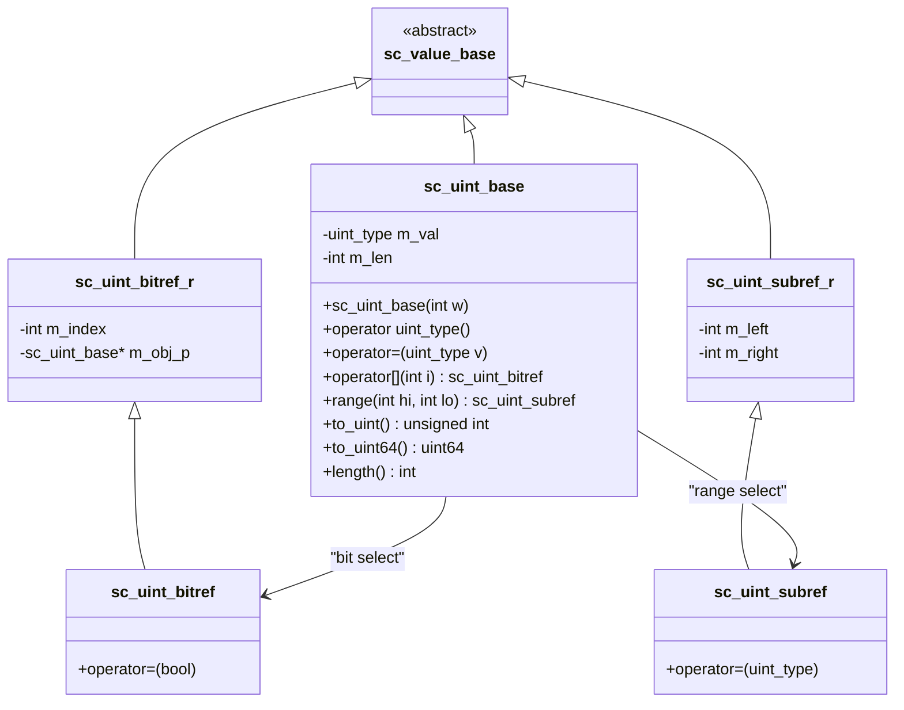

# sc_uint_base — 無號固定寬度整數的基底類別

## 概述

`sc_uint_base` 是 `sc_uint<W>` 模板類別的基底類別，代表一個 1 到 64 位元的無號整數。它與 `sc_int_base` 幾乎是鏡像設計，但所有運算都以無號方式進行。

**源檔案：**
- `ref/systemc/src/sysc/datatypes/int/sc_uint_base.h`
- `ref/systemc/src/sysc/datatypes/int/sc_uint_base.cpp`

## 日常類比

`sc_uint_base` 就像汽車的里程表——只能往上數，不會有負數。一台 5 位數的里程表最大顯示 99999，再多就會歸零重來。`sc_uint_base` 也是一樣：8 位元的範圍是 0 到 255，超過就繞回（wrap around）。

## 類別結構



## 核心概念

### 1. 值儲存

```cpp
uint_type m_val;  // 64-bit unsigned integer
int       m_len;  // bit width (1-64)
```

與 `sc_int_base` 使用有號 `int_type` 不同，`sc_uint_base` 使用無號 `uint_type`。這意味著：
- 沒有符號擴展問題
- 右移操作是邏輯右移（補零），而非算術右移（補符號位）

### 2. 與 sc_int_base 的差異

| 特性 | sc_int_base | sc_uint_base |
|------|-------------|--------------|
| 儲存型別 | `int_type` (signed) | `uint_type` (unsigned) |
| 數值範圍 | -2^(W-1) ~ 2^(W-1)-1 | 0 ~ 2^W-1 |
| 右移行為 | 算術右移（保留符號位） | 邏輯右移（補零） |
| 比較運算 | 有號比較 | 無號比較 |

### 3. 代理類別

與 `sc_int_base` 一樣，提供了四個代理類別：
- `sc_uint_bitref_r`：唯讀位元選取
- `sc_uint_bitref`：可寫位元選取
- `sc_uint_subref_r`：唯讀範圍選取
- `sc_uint_subref`：可寫範圍選取

### 4. 遮罩表（mask_int）

```cpp
extern const uint_type mask_int[SC_INTWIDTH][SC_INTWIDTH];
```

這是一個預先計算的查找表，用於快速進行部分選取操作。`mask_int[i][j]` 儲存了將位元 `i` 到 `j` 之外的位元清零所需的遮罩值。

## RTL 背景

在硬體中，無號整數最常見的用途是：
- **位址匯流排**：記憶體位址沒有負數
- **計數器**：如封包長度、迴圈計數
- **旗標暫存器**：每個位元代表一個獨立的控制旗標

```
// Verilog
reg [7:0] address;     // unsigned by default in Verilog
wire [3:0] count;

// SystemC
sc_uint<8> address;
sc_uint<4> count;
```

## 相關檔案

- [sc_uint.md](sc_uint.md) — 模板子類別 `sc_uint<W>`
- [sc_int_base.md](sc_int_base.md) — 有號版本 `sc_int_base`
- [sc_int32_mask.md](sc_int32_mask.md) — 32 位元遮罩表
- [sc_int64_mask.md](sc_int64_mask.md) — 64 位元遮罩表
- [../misc/sc_value_base.md](../misc/sc_value_base.md) — 基底類別
