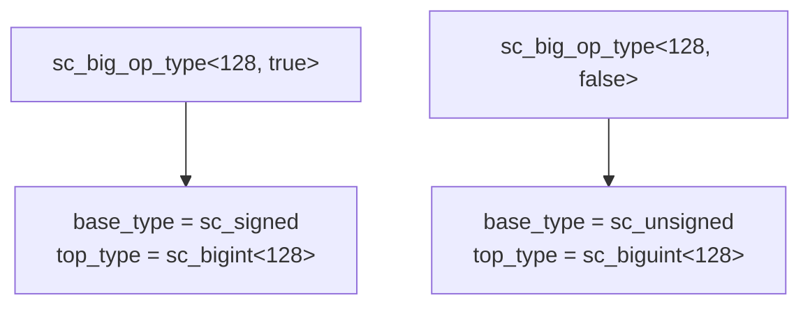

# sc_vector_utils.h — 向量運算型別工具

## 概述

`sc_vector_utils.h` 提供了一組模板工具類別，用於在編譯期計算大整數運算所需的型別資訊和寬度。這些工具是 `sc_big_ops.h` 中運算子實作的基礎設施。

**源檔案：**
- `ref/systemc/src/sysc/datatypes/int/sc_vector_utils.h`

## 日常類比

當你做直式乘法時，你需要先知道：
- 兩個數字各有幾位？
- 結果最多會有幾位？
- 需要準備多大的紙張？

`sc_vector_utils.h` 就是幫你在「開始計算之前」就回答這些問題的工具。而且它在編譯期就完成計算，執行期不需要任何額外開銷。

## 核心類別

### 1. sc_big_op_type\<WIDTH, SIGNED\>

根據寬度和有號性選擇正確的型別：



```cpp
template<int WIDTH>
class sc_big_op_type<WIDTH, true> {
    typedef sc_signed        base_type;
    typedef int              hod_type;   // high order digit type (signed)
    typedef sc_bigint<WIDTH> top_type;
};

template<int WIDTH>
class sc_big_op_type<WIDTH, false> {
    typedef sc_unsigned       base_type;
    typedef sc_digit          hod_type;   // high order digit type (unsigned)
    typedef sc_biguint<WIDTH> top_type;
};
```

### 2. sc_big_op_info\<WL, SL, WR, SR\>

在編譯期計算兩個運算元進行各種運算時，結果所需的位元寬度：

```cpp
template<int WL, bool SL, int WR, bool SR>
class sc_big_op_info {
    enum {
        signed_result = SL || SR,

        // Result widths for different operations:
        add_bits = max(WL+extra, WR+extra) + 1,
        sub_bits = max(WL+extra, WR+extra) + 1,
        mul_bits = WL + WR,
        div_bits = WL + SR,
        mod_bits = min(WL, WR+extra),
        bit_bits = max(WL+extra, WR+extra),  // bitwise ops

        // Digit indices for results:
        add_hod = digit_index(add_bits - 1),
        // ... etc
    };
};
```

**寬度計算規則：**

| 運算 | 結果寬度 | 理由 |
|------|----------|------|
| 加法 | max(WL, WR) + 1 | 進位可能多一位 |
| 減法 | max(WL, WR) + 1 | 借位可能多一位 |
| 乘法 | WL + WR | 位元寬度相加 |
| 除法 | WL + SR | 被除數寬度（加符號位） |
| 取餘 | min(WL, WR) | 餘數不超過除數 |
| 位元運算 | max(WL, WR) | 取較寬的 |

### 3. 有號/無號混合的額外位元

當有號與無號運算元混合時，需要額外的位元：

```cpp
left_extra = !SL && SR,   // unsigned left + signed right: left needs extra bit
right_extra = SL && !SR,  // signed left + unsigned right: right needs extra bit
```

這是因為無號數轉有號數時需要一個額外的 0 作為符號位。

## 設計原理

所有計算都發生在編譯期（透過 `enum`），這意味著：

1. **零執行期開銷**：寬度計算不消耗任何 CPU 時間
2. **編譯器最佳化**：知道精確的 digit 數量後，可以展開迴圈
3. **型別安全**：錯誤的運算元組合會在編譯期就被捕獲

## 相關檔案

- [sc_big_ops.md](sc_big_ops.md) — 使用這些型別資訊實作運算
- [sc_bigint.md](sc_bigint.md) — 提供 `DIGITS_N`、`HOD` 等常數
- [sc_biguint.md](sc_biguint.md) — 提供 `DIGITS_N`、`HOD` 等常數
- [sc_nbdefs.md](sc_nbdefs.md) — `SC_DIGIT_COUNT` 等巨集定義
