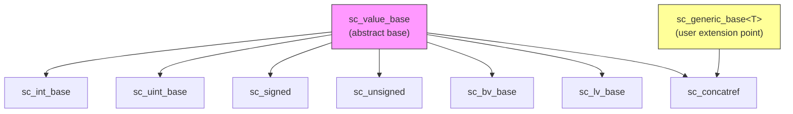

# SystemC 資料型別雜項子系統 — 基礎類別與串接支援

## 概述

`datatypes/misc/` 目錄包含 SystemC 資料型別系統的基礎設施類別。這些類別不屬於任何特定的資料型別分類（整數、位元向量、定點數），而是被所有資料型別共用的「地基」。

## 日常類比

如果 SystemC 的資料型別是各種電器（冰箱、洗衣機、電視），那 `misc/` 就是提供「電源插座標準」和「萬用插座轉接器」的地方：
- `sc_value_base`：電源插座標準（所有電器都要遵守）
- `sc_concatref`：萬用轉接器（把不同電器的訊號串接在一起）

## 檔案列表

| 檔案 | 說明 |
|------|------|
| [sc_value_base.md](sc_value_base.md) | `sc_value_base` — 所有 SystemC 值型別的抽象基底類別 |
| [sc_concatref.md](sc_concatref.md) | `sc_concatref` — 位元串接代理類別 |

## 類別關係

## 相關目錄

- [../int/](../int/_index.md) — 整數資料型別
- `../bit/` — 位元向量資料型別
- `../fx/` — 定點數資料型別
