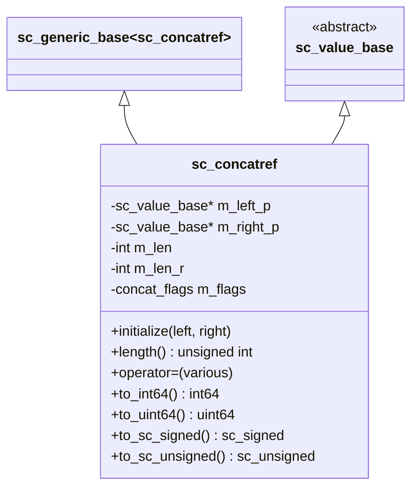
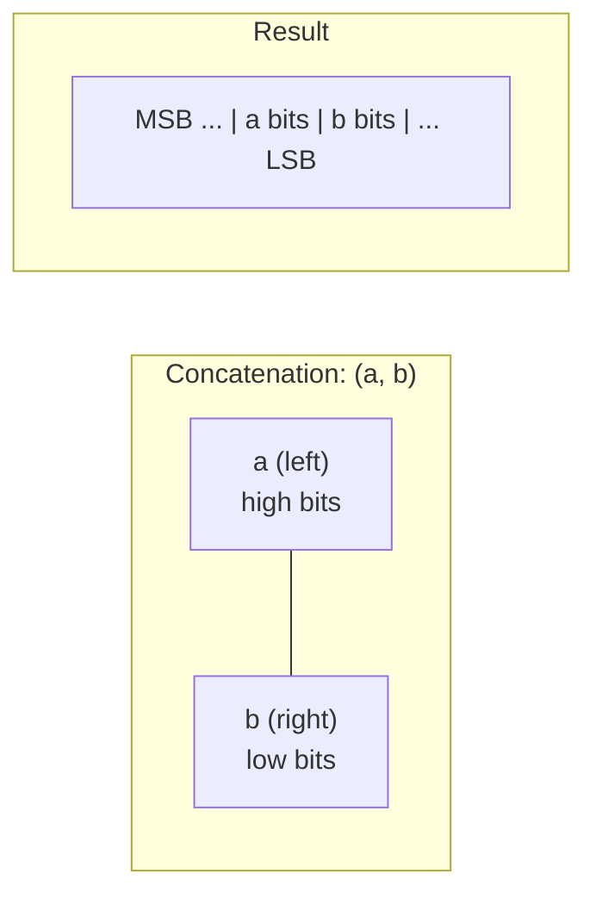

# sc_concatref — 位元串接代理類別

## 概述

`sc_concatref` 是 SystemC 串接（concatenation）操作的核心代理類別。當你寫 `(a, b)` 將兩個值串接在一起時，結果就是一個 `sc_concatref` 物件。它可以出現在賦值的左邊（拆分）和右邊（組合），支援所有 SystemC 數值型別的混合串接。

**源檔案：**
- `ref/systemc/src/sysc/datatypes/misc/sc_concatref.h`

## 日常類比

想像你有兩條不同長度的彩帶，你用膠帶把它們黏在一起：
- 黏在一起之後，你可以把整條彩帶當作一個整體來使用（讀取）
- 你也可以對整條彩帶進行操作，效果會自動傳遞到兩條原始彩帶上（寫入）

`sc_concatref` 就是那卷「膠帶」——它不儲存任何資料，只是「參照」兩個原始值，提供一個統一的介面。

## 類別結構



## 核心概念

### 1. 初始化

```cpp
void initialize( sc_value_base& left, sc_value_base& right )
{
    m_left_p = &left;
    m_right_p = &right;
    m_len_r = right.concat_length(&right_xz);
    m_len = left.concat_length(&left_xz) + m_len_r;
    m_flags = ( left_xz || right_xz ) ? cf_xz_present : cf_none;
}
```

`sc_concatref` 記住左右兩個運算元的指標和各自的位元長度。它本身不複製任何資料。

### 2. 串接方向



左邊的值佔據高位元，右邊的值佔據低位元。這與 Verilog 的 `{a, b}` 語意一致。

### 3. 讀取操作

讀取時，`sc_concatref` 委託給兩個子值：

```cpp
virtual bool concat_get_data( sc_digit* dst_p, int low_i ) const
{
    bool rnz = m_right_p->concat_get_data( dst_p, low_i );
    bool lnz = m_left_p->concat_get_data( dst_p, low_i + m_len_r );
    return rnz || lnz;
}
```

先取右邊（低位），再取左邊（高位，偏移量是右邊的長度）。

### 4. 寫入操作

寫入時也是類似的委託：

```cpp
virtual void concat_set( int64 src, int low_i )
{
    m_right_p->concat_set( src, low_i );
    m_left_p->concat_set( src, low_i + m_len_r );
}
```

### 5. 遞迴串接

`sc_concatref` 本身繼承自 `sc_value_base`，所以串接可以遞迴：

```cpp
sc_int<4> a, b, c;
// ((a, b), c) works: (a,b) creates sc_concatref,
// then (sc_concatref, c) creates another sc_concatref
auto result = (a, b, c);
```

### 6. sc_concat_bool

`sc_concatref.h` 中還定義了 `sc_concat_bool`，用於將單一 `bool` 值包裝成可以參與串接操作的物件。

### 7. 物件池

`sc_concatref` 物件透過 `sc_vpool` 物件池管理，避免頻繁的記憶體分配和釋放：

```cpp
friend class sc_core::sc_vpool<sc_concatref>;
```

## 運算子支援

`sc_concatref` 支援：
- **賦值**：從各種型別賦值（int、string、sc_signed、sc_unsigned 等）
- **轉換**：轉換為各種型別（to_int64、to_uint64、to_sc_signed 等）
- **算術**：加、減、乘、除、取餘
- **位元**：AND、OR、XOR、NOT、左移、右移
- **比較**：所有比較運算子

## RTL 對應

```
// Verilog: concatenation
wire [7:0] a, b;
wire [15:0] result = {a, b};        // read concatenation
assign {a, b} = some_16bit_value;   // write concatenation (split)

// SystemC equivalent
sc_uint<8> a, b;
sc_uint<16> result = (a, b);        // read concatenation
(a, b) = some_16bit_value;          // write concatenation (split)
```

## 設計原理

### 為什麼是代理物件而非直接產生新值？

1. **左值語意**：串接可以出現在賦值左邊，直接修改原始變數
2. **零拷貝**：不需要複製資料，只儲存參照
3. **型別無關**：透過 `sc_value_base` 虛擬方法，支援任意型別組合

### 混合型別支援

```cpp
sc_int<4> a = 5;
sc_uint<4> b = 3;
sc_bv<8> c;
(a, b) = c;    // mixed signed/unsigned/bitvector concatenation
```

這是 `sc_concatref` 最強大的地方——它可以串接任何繼承自 `sc_value_base` 的型別。

## 相關檔案

- [sc_value_base.md](sc_value_base.md) — 基底類別，定義串接介面
- [../int/sc_int_base.md](../int/sc_int_base.md) — 可參與串接的型別之一
- [../int/sc_uint_base.md](../int/sc_uint_base.md) — 可參與串接的型別之一
- [../int/sc_signed.md](../int/sc_signed.md) — 可參與串接的型別之一
