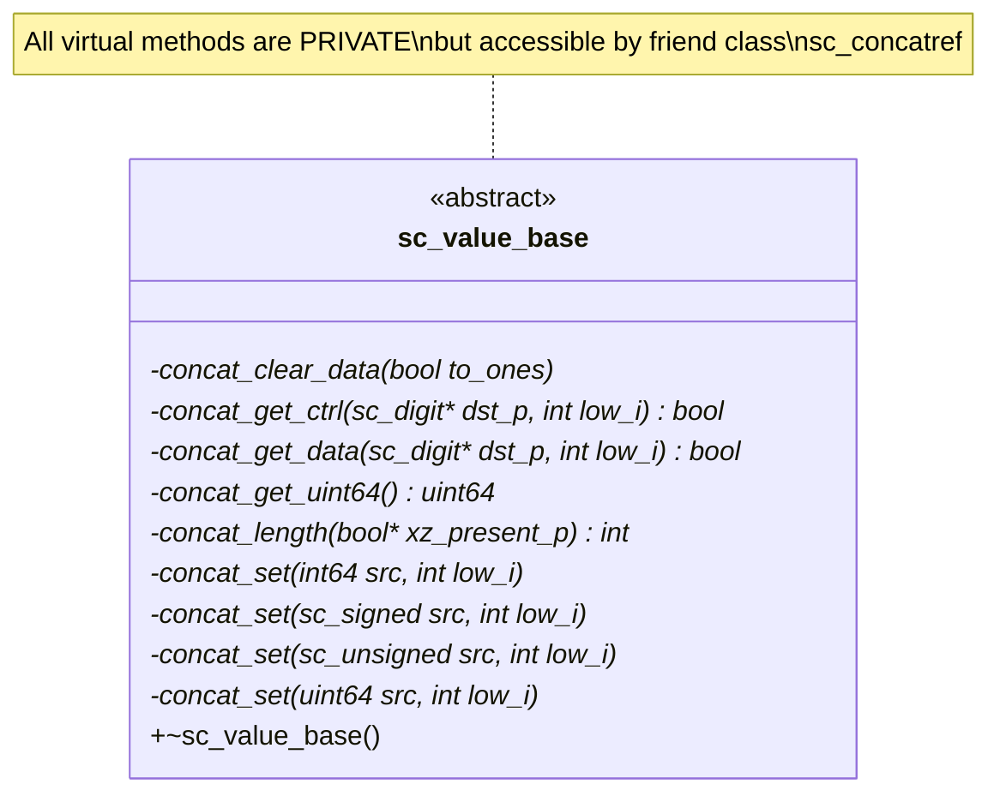
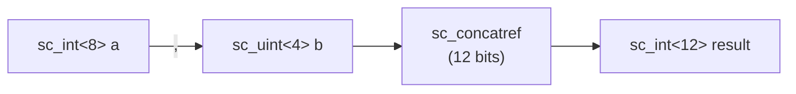

# sc_value_base — 所有 SystemC 值型別的抽象基底類別

## 概述

`sc_value_base` 是 SystemC 所有原生數值型別的抽象基底類別。它的主要職責是定義一組虛擬方法，讓不同型別的數值可以進行**串接（concatenation）**操作。所有的整數型別（`sc_int_base`、`sc_uint_base`、`sc_signed`、`sc_unsigned`）和位元向量型別（`sc_bv_base`、`sc_lv_base`）都繼承自這個類別。

**源檔案：**
- `ref/systemc/src/sysc/datatypes/misc/sc_value_base.h`
- `ref/systemc/src/sysc/datatypes/misc/sc_value_base.cpp`

## 日常類比

想像一家工廠有各種不同的零件（螺絲、齒輪、軸承），每個零件都有不同的規格和用途。但它們都必須遵守一個共同的「接口標準」，才能被組裝到同一條生產線上。

`sc_value_base` 就是這個「接口標準」。它規定了每個數值型別必須支援的基本操作：
- 你有多少位元？（`concat_length`）
- 把你的資料複製到這裡（`concat_get_data`）
- 從這裡讀取資料到你身上（`concat_set`）

## 類別定義



## 核心方法

### 串接介面（全部為 `private virtual`）

| 方法 | 說明 |
|------|------|
| `concat_length(bool* xz_present_p)` | 回傳此值的位元長度；若含 x/z 值，設定 `xz_present_p` |
| `concat_get_data(sc_digit* dst_p, int low_i)` | 將資料位元寫入目標 digit 陣列的 `low_i` 位置開始 |
| `concat_get_ctrl(sc_digit* dst_p, int low_i)` | 將控制位元（x/z）寫入目標 digit 陣列 |
| `concat_get_uint64()` | 回傳值的低 64 位元 |
| `concat_set(...)` | 從來源設定此值（多個多載版本） |
| `concat_clear_data(bool to_ones)` | 清除資料（設為全 0 或全 1） |

### 為什麼是 private？

這些方法被標記為 `private`，只有 `friend class sc_concatref` 可以存取。這樣做是為了：

1. **封裝**：使用者不應直接呼叫這些低階方法
2. **安全**：只有串接機制（`sc_concatref`）需要存取它們
3. **彈性**：可以在不影響公開介面的情況下修改內部實作

## sc_generic_base\<T\>

同一個標頭檔中還定義了 `sc_generic_base<T>`，它是使用者自定義型別的擴充點：

```cpp
template<class T>
class sc_generic_base {
    const T* operator->() const { return (const T*)this; }
    T* operator->() { return (T*)this; }
};
```

使用方式：

```cpp
class my_type : public sc_generic_base<my_type> {
    uint64 to_uint64() const;
    int64 to_int64() const;
    void to_sc_unsigned(sc_unsigned&) const;
    void to_sc_signed(sc_signed&) const;
};
```

透過繼承 `sc_generic_base`，自定義型別可以與 SystemC 的整數型別互相轉換和賦值。`operator->` 的使用讓模板可以透過 CRTP（Curiously Recurring Template Pattern）來存取衍生類別的方法。

## 設計原理

### 為什麼需要一個共同基底類別？



串接操作 `(a, b)` 需要將不同型別的值組合在一起。如果沒有共同基底類別，每對型別組合都需要專門的程式碼。有了 `sc_value_base`，`sc_concatref` 只需要呼叫統一的虛擬方法。

### RTL 對應

這對應 Verilog 中的串接運算子 `{}`：

```
// Verilog
wire [11:0] result = {a, b};  // a is 8-bit, b is 4-bit

// SystemC
sc_int<12> result = (a, b);   // same thing, different syntax
```

## 相關檔案

- [sc_concatref.md](sc_concatref.md) — 串接代理類別，`sc_value_base` 的主要消費者
- [../int/sc_int_base.md](../int/sc_int_base.md) — 繼承 `sc_value_base` 的整數類別
- [../int/sc_signed.md](../int/sc_signed.md) — 繼承 `sc_value_base` 的任意精度類別
