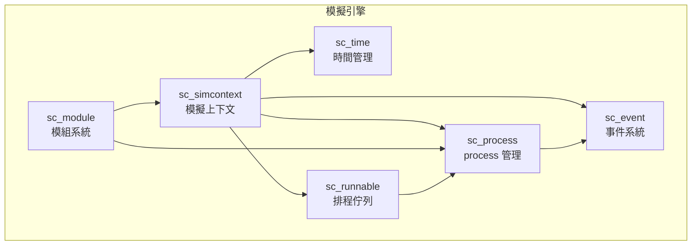
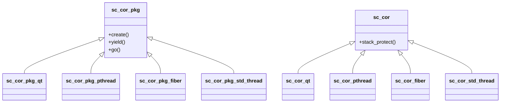
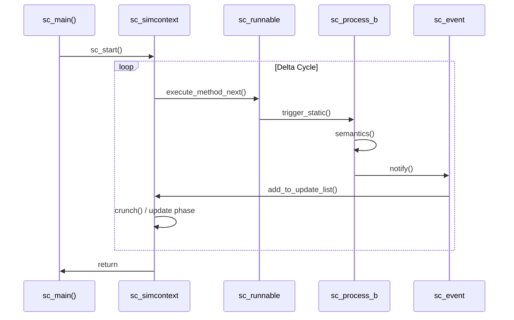

# sysc/kernel/ - 模擬核心引擎

> SystemC 模擬引擎的核心實作，包含事件、process、模組、時間管理、排程等基礎機制。

## 子系統概覽



## 詳細依賴關係圖

### 類別繼承階層

```mermaid
classDiagram
    sc_object <|-- sc_module
    sc_object <|-- sc_process_b
    sc_object <|-- sc_prim_channel
    sc_process_b <|-- sc_method_process
    sc_process_b <|-- sc_thread_process
    sc_thread_process <|-- sc_cthread_process
    sc_module <|-- "User Modules"

    class sc_object {
        +name()
        +kind()
        +get_parent_object()
        +get_child_objects()
    }
    class sc_process_b {
        +trigger_static()
        +trigger_dynamic()
        +kill_process()
        +reset_process()
    }
    class sc_module {
        +SC_METHOD()
        +SC_THREAD()
        +SC_CTHREAD()
        +sensitive
    }
```

### 協程實作策略



### 模擬執行流程



## 檔案分類

### 模擬上下文與主程式

| 檔案 | 說明 |
|------|------|
| [sc_simcontext](sc_simcontext.md) | 模擬上下文 — SystemC 的「大腦」，管理整個模擬流程 |
| [sc_main](sc_main.md) | 使用者入口點 `sc_main()` |
| [sc_main_main](sc_main_main.md) | 真正的 `main()` 函式，呼叫 `sc_main()` |
| [sc_ver](sc_ver.md) | 版本資訊 |
| [sc_status](sc_status.md) | 模擬狀態列舉 |
| [sc_constants](sc_constants.md) | 全域常數定義 |
| [sc_externs](sc_externs.md) | 外部宣告 |
| [sc_macros](sc_macros.md) | 常用巨集定義 |
| [sc_cmnhdr](sc_cmnhdr.md) | 共用標頭檔 |

### 事件系統

| 檔案 | 說明 |
|------|------|
| [sc_event](sc_event.md) | 事件類別 — 模擬中同步的核心機制 |

### Process 管理

| 檔案 | 說明 |
|------|------|
| [sc_process](sc_process.md) | process 基礎類別 |
| [sc_process_handle](sc_process_handle.md) | process 控制代碼（handle） |
| [sc_method_process](sc_method_process.md) | SC_METHOD process |
| [sc_thread_process](sc_thread_process.md) | SC_THREAD process |
| [sc_cthread_process](sc_cthread_process.md) | SC_CTHREAD（clocked thread）process |
| [sc_spawn](sc_spawn.md) | 動態 process 生成 |
| [sc_spawn_options](sc_spawn_options.md) | spawn 選項設定 |
| [sc_dynamic_processes](sc_dynamic_processes.md) | 動態 process 支援標頭 |
| [sc_runnable](sc_runnable.md) | 可執行 process 佇列 |
| [sc_sensitive](sc_sensitive.md) | process 敏感度設定 |
| [sc_wait](sc_wait.md) | process 等待機制 |
| [sc_wait_cthread](sc_wait_cthread.md) | clocked thread 等待機制 |
| [sc_reset](sc_reset.md) | process 重置機制 |
| [sc_join](sc_join.md) | process 合併（等待多個 process 結束） |
| [sc_except](sc_except.md) | process 例外處理 |

### 模組系統

| 檔案 | 說明 |
|------|------|
| [sc_module](sc_module.md) | 模組基礎類別 |
| [sc_module_name](sc_module_name.md) | 模組命名機制 |
| [sc_module_registry](sc_module_registry.md) | 模組註冊表 |
| [sc_object](sc_object.md) | 所有 SystemC 物件的基礎類別 |
| [sc_object_manager](sc_object_manager.md) | 物件管理器 |
| [sc_name_gen](sc_name_gen.md) | 自動名稱產生器 |
| [sc_attribute](sc_attribute.md) | 物件屬性系統 |

### 時間管理

| 檔案 | 說明 |
|------|------|
| [sc_time](sc_time.md) | 模擬時間類別 |

### 協程（Coroutine）支援

| 檔案 | 說明 |
|------|------|
| [sc_cor](sc_cor.md) | 協程抽象介面 |
| [sc_cor_fiber](sc_cor_fiber.md) | Windows Fiber 協程實作 |
| [sc_cor_pthread](sc_cor_pthread.md) | POSIX Thread 協程實作 |
| [sc_cor_qt](sc_cor_qt.md) | QuickThreads 協程實作 |
| [sc_cor_std_thread](sc_cor_std_thread.md) | C++ std::thread 協程實作 |

### Callback 與其他

| 檔案 | 說明 |
|------|------|
| [sc_stage_callback_if](sc_stage_callback_if.md) | 階段回呼介面 |
| [sc_stage_callback_registry](sc_stage_callback_registry.md) | 階段回呼註冊表 |
| [sc_initializer_function](sc_initializer_function.md) | 初始化函式機制 |
| [sc_kernel_ids](sc_kernel_ids.md) | kernel 錯誤/警告 ID |
