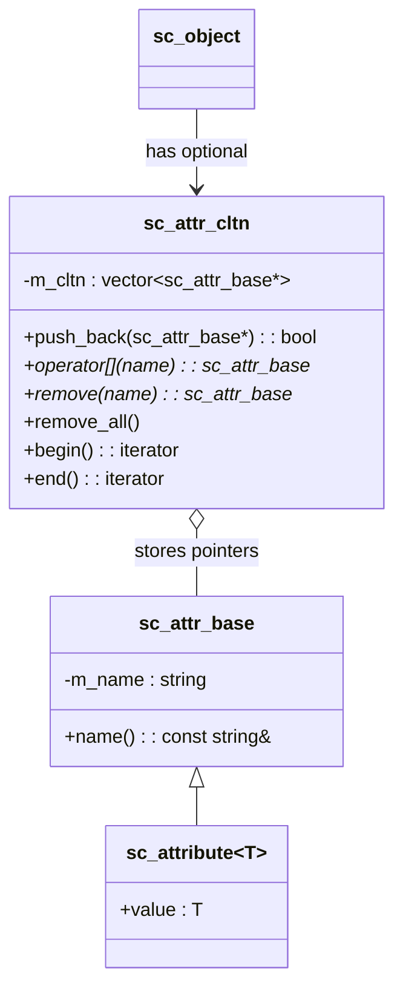

# sc_attribute -- 屬性類別系統

## 概觀

`sc_attribute` 提供了一個型別安全的鍵值對（key-value pair）系統，讓使用者可以在執行時期為任何 `sc_object` 附加額外的中繼資料（metadata）。

**生活比喻：** 想像你有一張學生證，上面印了基本資訊（姓名、學號）。但有時候你需要在學生證上貼上額外的標籤，例如「可以使用實驗室」、「已繳學費」。`sc_attribute` 就是這些可以動態貼上或撕下的標籤，每個標籤有名稱和值。

## 檔案角色

- **標頭檔 `sc_attribute.h`**：宣告 `sc_attr_base`、`sc_attr_cltn` 和模板類別 `sc_attribute<T>`。
- **實作檔 `sc_attribute.cpp`**：實作基礎類別和集合類別的方法。

## 類別階層



## `sc_attr_base` -- 屬性基礎類別

所有屬性的抽象基礎，只持有名稱：

```cpp
class sc_attr_base {
public:
    sc_attr_base( const std::string& name_ );
    sc_attr_base( const sc_attr_base& );
    virtual ~sc_attr_base();
    const std::string& name() const;
private:
    std::string m_name;
};
```

- 名稱在建構時設定，之後不可改變
- 禁用賦值運算子
- 解構子為虛擬（支援多型刪除）

## `sc_attribute<T>` -- 型別化屬性

模板類別，繼承自 `sc_attr_base`，攜帶一個型別為 `T` 的公開值：

```cpp
template <class T>
class sc_attribute : public sc_attr_base {
public:
    sc_attribute( const std::string& name_ );
    sc_attribute( const std::string& name_, const T& value_ );
    sc_attribute( const sc_attribute<T>& a );
    virtual ~sc_attribute();

    T value;  // public data member
};
```

**注意：** `value` 是公開成員，可以直接存取。這是有意為之的設計，簡化了使用方式：

```cpp
sc_attribute<int> priority("priority", 5);
obj.add_attribute(priority);
priority.value = 10;  // direct access
```

### `T` 的要求

`T` 必須有預設建構子和複製建構子。

## `sc_attr_cltn` -- 屬性集合

儲存指向屬性的指標向量，提供按名稱查找、插入和移除功能：

### 主要操作

| 操作 | 方法 | 說明 |
|------|------|------|
| 新增 | `push_back(attr*)` | 插入屬性（名稱必須唯一，重複回傳 `false`） |
| 查找 | `operator[](name)` | 按名稱查找，回傳指標或 `0` |
| 移除 | `remove(name)` | 按名稱移除，回傳指標或 `0` |
| 全部移除 | `remove_all()` | 清空集合 |
| 大小 | `size()` | 回傳屬性數量 |
| 迭代 | `begin()` / `end()` | STL 風格迭代器 |

### 唯一性檢查

`push_back()` 會遍歷整個集合檢查名稱是否已存在：

```cpp
bool sc_attr_cltn::push_back( sc_attr_base* attribute_ ) {
    if( attribute_ == 0 ) return false;
    for( int i = m_cltn.size() - 1; i >= 0; -- i ) {
        if( attribute_->name() == m_cltn[i]->name() ) {
            return false;  // duplicate name
        }
    }
    m_cltn.push_back( attribute_ );
    return true;
}
```

### 移除實作

使用「交換到最後再彈出」的技巧，避免大量元素搬移：

```cpp
sc_attr_base* sc_attr_cltn::remove( const std::string& name_ ) {
    for( int i = m_cltn.size() - 1; i >= 0; -- i ) {
        if( name_ == m_cltn[i]->name() ) {
            sc_attr_base* attribute = m_cltn[i];
            std::swap( m_cltn[i], m_cltn.back() );
            m_cltn.pop_back();
            return attribute;
        }
    }
    return 0;
}
```

## 與 `sc_object` 的整合

`sc_object` 透過以下方法使用屬性系統：

```cpp
bool add_attribute( sc_attr_base& );
sc_attr_base* get_attribute( const std::string& name_ );
sc_attr_base* remove_attribute( const std::string& name_ );
void remove_all_attributes();
int num_attributes() const;
sc_attr_cltn& attr_cltn();
```

屬性集合在 `sc_object` 中採用**延遲建立**：`m_attr_cltn_p` 初始為 `NULL`，只有在第一次使用時才動態分配。

## 設計考量

### 為何 `value` 是公開成員？

這是一個務實的設計選擇。屬性的主要用途是附加簡單的中繼資料，getter/setter 封裝在這裡只會增加不必要的程式碼複雜度。

### 為何集合不擁有屬性物件的所有權？

`sc_attr_cltn` 儲存指標但不負責刪除屬性物件。屬性的生命週期由使用者管理。`remove_all()` 只是清空指標向量，不會 `delete` 屬性物件。

### 線性查找的效能

按名稱查找使用線性掃描。由於屬性數量通常很少，這不是效能瓶頸。

## 相關檔案

- `sc_object.h/cpp` -- 基礎物件類別（持有屬性集合）
