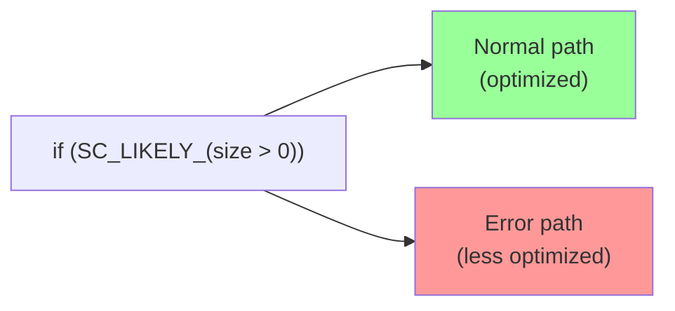

# sc_cmnhdr.h - 通用標頭檔（基礎定義）

## 概觀

`sc_cmnhdr.h` 是 SystemC 的「地基」標頭檔，被幾乎所有其他 SystemC 原始碼包含。它處理平台偵測、編譯器警告抑制、C++ 標準版本檢查、分支預測巨集、以及 DLL 匯出符號定義。

## 為什麼需要這個檔案？

想像你要在全世界不同的地方蓋房子（在不同的作業系統和編譯器上編譯）。每個地方的建築規範和材料規格都不同。`sc_cmnhdr.h` 就是那個「統一建築規範」，讓後續的程式碼不用擔心底層差異。

## 內容詳解

### 1. Windows 平台偵測

```cpp
#if defined(_WIN32) || defined(_MSC_VER) || defined(__BORLANDC__) || \
    defined(__MINGW32__)
    #if !defined(WIN32) && !defined(WIN64) && !defined(_WIN64)
    #define WIN32
    #endif
    #define _WIN32_WINNT 0x0400
    #define SC_HAS_WINDOWS_H_
#endif
```

確保在各種 Windows 編譯器下都定義 `WIN32`，並設定最低 Windows 版本為 NT 4.0（0x0400）。

`SC_HAS_WINDOWS_H_` 是延遲包含 `windows.h` 的機制——只有在需要時（定義了 `SC_INCLUDE_WINDOWS_H`），才真正 `#include <windows.h>`。這是因為 `windows.h` 是一個非常大的標頭檔，會顯著增加編譯時間。

### 2. MSVC 警告抑制

```cpp
#pragma warning(disable: 4231)  // extern template
#pragma warning(disable: 4355)  // 'this' used in initializer list
#pragma warning(disable: 4291)  // operator new warning
#pragma warning(disable: 4800)  // implicit bool conversion
#pragma warning(disable: 4146)  // unary minus on unsigned
#pragma warning(disable: 4521)  // multiple copy constructors
#pragma warning(disable: 4786)  // long identifiers in debug info
```

這些都是 Visual C++ 對合法但「可疑」程式碼的警告。SystemC 的設計決定這些情況是安全的。

### 3. 分支預測巨集

```cpp
#ifndef __GNUC__
#  define SC_LIKELY_(x)    !!(x)
#  define SC_UNLIKELY_(x)  !!(x)
#else
#  define SC_LIKELY_(x)    __builtin_expect(!!(x), 1)
#  define SC_UNLIKELY_(x)  __builtin_expect(!!(x), 0)
#endif
```

告訴 GCC 編譯器某個條件的預期結果，幫助 CPU 的分支預測器做出更好的決策：

- `SC_LIKELY_(x)`：x 通常為 true（例如正常路徑）
- `SC_UNLIKELY_(x)`：x 通常為 false（例如錯誤路徑）



在非 GCC 編譯器上，這些巨集退化為簡單的布林轉換 `!!(x)`。

### 4. C++ 標準版本檢查

```cpp
#define SC_CPLUSPLUS_BASE_ 201703L  // C++17

#if SC_CPLUSPLUS_AUTO_ < SC_CPLUSPLUS_BASE_
#  error **** SystemC requires C++17 ****
#endif
```

SystemC 3.x 要求至少 C++17。支援的版本：

| 值 | 標準 |
|----|------|
| `201703L` | C++17 (ISO/IEC 14882:2017) |
| `202002L` | C++20 (ISO/IEC 14882:2020) |
| `202302L` | C++23 (ISO/IEC 14882:2023) |

`SC_CPLUSPLUS` 巨集會自動偵測編譯器使用的 C++ 標準版本，也可以手動覆蓋（但不能高於編譯器實際支援的版本）。

`IEEE_1666_CPLUSPLUS` 巨集用於模型中查詢 SystemC 功能的可用性。

### 5. DLL 匯出控制

```cpp
#if defined(SC_WIN_DLL) && defined(_MSC_VER)
# if defined(SC_BUILD)
#   define SC_API  __declspec(dllexport)
# else
#   define SC_API  __declspec(dllimport)
# endif
#else
# define SC_API /* nothing */
#endif
```

在 Windows 上建置 DLL 時：
- **編譯函式庫時**（`SC_BUILD`）：`SC_API` = `dllexport`（匯出符號）
- **使用函式庫時**：`SC_API` = `dllimport`（匯入符號）
- **其他平台**：`SC_API` 為空（符號預設可見）

### 6. 標準函式庫包含

```cpp
#include <cassert>
#include <cstdio>
#include <cstdlib>
#include <vector>
```

這些是幾乎所有 SystemC 原始碼都需要的基本標準函式庫。

## Windows.h 的延遲包含

```cpp
// deliberately outside of include guards
#if defined(SC_HAS_WINDOWS_H_) && defined(SC_INCLUDE_WINDOWS_H)
#  undef SC_HAS_WINDOWS_H_
#  include <windows.h>
#endif
```

這段程式碼故意放在 include guard（`#endif // SC_CMNHDR_H`）**之外**，這樣每次 `#include "sc_cmnhdr.h"` 都會重新檢查是否需要包含 `windows.h`。只有在某個 `.cpp` 檔案先 `#define SC_INCLUDE_WINDOWS_H` 然後再包含 `sc_cmnhdr.h` 時，`windows.h` 才會被包含。

## 相關檔案

- `sc_macros.h` - 依賴此檔案的巨集定義
- `sc_ver.h` - 使用 `SC_CPLUSPLUS` 和 `SC_API`
- `sc_cor_fiber.h` - 使用 `SC_INCLUDE_WINDOWS_H` 來包含 `windows.h`
- 幾乎所有 SystemC 原始碼 - 直接或間接包含此檔案
