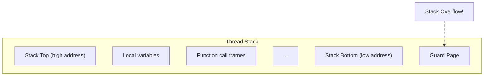

# sc_constants.h - 預設常數定義

## 概觀

`sc_constants.h` 定義了 SystemC 核心的預設常數值。這些值可能需要根據應用程式的需求進行調整。目前這個檔案非常精簡，只定義了少數幾個常數。

## 為什麼需要這個檔案？

就像蓋房子有「預設的天花板高度」一樣，SystemC 也有一些預設參數。例如，每個 `SC_THREAD` 需要一塊記憶體作為執行堆疊，這個堆疊的預設大小就定義在這裡。如果你的模擬有特殊需求（例如深度遞迴），可以調整這些值。

## 常數定義

### `SC_DEFAULT_STACK_SIZE`

```cpp
extern const int SC_DEFAULT_STACK_SIZE;
```

每個 `SC_THREAD` 和 `SC_CTHREAD` 的預設堆疊大小。實際值定義在 `sc_thread_process.cpp` 中。

- 在 IEEE 1666-2005 中已被標記為 deprecated
- 可以透過定義 `SC_OVERRIDE_DEFAULT_STACK_SIZE` 來覆蓋
- 也可以在 process 建立後用 `set_stack_size()` 個別調整

### `SC_MAX_NUM_DELTA_CYCLES`

```cpp
#ifdef DEBUG_SYSTEMC
const int SC_MAX_NUM_DELTA_CYCLES = 10000;
#endif
```

僅在除錯模式（`DEBUG_SYSTEMC`）下定義。限制一個時間步內的最大 delta cycle 數量，防止無限迴圈導致模擬器卡住。

| 參數 | 值 | 條件 | 說明 |
|------|------|------|------|
| `SC_DEFAULT_STACK_SIZE` | 平台相依 | 總是存在 | 執行緒預設堆疊大小 |
| `SC_MAX_NUM_DELTA_CYCLES` | 10000 | 僅 `DEBUG_SYSTEMC` | 最大 delta cycle 數 |

## 堆疊大小的重要性



堆疊太小會導致溢位（stack overflow），程式崩潰。堆疊太大會浪費記憶體。在有大量 `SC_THREAD` 的設計中（例如 NoC 模擬可能有數千個 process），堆疊大小對總記憶體用量影響很大。

## 相關檔案

- `sc_thread_process.cpp` - `SC_DEFAULT_STACK_SIZE` 的實際定義
- `sc_cor.h` - 協程建立時使用 `stack_size` 參數
- `sc_process_b.h` - `set_stack_size()` 方法
