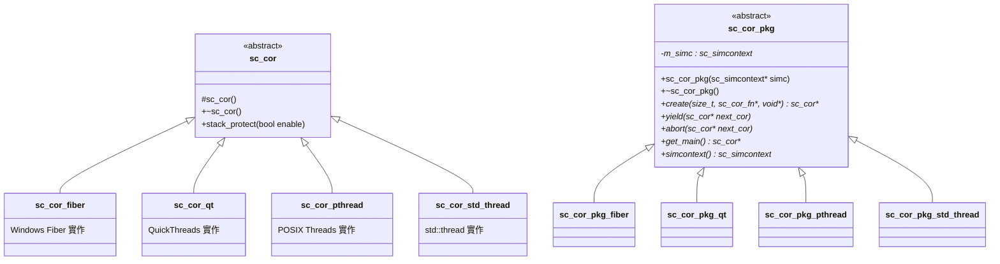

# sc_cor.h - Coroutine 抽象基底類別

## 概觀

`sc_cor.h` 定義了 SystemC 協程（coroutine）系統的抽象基底類別。這個檔案是整個協程機制的根基，所有平台特定的協程實作（Fiber、pthread、QuickThreads、std::thread）都必須繼承這些抽象類別。

## 為什麼需要這個檔案？

SystemC 模擬器需要同時執行多個「process」（例如多個硬體模組的行為），但實際上只有一個 CPU 執行緒在運作。協程就像是一群廚師共用一個廚房：每個廚師（process）輪流使用廚房（CPU），做到某個步驟就暫停，讓下一位廚師繼續。這個檔案定義了「廚師輪流規則」的介面。

## 核心概念

### 協程（Coroutine）是什麼？

想像你在看一本有很多角色的小說。你不是一次把所有角色的故事讀完，而是讀角色 A 幾段、切換到角色 B 幾段、再切換到角色 C。每次切換時，你會記住每個角色讀到哪裡了。協程就是這樣的機制：

- **普通函式**：從頭跑到尾，不能暫停
- **協程**：可以中途暫停，之後從暫停的地方繼續

### 設計模式：策略模式（Strategy Pattern）

這個檔案使用了經典的策略模式。`sc_cor` 和 `sc_cor_pkg` 定義了介面，具體的實作由子類別提供。這樣 SystemC 可以在不同作業系統上使用最適合的協程實作。

## 類別詳解

### `sc_cor_fn`

```cpp
typedef void (sc_cor_fn)( void* );
```

協程函式的型別定義。每個協程在被建立時，需要指定一個入口函式，這就像指定每位廚師要做的菜色。

### `sc_cor` - 協程抽象基底類別

| 成員 | 說明 |
|------|------|
| `sc_cor()` | 建構子（`protected`，只有子類別可以建立） |
| `~sc_cor()` | 虛擬解構子 |
| `stack_protect(bool enable)` | 開啟/關閉堆疊保護（類似安裝護欄防止記憶體溢位） |

這個類別非常簡潔，因為它只是一個「標籤」，標記某個東西是協程。真正的資料（堆疊指標、執行緒物件等）由子類別自行定義。

### `sc_cor_pkg` - 協程套件抽象基底類別

這是協程的「工廠」和「管理者」。它負責建立、切換和管理協程。

| 方法 | 說明 | 生活類比 |
|------|------|----------|
| `create(stack_size, fn, arg)` | 建立新協程 | 雇用一位新廚師，分配他的工作台空間 |
| `yield(next_cor)` | 讓出執行權給下一個協程 | 當前廚師暫停，換下一位廚師 |
| `abort(next_cor)` | 終止當前協程並切換 | 廚師離職，馬上換人 |
| `get_main()` | 取得主協程 | 找到廚房的主廚 |
| `simcontext()` | 取得模擬上下文 | 查看整個餐廳的運作狀態 |

## 類別關係圖



## 設計考量

### 為什麼禁用拷貝？

```cpp
sc_cor( const sc_cor& );
sc_cor& operator = ( const sc_cor& );
```

協程擁有自己的執行堆疊，拷貝一個協程就像試圖複製一個正在做菜的廚師——你無法複製他腦中正在想的步驟和手上正在切的菜。因此禁用拷貝是合理的設計。

### RTL 背景

在硬體描述語言（如 Verilog/VHDL）中，所有 `always` 區塊是「真正平行」執行的。但軟體模擬器只有一個 CPU，必須用協程來模擬這種平行性。每個 `SC_THREAD` 或 `SC_METHOD` 就對應一個協程。

## 相關檔案

- `sc_cor_fiber.h` / `.cpp` - Windows Fiber 實作
- `sc_cor_pthread.h` / `.cpp` - POSIX Thread 實作
- `sc_cor_qt.h` / `.cpp` - QuickThreads 實作
- `sc_cor_std_thread.h` / `.cpp` - C++ std::thread 實作
- `sc_simcontext.h` - 模擬上下文（持有 `sc_cor_pkg` 實例）
