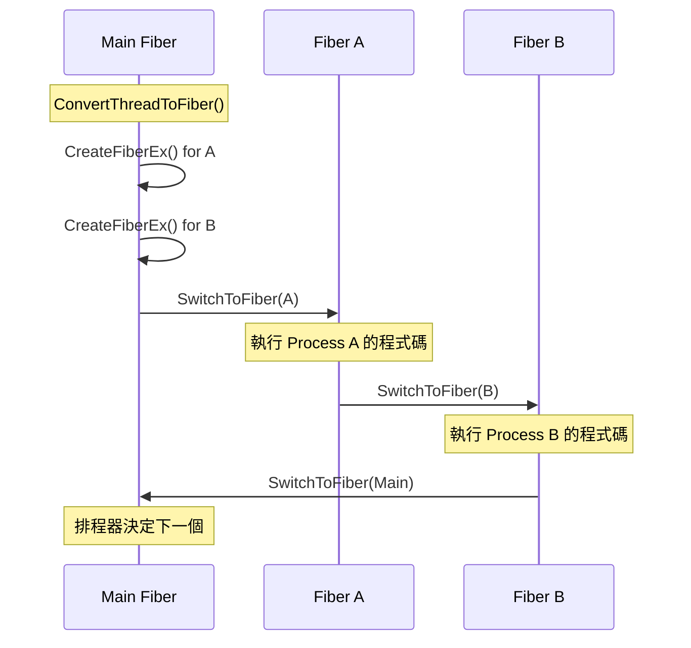

# sc_cor_fiber.h / .cpp - Windows Fiber 協程實作

## 概觀

`sc_cor_fiber` 是 SystemC 協程機制在 Windows 平台上的實作，使用 Windows API 的 **Fiber**（纖程）機制。這個實作僅在 Windows 環境（`_WIN32`、`WIN32`、`WIN64`）下編譯。

## 為什麼需要這個檔案？

Windows 作業系統不支援 QuickThreads（Unix 專用）和 POSIX Threads 的原生方式，所以需要用 Windows 自己提供的 Fiber API 來實現協程。Fiber 是 Windows 提供的一種輕量級「使用者模式」執行緒，由程式自己控制切換，不需要作業系統介入。

## 核心概念

### Windows Fiber 是什麼？

想像你有一台遊戲機（CPU），可以插不同的遊戲卡帶（Fiber）。每個卡帶都有自己的存檔（堆疊和暫存器狀態）。你隨時可以拔掉當前的卡帶、插入另一個卡帶，從上次的存檔繼續玩。

- **Thread（執行緒）**：由作業系統決定什麼時候換誰玩（搶占式）
- **Fiber（纖程）**：由程式自己決定什麼時候換誰玩（合作式）

SystemC 需要的正是合作式排程——process 只在明確呼叫 `wait()` 時才會暫停。

## 類別詳解

### `sc_cor_fiber` - 協程類別

| 成員 | 型別 | 說明 |
|------|------|------|
| `m_stack_size` | `std::size_t` | 堆疊大小 |
| `m_fiber` | `void*` | Windows Fiber 的控制代碼（handle） |
| `m_pkg` | `sc_cor_pkg_fiber*` | 指向建立此協程的套件 |
| `m_eh` | `SjLj_Function_Context` | GCC SJLJ 例外處理上下文（僅 GCC） |

### `sc_cor_pkg_fiber` - 協程套件類別

#### 建構流程

```
ConvertThreadToFiber(0)  -->  將主執行緒轉換為 Fiber
                              （這樣主執行緒也能參與 Fiber 切換）
```

如果主執行緒已經是 Fiber（別人先轉換了），就直接用 `GetCurrentFiber()` 取得。

#### 方法說明

| 方法 | 實作細節 |
|------|----------|
| `create()` | 呼叫 `CreateFiberEx()` 建立新 Fiber，初始堆疊大小為 `stack_size/2`，最大為 `stack_size` |
| `yield()` | 呼叫 `SwitchToFiber()` 切換到目標 Fiber |
| `abort()` | 同 `yield()`，但語意是放棄當前協程 |
| `get_main()` | 回傳 `&m_main_cor`（主協程） |

#### 解構流程

```
如果 m_fiber 不是空的:
    取得當前 Fiber
    如果不是當前 Fiber 且不是主協程:
        DeleteFiber(m_fiber)  -- 刪除 Fiber
```

注意不能刪除正在執行的 Fiber，也不能刪除主 Fiber（它是從 Thread 轉換來的）。

## Fiber 切換流程



## GCC SJLJ 例外處理

在 Windows 上使用 GCC 編譯時，如果使用 SJLJ（SetJmp/LongJmp）例外處理方式，切換 Fiber 時需要同步切換例外處理上下文。否則當 Fiber B 丟出例外時，可能會跳到 Fiber A 的 catch 區塊——這就像你在看 B 的故事時，角色 A 卻突然出現了。

```cpp
_Unwind_SjLj_Register(&curr_cor->m_eh);
_Unwind_SjLj_Unregister(&new_cor->m_eh);
```

## 平台條件編譯

```
#if defined(_WIN32) || defined(WIN32) || defined(WIN64)
    // 整個檔案的內容
#endif
```

這確保此實作只在 Windows 上編譯。

## 相關檔案

- `sc_cor.h` - 抽象基底類別定義
- `sc_cor_qt.h` - Unix/Linux 上的 QuickThreads 替代方案
- `sc_cor_pthread.h` - POSIX Threads 替代方案
- `sc_cor_std_thread.h` - C++ 標準執行緒替代方案
- `sc_simcontext.h` - 模擬上下文，管理協程套件
