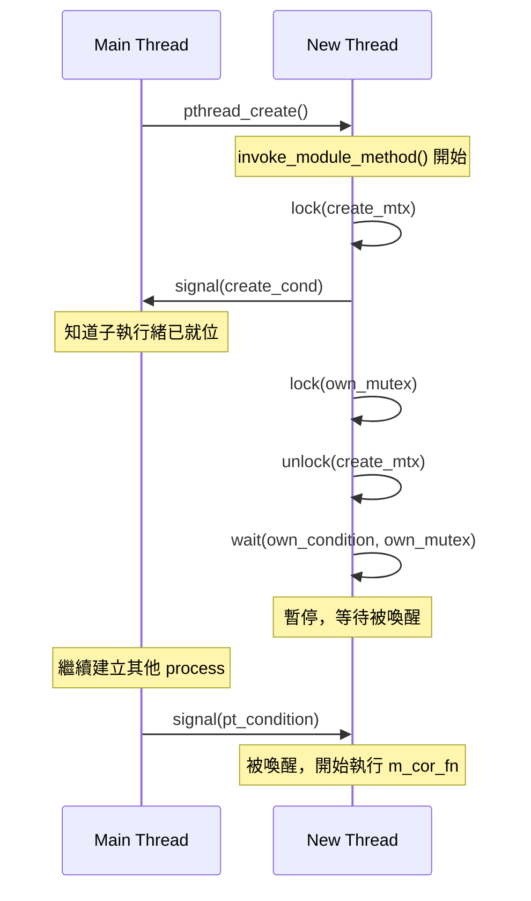
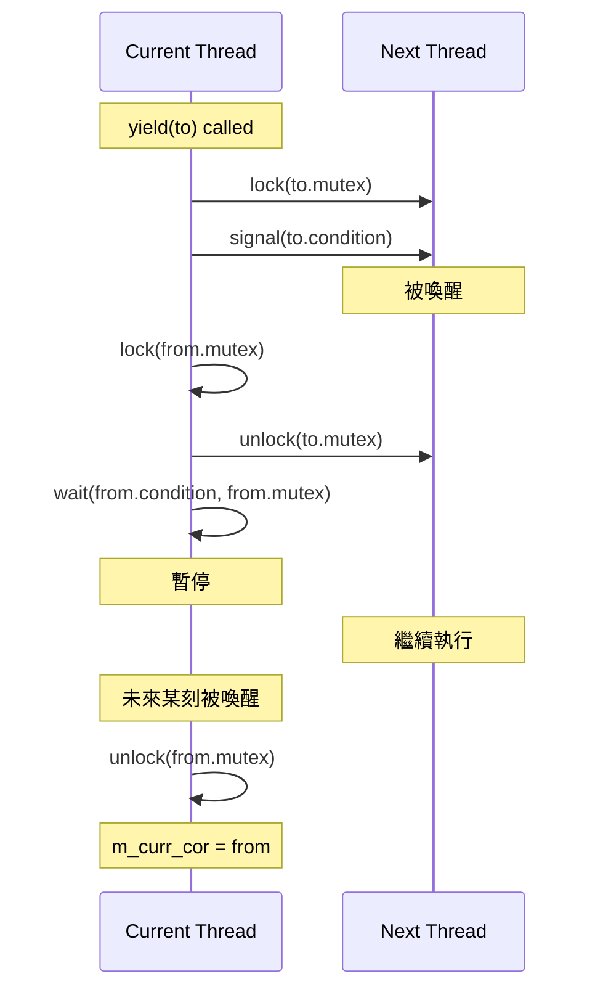
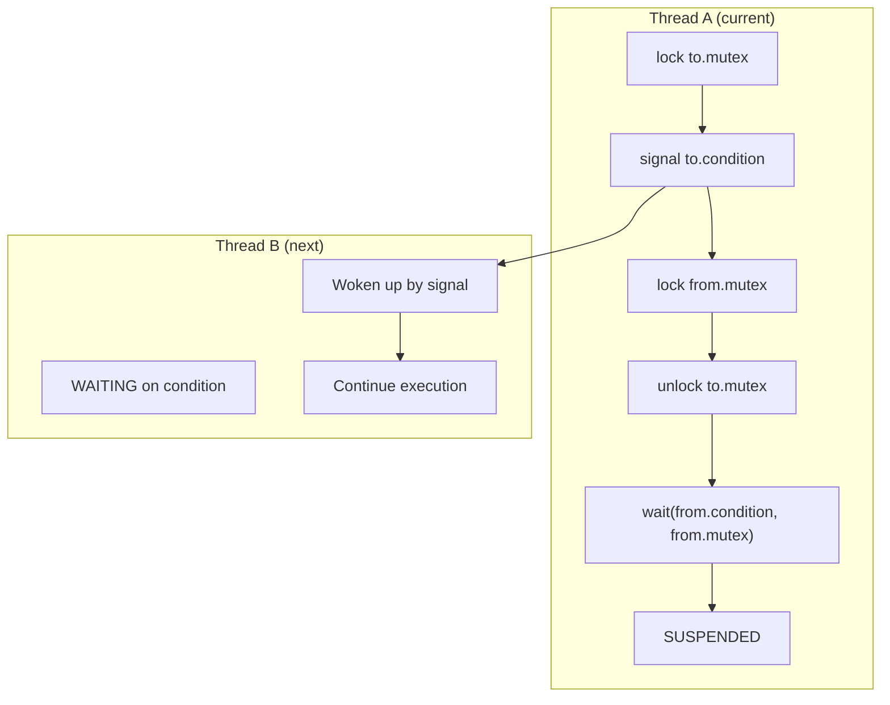

# sc_cor_pthread.h / .cpp - POSIX Threads 協程實作

## 概觀

`sc_cor_pthread` 使用 POSIX Threads (pthreads) 來實現 SystemC 的協程機制。這個實作在定義了 `SC_USE_PTHREADS` 且非 Windows 的平台上使用。雖然 pthreads 本身是搶占式的多執行緒機制，但這裡巧妙地用互斥鎖和條件變數將其轉換為合作式的協程。

## 為什麼需要這個檔案？

QuickThreads（預設的協程實作）直接操作 CPU 暫存器和堆疊，雖然效能很好，但在某些平台上可能不支援或不穩定。pthreads 是 POSIX 標準的一部分，幾乎所有 Unix-like 系統都支援，因此是一個可靠的備用方案。

## 核心概念

### 用 pthreads 模擬協程

想像你有一群學生（threads），但教室裡只有一張椅子（CPU 執行權）。每個學生都有自己的作業（process 邏輯），但一次只能有一個學生坐下來寫作業。規則是：

1. 只有坐在椅子上的學生才能寫作業
2. 學生寫到某個步驟時，必須主動站起來（unlock + signal）
3. 然後點名下一位學生坐下（wait）

這就是用「互斥鎖 + 條件變數」實現合作式排程的核心思路。

## 類別詳解

### `sc_cor_pthread` - 協程類別

| 成員 | 型別 | 說明 |
|------|------|------|
| `m_cor_fn` | `sc_cor_fn*` | 協程的入口函式 |
| `m_cor_fn_arg` | `void*` | 入口函式的參數 |
| `m_mutex` | `pthread_mutex_t` | 用於暫停此執行緒的互斥鎖 |
| `m_pkg_p` | `sc_cor_pkg_pthread*` | 所屬的協程套件 |
| `m_pt_condition` | `pthread_cond_t` | 等待喚醒的條件變數 |
| `m_thread` | `pthread_t` | 底層的 POSIX 執行緒 |

#### `invoke_module_method()` - 執行緒啟動回呼

這是 `pthread_create()` 實際執行的函式。它的流程非常關鍵：



### `sc_cor_pkg_pthread` - 協程套件類別

| 成員 | 說明 |
|------|------|
| `m_main_cor` | 主協程（代表模擬器的主執行緒） |
| `m_curr_cor` | 當前正在執行的協程 |
| `m_create_mtx` | 建立執行緒時的同步互斥鎖 |
| `m_create_cond` | 建立執行緒時的同步條件變數 |

#### `create()` - 建立新協程

```
1. 建立 sc_cor_pthread 物件
2. 設定 pthread 屬性（detached, stack_size）
3. 鎖住 m_create_mtx
4. 呼叫 pthread_create()（子執行緒開始跑）
5. 等待 m_create_cond（子執行緒就位訊號）
6. 子執行緒已暫停在 invoke_module_method 中
7. 解鎖 m_create_mtx，返回
```

#### `yield()` - 讓出執行權



重點：`yield()` 呼叫後，`from_p` 執行緒會停在 `pthread_cond_wait()`，直到其他執行緒對它 signal。

#### `abort()` - 終止並切換

與 `yield()` 不同，`abort()` 只喚醒目標執行緒，不等待自己被喚醒。因為呼叫 `abort()` 的協程已經要被銷毀了。

## 執行緒同步機制圖



## 設計考量

### 為什麼用 DETACHED 模式？

```cpp
pthread_attr_setdetachstate( &attr, PTHREAD_CREATE_DETACHED );
```

因為 SystemC 協程不需要被 `pthread_join()`。它們的生命週期由 SystemC 排程器管理，不需要其他執行緒等待它們結束。

### 效能代價

pthreads 方式比 QuickThreads 慢很多，因為：
- 每次切換需要 lock/unlock/signal/wait 多次系統呼叫
- 每個協程都是一個真正的 OS 執行緒，佔用更多記憶體
- 條件變數的喚醒可能涉及作業系統排程器

因此，pthreads 通常只在 QuickThreads 不可用時才使用。

## 平台條件編譯

```cpp
#if defined(SC_USE_PTHREADS)         // header
#if !defined(_WIN32) && !defined(WIN32) && defined(SC_USE_PTHREADS)  // source
```

需要明確定義 `SC_USE_PTHREADS` 才會啟用，且排除 Windows 平台。

## 相關檔案

- `sc_cor.h` - 抽象基底類別
- `sc_cor_qt.h` - QuickThreads 實作（預設，效能較好）
- `sc_cor_fiber.h` - Windows Fiber 實作
- `sc_cor_std_thread.h` - C++ std::thread 實作（現代替代方案）
- `sc_simcontext.h` - 模擬上下文
