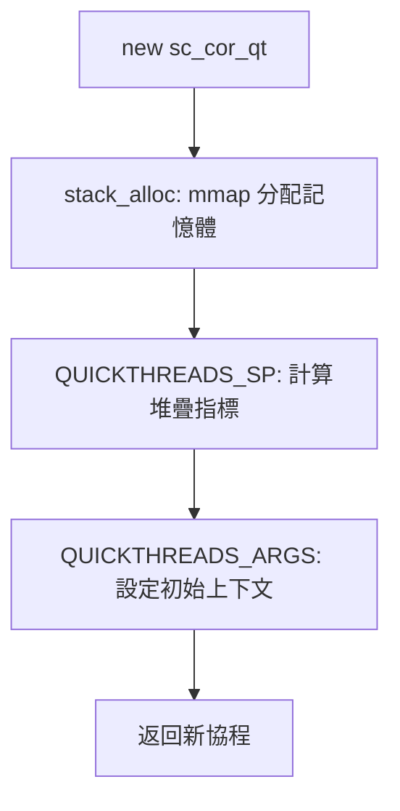
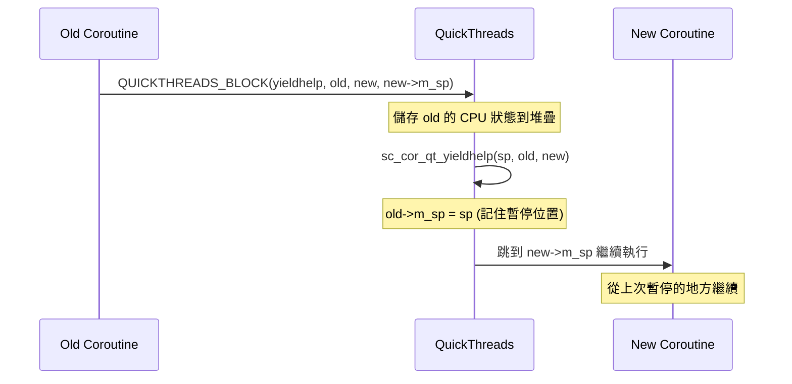

# sc_cor_qt.h / .cpp - QuickThreads 協程實作

## 概觀

`sc_cor_qt` 是 SystemC 在非 Windows 平台上的**預設**協程實作，使用 QuickThreads 函式庫。QuickThreads 是一個非常輕量的使用者空間執行緒切換函式庫，直接操作 CPU 暫存器和堆疊指標來實現極快的上下文切換。

## 為什麼需要這個檔案？

在所有協程實作中，QuickThreads 的效能最好。它不需要作業系統介入（不像 pthreads），也不需要特定平台 API（不像 Windows Fiber），而是直接用組合語言操作 CPU 來切換執行上下文。這就像換台時直接切換頻道，而不是先關電視再開電視。

## 啟用條件

```cpp
#if !defined(_WIN32) && !defined(WIN32) && !defined(WIN64) \
    && !defined(SC_USE_PTHREADS) && !defined(SC_USE_STD_THREADS)
```

也就是說：不是 Windows、沒有指定用 pthreads、也沒有指定用 std::threads 時，就用 QuickThreads。

## 核心概念

### QuickThreads 的原理

想像你有很多信封（協程），每個信封裡裝著一張書籤（堆疊指標 `m_sp`）。當你要切換到某個協程時：

1. 把當前的書籤放回信封（儲存 stack pointer）
2. 從目標信封拿出書籤（載入 stack pointer）
3. CPU 馬上從新書籤的位置繼續執行

整個過程只需要幾個 CPU 指令，遠快於 pthreads 的 mutex/condition 操作。

## 類別詳解

### `sc_cor_qt` - 協程類別

| 成員 | 型別 | 說明 |
|------|------|------|
| `m_stack_size` | `std::size_t` | 堆疊大小 |
| `m_stack` | `void*` | 堆疊記憶體起始位址 |
| `m_sp` | `qt_t*` | 堆疊指標（QuickThreads 格式） |
| `m_fake_stack` | `void*` | AddressSanitizer 使用的假堆疊 |
| `m_pkg` | `sc_cor_pkg_qt*` | 所屬的協程套件 |

#### `stack_protect()` - 堆疊保護

使用 `mprotect()` 系統呼叫在堆疊末端設置「紅色區域」（red zone）：

```
堆疊方向 (GROW_DOWN):
┌──────────────────┐ 高位址
│                  │
│   正常堆疊空間    │  PROT_READ | PROT_WRITE
│                  │
├──────────────────┤
│   Red Zone       │  PROT_NONE (不可讀寫)
│   (1 page)       │  ← 存取會觸發 SIGSEGV
└──────────────────┘ 低位址
```

這就像在懸崖邊裝護欄——如果程式的堆疊用量超過分配的空間，會立即產生錯誤信號，而不是悄悄覆蓋其他記憶體。

#### 解構子

```cpp
sc_cor_qt::~sc_cor_qt()
{
    if (this == m_pkg->get_main()) return;  // don't delete main stack
    if (m_stack) ::munmap(m_stack, m_stack_size);
    // cleanup fake stack for Asan
}
```

主協程的堆疊是主執行緒的堆疊，不能 `munmap`。其他協程的堆疊是用 `mmap` 分配的，需要手動釋放。

### `sc_cor_pkg_qt` - 協程套件類別

#### 記憶體分配：`stack_alloc()`

使用 `mmap` 分配對齊的堆疊記憶體：

```cpp
*buf = ::mmap(NULL, *stack_size,
              PROT_READ | PROT_WRITE,
              MAP_PRIVATE | MAP_ANON, -1, 0);
```

- `MAP_PRIVATE`：私有映射，不與其他 process 共享
- `MAP_ANON`：匿名映射，不對應檔案
- 堆疊大小會向上對齊到頁面大小的整數倍

#### `create()` - 建立新協程



`QUICKTHREADS_SP` 和 `QUICKTHREADS_ARGS` 是 QuickThreads 函式庫的巨集，負責在新堆疊上建立初始的呼叫框架。

#### `yield()` - 切換協程



#### `abort()` - 終止並切換

與 `yield()` 類似，但使用 `QUICKTHREADS_ABORT`。差別在於 abort 不期望回來，所以不需要完整儲存舊協程的狀態。

### 包裝函式：`sc_cor_qt_wrapper()`

```cpp
extern "C" void sc_cor_qt_wrapper(void* arg, void* cor, qt_userf_t* fn)
```

這是每個新協程第一次執行時的入口點。它：
1. 設定 `m_curr_cor` 為新協程
2. 呼叫使用者的協程函式 `fn(arg)`

## AddressSanitizer (Asan) 支援

程式碼包含了對 Asan 的支援，這是 Google 開發的記憶體錯誤檢測工具。因為協程切換涉及非標準的堆疊操作，Asan 需要被告知堆疊的切換：

```cpp
static void sanitizer_start_switch_fiber_weak(...)  // weak reference
static void sanitizer_finish_switch_fiber_weak(...)
```

使用 `__weakref__` 屬性，如果 Asan 沒有連結，這些函式指標就是 `nullptr`，不會影響正常執行。

## 效能比較

| 實作 | 切換方式 | 切換成本 | 記憶體開銷 |
|------|----------|----------|------------|
| **QuickThreads** | 直接操作堆疊指標 | 極低（幾個 CPU 指令） | 低（只需堆疊空間） |
| pthreads | mutex + condition | 高（多次系統呼叫） | 高（每個都是 OS 執行緒） |
| Fiber | Windows API 呼叫 | 中 | 中 |
| std::thread | mutex + condition | 高 | 高 |

## 相關檔案

- `sc_cor.h` - 抽象基底類別
- `sysc/packages/qt/qt.h` - QuickThreads 函式庫標頭
- `sc_cor_pthread.h` - pthreads 替代方案
- `sc_cor_fiber.h` - Windows Fiber 替代方案
- `sc_simcontext.h` - 模擬上下文
