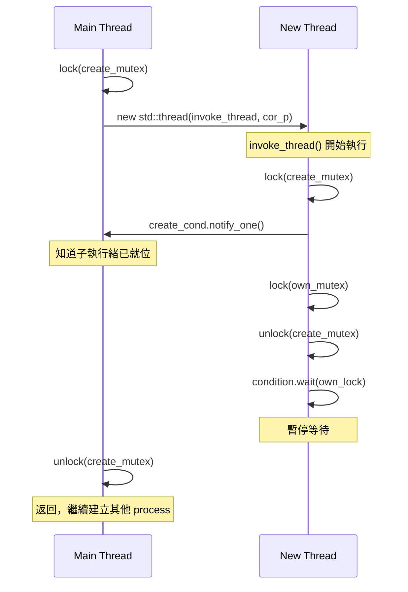
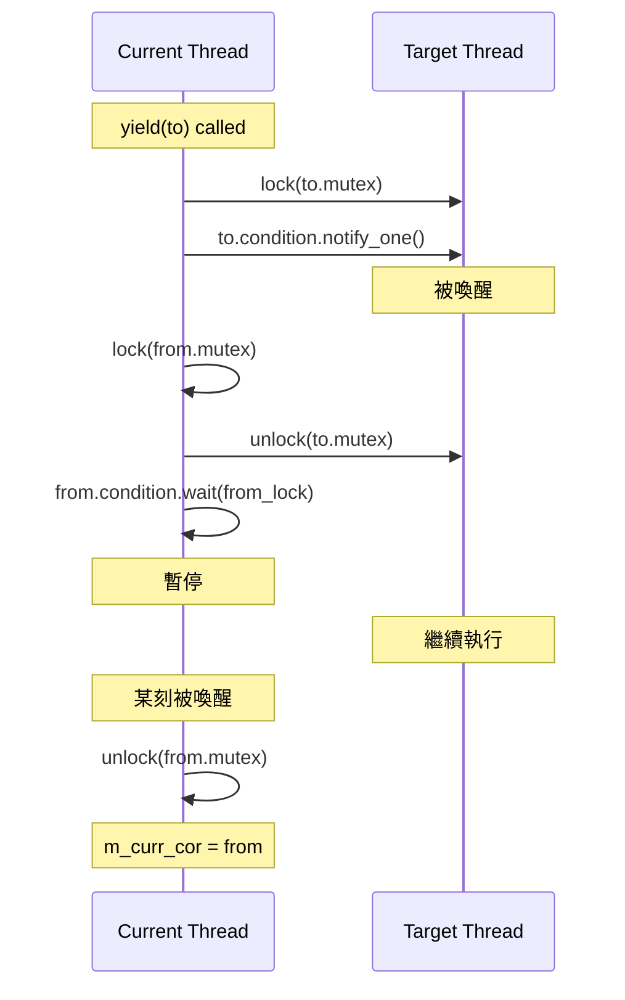

# sc_cor_std_thread.h / .cpp - C++ 標準執行緒協程實作

## 概觀

`sc_cor_std_thread` 使用 C++ 標準函式庫的 `std::thread`、`std::mutex`、`std::condition_variable` 來實現 SystemC 的協程機制。這是最新加入的實作（2025年），需要定義 `SC_USE_STD_THREADS` 才會啟用。

## 為什麼需要這個檔案？

隨著 C++ 標準的演進，`std::thread` 已成為跨平台多執行緒程式設計的標準方式。相比 pthreads（僅限 POSIX 系統），`std::thread` 可以在任何支援 C++11 以上的編譯器上運作，包括 Windows。這個實作提供了一個更現代、更可攜的替代方案。

## 與 pthread 版本的比較

這個實作在設計上幾乎是 `sc_cor_pthread` 的「現代 C++ 翻譯版」。核心邏輯相同，但使用 C++ 標準函式庫的同步原語取代 POSIX API：

| POSIX API | C++ 標準 | 用途 |
|-----------|----------|------|
| `pthread_t` | `std::thread` | 執行緒物件 |
| `pthread_mutex_t` | `std::mutex` | 互斥鎖 |
| `pthread_cond_t` | `std::condition_variable` | 條件變數 |
| `pthread_mutex_lock/unlock` | `std::unique_lock` | RAII 鎖管理 |
| `pthread_cond_wait` | `condition.wait(lock)` | 等待條件 |
| `pthread_cond_signal` | `condition.notify_one()` | 通知一個等待者 |

## 類別詳解

### `sc_cor_std_thread` - 協程類別

| 成員 | 型別 | 說明 |
|------|------|------|
| `m_cor_fn` | `sc_cor_fn*` | 協程入口函式 |
| `m_cor_fn_arg` | `void*` | 入口函式參數 |
| `m_condition` | `std::condition_variable` | 等待喚醒的條件變數 |
| `m_mutex` | `std::mutex` | 此執行緒的互斥鎖 |
| `m_pkg_p` | `sc_cor_pkg_std_thread*` | 所屬協程套件 |
| `m_thread_p` | `std::thread*` | 底層 C++ 執行緒物件 |

### `sc_cor_pkg_std_thread` - 協程套件類別

| 成員 | 說明 |
|------|------|
| `m_main_cor` | 主協程 |
| `m_curr_cor` | 當前執行中的協程 |
| `m_create_cond` | 執行緒建立同步用的條件變數 |
| `m_create_mutex` | 執行緒建立同步用的互斥鎖 |

## 協程生命週期

### 建立流程



### 切換流程 (`yield`)



### 終止流程 (`abort`)

```cpp
void sc_cor_pkg_std_thread::abort(sc_cor* next_cor_p) {
    std::unique_lock<std::mutex> to_lock(n_p->m_mutex);
    n_p->m_condition.notify_one();
    // unique_lock 離開作用域自動 unlock
}
```

`abort()` 比 `yield()` 簡單——只需要喚醒目標執行緒，不需要暫停自己（因為自己要被銷毀了）。

## 注意事項

### 堆疊大小被忽略

```cpp
// Notes:
//   (1) The stack information is currently ignored as the std::thread
//       package supplies an 8 MB stack by default.
```

`std::thread` 不像 pthreads 那樣容易控制堆疊大小，所以 `stack_size` 參數目前被忽略。每個 `std::thread` 預設有 8 MB 的堆疊空間。

### 解構子中的 detach

```cpp
sc_cor_std_thread::~sc_cor_std_thread() {
    m_thread_p->detach();
    delete m_thread_p;
}
```

在刪除 `std::thread` 物件之前必須 `detach()`（或 `join()`），否則程式會終止。這裡選擇 `detach()` 因為 SystemC 排程器自己管理協程的生命週期。

## RAII 風格的鎖管理

與 pthread 版本相比，std::thread 版本使用了 RAII（Resource Acquisition Is Initialization）風格的 `std::unique_lock`：

```cpp
// pthread 版本：手動管理
pthread_mutex_lock(&to_p->m_mutex);
pthread_cond_signal(&to_p->m_pt_condition);
pthread_mutex_lock(&from_p->m_mutex);
pthread_mutex_unlock(&to_p->m_mutex);
// 如果中間拋出例外，可能忘記 unlock

// std::thread 版本：RAII 自動管理
std::unique_lock<std::mutex> to_lock(to_p->m_mutex, std::defer_lock);
to_lock.lock();
to_p->m_condition.notify_one();
// to_lock 離開作用域自動 unlock
```

`std::defer_lock` 表示建立 lock 物件但不立即鎖定，之後手動呼叫 `lock()` 控制鎖定時機。

## 平台條件

```cpp
#if defined(SC_USE_STD_THREADS)                    // header
#if !defined(_WIN32) && !defined(WIN32) && defined(SC_USE_STD_THREADS)  // source
```

目前 `.cpp` 排除了 Windows，但 `.h` 沒有。這表示未來可能擴展到 Windows 平台。

## 相關檔案

- `sc_cor.h` - 抽象基底類別
- `sc_cor_pthread.h` - POSIX Threads 版本（設計非常類似）
- `sc_cor_qt.h` - QuickThreads 版本（預設，效能最好）
- `sc_cor_fiber.h` - Windows Fiber 版本
- `sc_simcontext.h` - 模擬上下文
