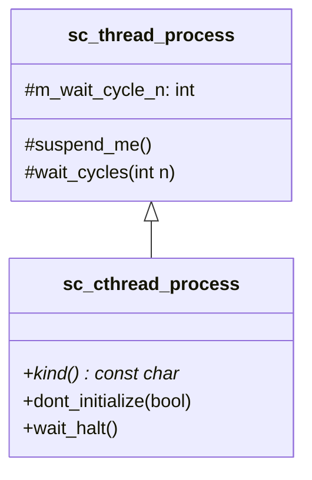
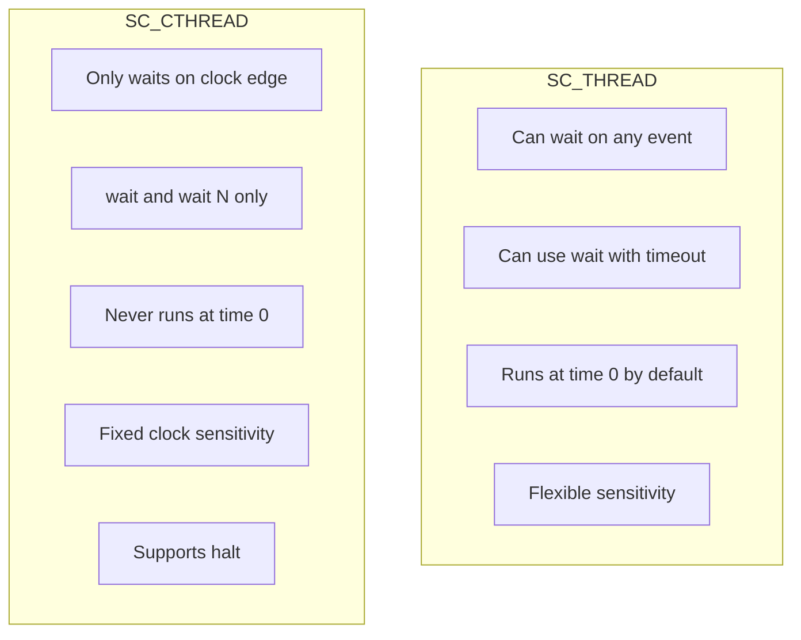

# sc_cthread_process -- Clocked Thread Process Implementation

## Overview

`sc_cthread_process.h` / `sc_cthread_process.cpp` implement `sc_cthread_process`, the class for `SC_CTHREAD` processes. A clocked thread is a specialized thread process that is sensitive to a single clock edge and supports the `halt()` function.

---

## Analogy: The Assembly Line Worker

Think of `SC_CTHREAD` as an **assembly line worker** who works in sync with a conveyor belt:

- The conveyor belt moves at a fixed pace (clock).
- Each time the belt advances one step (clock edge), the worker does one unit of work.
- The worker can say "I need 3 belt-steps to finish this" (`wait(3)`), and they simply stand idle for 3 beats.
- If the worker is done forever, they leave the line (`halt()`).
- The worker cannot respond to random events -- only the belt matters.

---

## Key Characteristics

| Feature | SC_CTHREAD |
|---------|------------|
| Inherits from | `sc_thread_process` |
| Sensitivity | Single clock edge only |
| `wait()` support | Only `wait()` and `wait(N)` recommended |
| `halt()` support | Yes -- permanently stops the process |
| `dont_initialize()` | Always true (does not run at time 0) |
| Dynamic sensitivity | Deprecated (use `SC_THREAD` instead) |

---

## Class Structure



The class is remarkably small because it reuses almost everything from `sc_thread_process`.

---

## Important Methods

### `wait_halt()` (inline)

This method permanently halts the clocked thread:

```cpp
inline void sc_cthread_process::wait_halt() {
    m_wait_cycle_n = 0;
    suspend_me();       // yield to kernel
    throw sc_halt();    // upon wake-up, throw halt exception
}
```

The mechanism:
1. Set wait cycles to 0 (so it can be woken up).
2. Suspend the coroutine.
3. When the kernel tries to run it again, throw `sc_halt()`.
4. The coroutine entry function (`sc_thread_cor_fn`) catches `sc_halt()` and terminates the process.

### `dont_initialize(bool)`

Overrides the base class to issue a warning. Clocked threads always skip initialization (they don't run at time 0), so calling `dont_initialize()` is redundant.

```cpp
void sc_cthread_process::dont_initialize(bool) {
    SC_REPORT_WARNING(SC_ID_DONT_INITIALIZE_, 0);
}
```

---

## Constructor

```cpp
sc_cthread_process::sc_cthread_process(
    const char* name_p, bool free_host,
    sc_entry_func method_p, sc_process_host* host_p,
    const sc_spawn_options* opt_p
) : sc_thread_process(name_p, free_host, method_p, host_p, opt_p)
{
    m_dont_init = true;         // never run at time 0
    m_process_kind = SC_CTHREAD_PROC_;
}
```

Key differences from `sc_thread_process`:
- `m_dont_init` is always `true`.
- `m_process_kind` is set to `SC_CTHREAD_PROC_` (overriding the thread's `SC_THREAD_PROC_`).

---

## Usage Pattern

```cpp
SC_MODULE(Counter) {
    sc_in_clk clk;
    sc_out<int> count;

    void counting() {
        count.write(0);       // reset value
        wait();               // wait for first clock edge
        while (true) {
            count.write(count.read() + 1);
            wait();           // wait for next clock edge
        }
    }

    SC_CTOR(Counter) {
        SC_CTHREAD(counting, clk.pos());
        // dont_initialize() is automatic
    }
};
```

---

## SC_CTHREAD vs SC_THREAD



### When to Use SC_CTHREAD

- Modeling **synchronous digital logic** that operates on a clock edge.
- When you want the synthesis tool to understand the clock boundary.
- For RTL-style code that maps directly to flip-flops.

### When to Use SC_THREAD Instead

- When you need to wait on multiple events (not just clock).
- When you need timeout-based waits.
- For testbench code that does not need synthesis.

---

## Deprecation Notes

The following features are **deprecated** for `SC_CTHREAD`:
- `wait(event)` -- use `SC_THREAD` instead.
- `wait(time)` -- use `SC_THREAD` instead.
- `wait(event_list)` -- use `SC_THREAD` instead.

Only `wait()` (single clock cycle) and `wait(N)` (N clock cycles) are recommended.

---

## Design Rationale

### RTL Background

In hardware design, a clocked thread directly corresponds to a **sequential always block**:

```verilog
always @(posedge clk) begin
    // This code runs once per clock edge
    count <= count + 1;
end
```

The `SC_CTHREAD` enforces this discipline by limiting sensitivity to a single clock edge. This makes the code more amenable to high-level synthesis (HLS) tools that need to understand clock boundaries.

### Why Inherit from sc_thread_process?

A clocked thread IS a thread with restrictions. By inheriting from `sc_thread_process`, it gets coroutine support, `wait()` mechanics, and all process control features for free. The specialization is minimal -- just forcing clock-only sensitivity and adding `halt()`.

---

## Related Files

- `sc_thread_process.h/.cpp` -- Parent class.
- `sc_process.h/.cpp` -- Base class `sc_process_b`.
- `sc_wait_cthread.h/.cpp` -- `halt()` and `wait(N)` free functions.
- `sc_except.h` -- `sc_halt` exception class.
- `sc_sensitive.h/.cpp` -- How clock sensitivity is set up.
