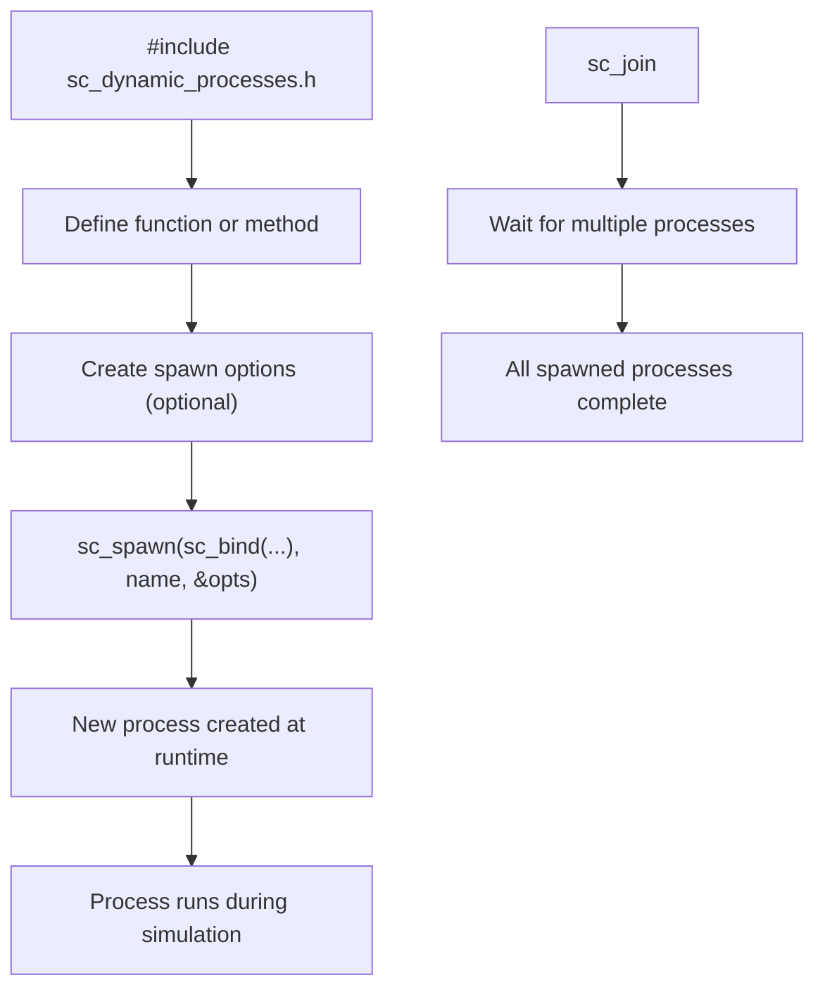

# sc_dynamic_processes.h - 動態 Process 套件定義

## 概觀

`sc_dynamic_processes.h` 是使用 SystemC 動態 process（執行時期建立的 process）所需的統一標頭檔。它匯入了 `sc_spawn`、`sc_join`、例外處理等功能，同時提供了 `sc_bind`、`sc_ref`、`sc_cref` 等 SystemC 版本的 std 函式包裝。

## 為什麼需要這個檔案？

在傳統的 SystemC 中，所有的 process（`SC_METHOD`、`SC_THREAD`、`SC_CTHREAD`）都必須在 elaboration 階段（模組建構時）靜態定義。但有時候你需要在模擬執行期間動態建立新的 process——例如模擬一個新的封包到達時產生的處理任務。

這就像餐廳在營業前（elaboration）安排好固定員工，但營業中（simulation running）可能需要臨時叫外送員（動態 process）。`sc_dynamic_processes.h` 提供了呼叫外送員所需的所有工具。

## 匯入的標頭檔

| 標頭檔 | 提供的功能 |
|--------|-----------|
| `sc_except.h` | `sc_unwind_exception` 等例外處理 |
| `sc_spawn.h` | `sc_spawn()` 函式和 `sc_spawn_options` |
| `sc_join.h` | `sc_join` 類別，用於等待多個 process 完成 |

## `sc_bind` / `sc_ref` / `sc_cref`

這些是 `std::bind`、`std::ref`、`std::cref` 的 SystemC 包裝。它們在 SystemC 命名空間中，方便與 `sc_spawn` 搭配使用。

### `sc_bind`

```cpp
template<typename F, typename... Args>
auto sc_bind(F&& f, Args&&... args)
 -> decltype(std::bind(std::forward<F>(f), std::forward<Args>(args)...))
```

將函式和參數綁定在一起，產生一個可呼叫物件。常用於 `sc_spawn()`：

```cpp
// spawn a thread that calls obj.method(42)
sc_spawn(sc_bind(&MyClass::method, &obj, 42));
```

### `sc_ref` / `sc_cref`

```cpp
template<typename T>
auto sc_ref(T&& v) noexcept { return std::ref(std::forward<T>(v)); }

template<typename T>
void sc_ref(const T&&) = delete;  // prevent binding to temporaries
```

傳遞參考而非複製，在 `sc_bind` 中使用：

```cpp
int result;
sc_spawn(sc_bind(&compute, sc_ref(result)));
// result will be modified by the spawned process
```

注意：`sc_ref(const T&&)` 被刪除（`= delete`），防止綁定到臨時物件（dangling reference）。

## Placeholder 命名空間

```cpp
namespace sc_unnamed {
    using namespace std::placeholders;
}
```

匯入 `_1`、`_2` 等佔位符到 `sc_unnamed` 命名空間，用於部分綁定：

```cpp
using namespace sc_unnamed;
sc_spawn(sc_bind(&MyClass::method, &obj, _1), "name", &opts);
```

## 動態 Process 使用流程



## 全域 using 宣告

```cpp
using sc_core::sc_bind;
using sc_core::sc_ref;
using sc_core::sc_cref;
```

這些函式被提升到全域命名空間，使用者不需要寫 `sc_core::sc_bind`。

## 相關檔案

- `sc_spawn.h` - `sc_spawn()` 和 `sc_spawn_options` 的定義
- `sc_join.h` - `sc_join` 類別
- `sc_except.h` - 例外處理機制
- `sc_process_b.h` - process 基底類別
- `sc_simcontext.h` - process 的建立和管理
