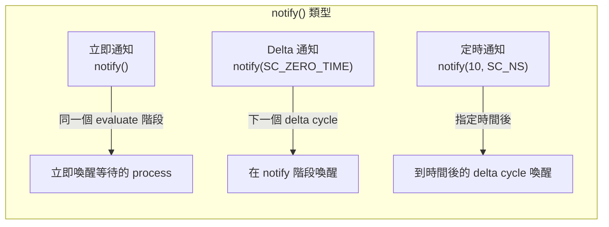
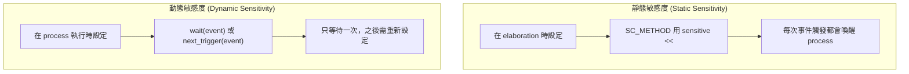
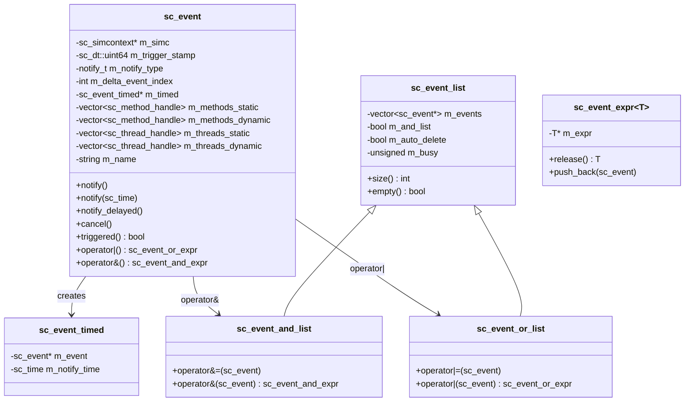
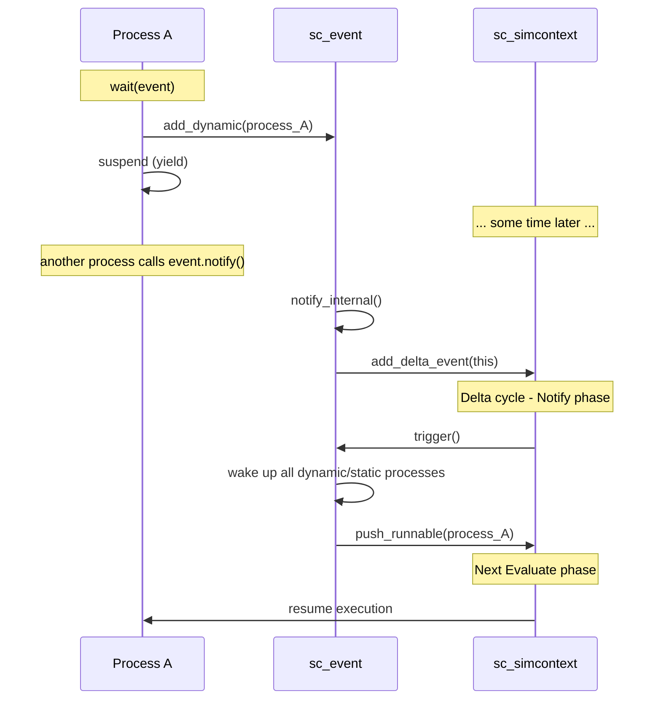

# sc_event -- SystemC 模擬中的通知信號

## 概述

`sc_event` 是 SystemC 中 process 間同步的核心機制。在硬體模擬中，process 需要一種方式來「等待某件事發生」然後「被喚醒」。`sc_event` 就是這個「某件事」的抽象，它可以被觸發（notify），也可以被等待（wait）。

本檔案還定義了事件列表（`sc_event_list`、`sc_event_and_list`、`sc_event_or_list`）和事件表達式（`sc_event_expr`），讓使用者可以組合多個事件進行等待。

**原始碼位置：**
- 標頭檔：`ref/systemc/src/sysc/kernel/sc_event.h`
- 實作檔：`ref/systemc/src/sysc/kernel/sc_event.cpp`

---

## 日常生活類比

把 `sc_event` 想成**手機的通知系統**：

| 手機通知 | sc_event |
|---------|---------|
| 你在等一則重要訊息 | `wait(my_event)` |
| 訊息到達時手機響鈴 | `my_event.notify()` |
| 設定鬧鐘在 10 分鐘後響 | `my_event.notify(10, SC_NS)` |
| 「收到 A 或 B 任一訊息就提醒我」 | `wait(event_a \| event_b)` |
| 「A 和 B 都收到才提醒我」 | `wait(event_a & event_b)` |
| 取消鬧鐘 | `my_event.cancel()` |
| 檢查剛才是不是有通知 | `my_event.triggered()` |
| 永遠不會響的通知 | `sc_event::none()` |

---

## 核心概念

### 通知的三種方式



1. **立即通知** `notify()`：在當前 evaluate 階段立即觸發。等待此事件的 process 會在本次 evaluate 階段被執行。
2. **Delta 通知** `notify(SC_ZERO_TIME)`：在下一個 delta cycle 的 notify 階段觸發。
3. **定時通知** `notify(10, SC_NS)`：在指定時間後觸發。

### 靜態敏感度 vs 動態敏感度



---

## 類別架構



---

## sc_event 類別詳解

### 建構與命名

```cpp
sc_event();                       // unnamed event
explicit sc_event(const char* name);  // named event
```

命名事件會在物件階層中註冊，可以透過 `sc_find_event()` 找到。匿名事件則不會。

### 通知方法

#### notify() -- 立即/延遲/定時通知

```cpp
void notify();                      // immediate
void notify(const sc_time&);        // timed (or delta if SC_ZERO_TIME)
void notify(double, sc_time_unit);  // convenience overload
```

**內部實作 `notify_internal()`**：

```cpp
void sc_event::notify_internal(const sc_time& t) {
    if (t == SC_ZERO_TIME) {
        // Delta notification: add to delta events list
        m_delta_event_index = m_simc->add_delta_event(this);
        m_notify_type = DELTA;
    } else {
        // Timed notification: add to timed events priority queue
        sc_event_timed* et = new sc_event_timed(this, m_simc->time_stamp() + t);
        m_simc->add_timed_event(et);
        m_timed = et;
        m_notify_type = TIMED;
    }
}
```

#### notify_delayed() -- 保證延遲通知

```cpp
void notify_delayed();                      // next delta
void notify_delayed(const sc_time&);        // at least specified time
void notify_delayed(double, sc_time_unit);  // convenience overload
```

`notify_delayed()` 與 `notify()` 的差異：
- `notify()` 如果已有更早的通知，會覆蓋或忽略
- `notify_delayed()` 如果已有任何待處理的通知，會報錯

#### cancel()

取消目前待處理的通知（delta 或 timed），不影響立即通知。

### 觸發查詢

```cpp
bool triggered() const;
```

回傳此事件是否在**目前 delta cycle** 被觸發。內部透過比較 `m_trigger_stamp` 與模擬器的 `change_stamp` 實現。

### 靜態空事件

```cpp
static const sc_event& none();
```

回傳一個永遠不會被觸發的事件。用於需要事件參考但實際上不想等待任何事件的場合。

### 敏感度管理

```cpp
// internal methods for registering process sensitivity
void add_static(sc_method_handle) const;
void add_static(sc_thread_handle) const;
void add_dynamic(sc_method_handle) const;
void add_dynamic(sc_thread_handle) const;
```

每個事件維護四個列表，分別記錄靜態和動態敏感的 method 與 thread process。

---

## 事件表達式系統

### sc_event_expr -- 表達式樣板

```cpp
template<typename T>
class sc_event_expr {
    mutable T* m_expr;
public:
    void push_back(const sc_event& e) const;
    T const& release() const;
    operator T const&() const;
};
```

這是一個利用**移動語意**的輕量包裝器。當你寫 `event_a | event_b | event_c` 時，每個 `|` 運算子都會建立一個 `sc_event_expr`，不斷累積事件到列表中。最後在 `wait()` 中被消費。

### sc_event_list -- 事件列表基底類別

```cpp
class sc_event_list {
    std::vector<const sc_event*> m_events;  // events in the list
    bool m_and_list;                         // AND or OR list?
    bool m_auto_delete;                      // auto-delete when done?
    mutable unsigned m_busy;                 // reference count
};
```

**`m_busy` 計數**：當事件列表正在被 process 使用時（等待中），`m_busy > 0`，此時不允許修改列表。

**`m_auto_delete`**：由表達式建立的暫時列表會在使用完後自動刪除。

### sc_event_and_list -- AND 組合

```cpp
wait(event_a & event_b & event_c);  // wait until ALL events triggered
```

所有事件都必須被觸發，process 才會被喚醒。

### sc_event_or_list -- OR 組合

```cpp
wait(event_a | event_b | event_c);  // wait until ANY event triggered
```

任一事件被觸發，process 就會被喚醒。

---

## sc_event_timed -- 定時通知的包裝

```cpp
class sc_event_timed {
    sc_event* m_event;       // which event
    sc_time   m_notify_time; // absolute notify time
};
```

當事件需要定時通知時，會建立一個 `sc_event_timed` 物件並加入模擬器的定時事件優先佇列。它使用自訂的記憶體管理（`allocate()`/`deallocate()`）來提升效能。

定時事件的比較函式：

```cpp
int sc_notify_time_compare(const void* p1, const void* p2) {
    // earlier time = higher priority (returns 1)
    if (t1 < t2) return 1;
    else if (t1 > t2) return -1;
    else return 0;
}
```

---

## 事件觸發的完整流程



---

## 設計原理

### 為什麼事件不能被複製？

```cpp
private:
    sc_event(const sc_event&);              // disabled
    sc_event& operator=(const sc_event&);   // disabled
```

事件代表一個獨特的同步點。如果可以複製，就會出現「兩個事件指向同一組等待者」的混亂情況。這類似於 C++ 中的 mutex 不能被複製。

### 立即通知的語意

`notify()` 不帶參數時是立即通知。這意味著在同一個 evaluate 階段，如果有 process 正在等待此事件，它們會立即被排入可執行佇列。這模擬了硬體中「組合邏輯」的即時傳播行為。

### notify vs notify_delayed

`notify()` 遵循「最近通知勝出」的規則：
- 立即通知 > delta 通知 > 定時通知
- 新的通知如果比現有的更早，會取消現有的

`notify_delayed()` 則更嚴格：如果已經有待處理的通知就報錯。這適用於需要保證通知語意不被意外覆蓋的場合。

### RTL 背景

在 Verilog 中，事件的概念是隱式的：

```verilog
always @(posedge clk)  // equivalent to: sensitive to clock's posedge event
    q <= d;

@(negedge reset);      // equivalent to: wait(reset_negedge_event)
```

SystemC 將這些隱式概念顯式化為 `sc_event` 物件，提供更大的彈性但也需要更多明確的程式碼。

---

## 使用範例

```cpp
// declare an event
sc_event data_ready;

// SC_THREAD process
void producer() {
    while (true) {
        // produce data
        data_ready.notify();  // immediate notification
        wait(10, SC_NS);
    }
}

// SC_METHOD process, static sensitivity
void consumer() {
    // process data
    // (will be called again when data_ready fires)
}
// in constructor: sensitive << data_ready;

// OR/AND combinations
void complex_waiter() {
    wait(event_a | event_b);   // wake on either
    wait(event_a & event_b);   // wake when both triggered
}
```

---

## 相關檔案

| 檔案 | 說明 |
|------|------|
| `sc_simcontext.h/cpp` | 管理 delta events 和 timed events 佇列 |
| `sc_time.h/cpp` | 定時通知需要 `sc_time` |
| `sc_process.h` | Process 基底類別，包含敏感度列表 |
| `sc_method_process.h/cpp` | SC_METHOD 的觸發邏輯 |
| `sc_thread_process.h/cpp` | SC_THREAD 的等待/喚醒邏輯 |
| `sc_wait.h` | `wait()` 和 `next_trigger()` 函式 |
| `sc_clock.h/cpp` | 時鐘使用事件來通知正緣/負緣 |
| `sc_signal.h` | 信號值變更時觸發事件 |
| `sc_kernel_ids.h` | 定義事件相關的錯誤 ID |
