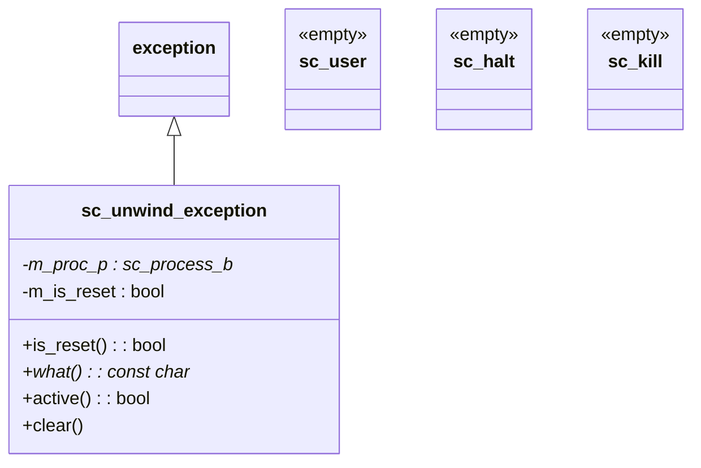

# sc_except -- SystemC 例外處理類別

## 概觀

`sc_except` 定義了 SystemC 核心使用的例外類別，用於實作行程的終止（kill）和重置（reset）機制。這些例外類別不是給使用者直接拋出的，而是 SystemC 核心內部用來控制行程執行流程的工具。

**生活比喻：** 想像一個工廠的生產線。正常情況下工人按照流程操作。但有時候需要：
- **停機檢修**（`sc_halt`）：讓生產線暫停
- **緊急停工**（`sc_kill`）：立即停止生產線
- **重啟生產線**（`sc_unwind_exception` with reset）：清空目前的半成品，從頭開始

這些「例外情況」不是錯誤，而是有意為之的控制指令。SystemC 用 C++ 的例外機制來實現這種「中斷目前工作、展開堆疊、回到起點」的效果。

## 檔案角色

- **標頭檔 `sc_except.h`**：宣告 `sc_user`、`sc_halt`、`sc_kill` 和 `sc_unwind_exception` 類別。
- **實作檔 `sc_except.cpp`**：實作 `sc_unwind_exception` 的方法和全域例外處理函數 `sc_handle_exception()`。

## 類別總覽



## 簡單例外類別

### `sc_user`

```cpp
class sc_user { /* EMPTY */ };
```

空的標記類別，用於使用者定義的例外情境。

### `sc_halt`

```cpp
class sc_halt { /* EMPTY */ };
```

用於暫停行程執行。當 `SC_CTHREAD` 呼叫 `halt()` 時，核心會拋出這個例外來停止行程。

### `sc_kill`

```cpp
class sc_kill { /* EMPTY */ };
```

用於終止行程。這是一個內部標記類別。

這三個類別都是**有意為空**的。它們存在的意義不是攜帶資料，而是作為 C++ 例外機制中的「型別標記」，讓 `catch` 區塊能根據型別區分不同的控制流情境。

## `sc_unwind_exception` -- 堆疊展開例外

這是最重要的例外類別，繼承自 `std::exception`，用於實作行程的 kill 和 reset 操作。

### 成員

| 成員 | 說明 |
|------|------|
| `m_proc_p` | 目標行程指標（`mutable`，支援 move 語意） |
| `m_is_reset` | `true` 表示重置、`false` 表示終止 |

### 關鍵方法

#### 建構子

```cpp
sc_unwind_exception::sc_unwind_exception(
    sc_process_b* proc_p, bool is_reset)
  : m_proc_p(proc_p), m_is_reset(is_reset)
{
    sc_assert( m_proc_p );
    m_proc_p->start_unwinding();
}
```

建構時立即將行程標記為「正在展開」。

#### 複製建構子（Move 語意）

```cpp
sc_unwind_exception::sc_unwind_exception(
    const sc_unwind_exception& that)
  : std::exception(that)
  , m_proc_p(that.m_proc_p)
  , m_is_reset(that.m_is_reset)
{
    that.m_proc_p = 0;  // move to new instance
}
```

雖然宣告為複製建構子，但實際上實作了 move 語意 -- 將 `m_proc_p` 從舊實例轉移到新實例。這是因為 C++ 例外在傳播時可能被複製，但只有一個實例應該持有行程指標。

#### `what()`

```cpp
const char* sc_unwind_exception::what() const noexcept {
    return ( m_is_reset ) ? "RESET" : "KILL";
}
```

回傳 `"RESET"` 或 `"KILL"`，供偵錯使用。

#### `is_reset()`

```cpp
virtual bool is_reset() const { return m_is_reset; }
```

讓使用者程式碼在 `catch` 區塊中判斷是重置還是終止。

#### `active()` 與 `clear()`

```cpp
bool sc_unwind_exception::active() const {
    return m_proc_p && m_proc_p->is_unwinding();
}

void sc_unwind_exception::clear() const {
    sc_assert( m_proc_p );
    m_proc_p->clear_unwinding();
}
```

這兩個方法供核心內部使用，用於查詢和清除行程的展開狀態。

#### 解構子

```cpp
sc_unwind_exception::~sc_unwind_exception() noexcept {
    if( active() ) {
        SC_REPORT_FATAL( SC_ID_RETHROW_UNWINDING_, m_proc_p->name() );
        sc_abort();
    }
}
```

**關鍵安全檢查：** 如果例外被解構時行程仍在展開狀態，表示使用者程式碼捕獲了例外但沒有重新拋出，這是致命錯誤。因為堆疊展開必須完整進行，中途攔截會導致系統狀態不一致。

## 展開流程

```mermaid
sequenceDiagram
    participant Kernel as SystemC Kernel
    participant Thread as SC_THREAD
    participant UE as sc_unwind_exception

    Kernel->>UE: throw sc_unwind_exception(proc, is_reset)
    UE->>Thread: start_unwinding()
    Note over Thread: Stack unwinding begins...
    Thread-->>Thread: Local objects destroyed

    alt User catches and re-throws
        Thread->>Thread: catch(sc_unwind_exception& e)
        Thread->>Thread: cleanup...
        Thread->>Thread: throw; (re-throw)
    else User catches and swallows (BUG!)
        Thread->>UE: ~sc_unwind_exception()
        UE->>UE: FATAL ERROR! active() == true
    end

    Kernel->>UE: catch & clear()
    UE->>Thread: clear_unwinding()
```

## `sc_handle_exception()` -- 全域例外處理

```cpp
sc_report* sc_handle_exception() {
    try {
        try { throw; }  // re-throw current exception
        catch( sc_report & ) { throw; }
        catch( sc_unwind_exception const & ) {
            SC_REPORT_ERROR(..., "unhandled kill/reset");
        }
        catch( std::exception const & x ) {
            SC_REPORT_ERROR(..., x.what());
        }
        catch( char const * x ) {
            SC_REPORT_ERROR(..., x);
        }
        catch( ... ) {
            SC_REPORT_ERROR(..., "UNKNOWN EXCEPTION");
        }
    }
    catch( sc_report & rpt ) {
        sc_report* rpt_p = new sc_report;
        rpt_p->swap( rpt );
        return rpt_p;
    }
    return 0;
}
```

這個函數將任何未捕獲的例外轉換為 `sc_report` 物件。它使用了「雙層 try-catch」技巧：

1. 外層重新拋出當前例外
2. 內層按型別分類處理，將所有非 `sc_report` 的例外轉換為 `SC_REPORT_ERROR`
3. 最外層捕獲（現在一定是 `sc_report`），動態分配並回傳

## 設計考量

### 為何用例外而非旗標來實作 reset/kill？

C++ 的例外機制自動處理堆疊展開（stack unwinding），確保所有區域變數的解構子被呼叫。如果只用旗標，行程函數需要手動檢查旗標並清理資源，容易出錯。

### 為何不允許吞掉 `sc_unwind_exception`？

堆疊展開必須完整進行到核心控制點。如果使用者程式碼捕獲了展開例外但沒有重新拋出，行程會處於不一致的狀態 -- 核心認為行程在展開，但行程卻繼續正常執行。

### 為何複製建構子實作 move 語意？

在 C++11 之前的程式碼（SystemC 歷史悠久）中，例外物件在傳播時只能被複製。透過在複製建構子中將原始實例的指標清零，實現了所有權的轉移。

## 相關檔案

- `sc_process.h` -- 行程基礎類別（`start_unwinding`/`clear_unwinding`/`is_unwinding`）
- `sc_thread_process.h` -- 執行緒行程（例外拋出和捕獲的主要場景）
- `sc_method_process.h` -- 方法行程
- `sc_simcontext.h` -- 模擬環境上下文（呼叫 `sc_handle_exception`）
- `sc_report.h` -- 報告系統
