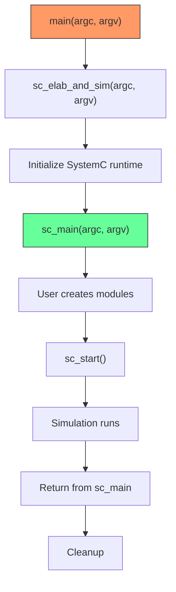

# sc_externs.h - 全域函式宣告

## 概觀

`sc_externs.h` 宣告了 SystemC 程式的全域入口點和命令列參數存取函式。最重要的是 `sc_main()`，這是每個 SystemC 程式的起點。

## 為什麼需要這個檔案？

每個 C/C++ 程式都有一個 `main()` 函式作為入口點。SystemC 把 `main()` 藏起來了——它在 SystemC 函式庫內部處理初始化工作，然後呼叫使用者定義的 `sc_main()`。這個檔案宣告了這些全域函式的介面。

這就像你去參加活動：主辦方（SystemC 函式庫）負責場地佈置和簽到（初始化），然後把麥克風交給你（呼叫 `sc_main()`）讓你做報告。

## 函式宣告

### `sc_main()`

```cpp
extern "C" int sc_main(int argc, char* argv[]);
```

使用者必須定義的函式，SystemC 程式的真正入口點。

- `extern "C"` 表示使用 C 語言的命名規則，避免 C++ 名稱修飾（name mangling）
- 參數與 `main()` 相同：`argc` 是參數數量，`argv` 是參數陣列
- 回傳 0 表示成功，非 0 表示錯誤

### `sc_elab_and_sim()`

```cpp
extern "C" int sc_elab_and_sim(int argc, char* argv[]);
```

SystemC 的核心啟動函式，負責：
1. 初始化模擬環境
2. 呼叫 `sc_main()`
3. 清理資源

### `sc_argc()` / `sc_argv()`

```cpp
extern "C" int sc_argc();
extern "C" const char* const* sc_argv();
```

在 `sc_main()` 之外存取命令列參數的方式。例如在模組建構子中可能需要讀取命令列參數。

## 程式啟動流程



注意：實際的 `main()` 定義在 SystemC 函式庫中（通常在 `sc_main_main.cpp`），使用者不需要也不應該定義 `main()`。

## `extern "C"` 的用途

使用 `extern "C"` 是因為：
1. **跨語言相容**：確保函式名稱不會被 C++ 編譯器改變
2. **連結可靠性**：不同編譯器的 C++ name mangling 可能不同，但 C 的規則是統一的
3. **SystemC 函式庫的 `main()` 需要能找到使用者的 `sc_main()`**

## 相關檔案

- `sc_main.cpp` / `sc_main_main.cpp` - `main()` 和 `sc_elab_and_sim()` 的實作
- `sc_simcontext.h` - 模擬上下文初始化
- `sc_ver.h` - 版本檢查在啟動時執行
