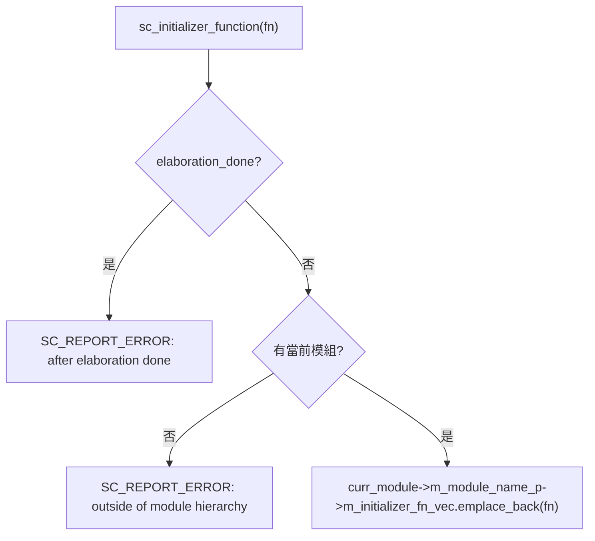

# sc_initializer_function.h - 模組內初始化函式輔助工具

## 概觀

`sc_initializer_function.h` 提供了一組巨集和輔助類別，讓 SystemC 模組可以在類別定義中直接初始化複雜物件（如 process 的靈敏度設定）。這是一種現代 C++ 風格的改進，減少了在建構子中寫大量初始化程式碼的需求。

## 為什麼需要這個檔案？

傳統的 SystemC 模組寫法要求你在建構子（`SC_CTOR`）中集中註冊所有 process 和設定靈敏度：

```cpp
SC_MODULE(MyModule) {
    void my_thread();
    SC_CTOR(MyModule) {
        SC_THREAD(my_thread);
        sensitive << clk.pos();
    }
};
```

當模組很大時，建構子會變得很長。`sc_initializer_function` 允許你把初始化邏輯放在 process 的宣告旁邊，就像在每個員工的座位旁貼上他的工作指引，而不是把所有指引都堆在公司入口。

## 核心巨集

### `SC_INIT(object_name)`

將初始化函式綁定到物件宣告旁：

```cpp
SC_MODULE(MyModule) {
    SC_INIT(my_thread) {
        SC_THREAD(my_thread);
        sensitive << clk.pos();
    }
    void my_thread();
};
```

展開後等同於建立一個 `sc_initializer_function` 物件和一個初始化函式。

### `SC_NAMED_WITH_INIT(object_name, ...)`

結合命名和初始化：

```cpp
SC_MODULE(MyModule) {
    SC_NAMED_WITH_INIT(my_signal, 0) {
        // initialization code
    }
};
```

### `SC_THREAD_IMP(thread_name, ...)`

簡化 `SC_THREAD` 的宣告和實作：

```cpp
SC_MODULE(MyModule) {
    SC_THREAD_IMP(my_thread,
        sensitive << clk.pos();
    ) {
        // thread body
        while (true) {
            wait();
            // ...
        }
    }
};
```

這個巨集把 `SC_THREAD` 註冊、靈敏度設定和函式定義合併在一起。

### `SC_CTHREAD_IMP(thread_name, edge, ...)`

類似 `SC_THREAD_IMP`，但用於時脈驅動的執行緒。

### `SC_METHOD_IMP(method_name, ...)`

類似 `SC_THREAD_IMP`，但用於 `SC_METHOD`。

## 類別詳解

### `sc_initializer_function`

```cpp
class sc_initializer_function {
public:
    template<class F>
    explicit sc_initializer_function(F&& fn);
};
```

這個類別的建構子接收一個 lambda 或可呼叫物件，並將其加入當前模組的初始化函式佇列中。在 elaboration 階段，這些函式會按順序被呼叫。

#### 建構流程



重點限制：
1. **只能在 elaboration 期間使用**：模擬開始後就不能再註冊
2. **必須在模組層級內使用**：不能在全域範圍使用

### `sc_initializer_function_name_fwd()`

```cpp
template <class F>
inline const char* sc_initializer_function_name_fwd(const char* name, F&& fn)
{
    sc_initializer_function(std::move(fn));
    return name;
}
```

這是 `SC_NAMED_WITH_INIT` 巨集的輔助函式。它做兩件事：
1. 建立 `sc_initializer_function` 物件來註冊初始化函式
2. 把名稱字串傳遞回去，用作物件的建構參數

## 巨集展開範例

`SC_INIT(my_thread) { ... }` 展開為：

```cpp
sc_core::sc_initializer_function my_thread_initialization_fn_lambda {
    [this]() {
        my_thread_initialization_fn();
    }
};
void my_thread_initialization_fn() {
    // user code: SC_THREAD(my_thread); etc.
}
```

## 設計考量

### 為什麼用 Lambda？

使用 lambda 可以捕獲 `this` 指標，讓初始化函式能存取模組的成員。`std::move` 用來避免不必要的複製。

### 與傳統方式的比較

| 特性 | 傳統 `SC_CTOR` | `SC_INIT` / `SC_THREAD_IMP` |
|------|----------------|---------------------------|
| 初始化位置 | 集中在建構子 | 分散在各 process 旁邊 |
| 可讀性 | 大模組難以閱讀 | 程式碼組織更清晰 |
| 維護性 | 新增 process 要改兩處 | 新增 process 只改一處 |

## 相關檔案

- `sc_macros.h` - 提供 `SC_CONCAT_HELPER_`、`SC_STRINGIFY_HELPER_` 等巨集
- `sc_module.h` - `sc_module` 類別，提供 `m_module_name_p` 成員
- `sc_simcontext.h` - 提供 `hierarchy_curr()` 和 `elaboration_done()`
