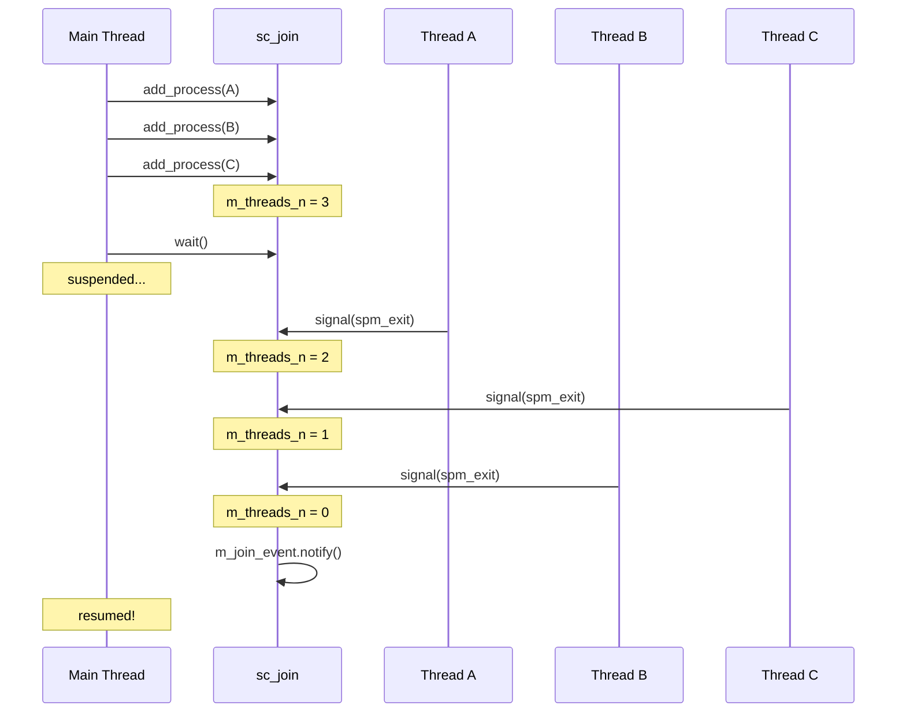
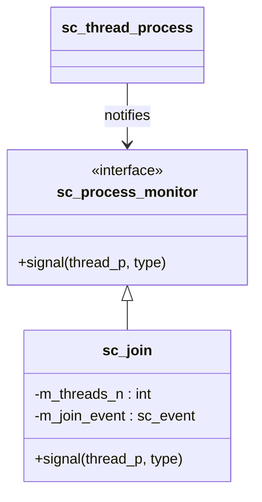

# sc_join -- 行程同步匯合

## 概觀

`sc_join` 提供了一種等待多個執行緒行程（thread process）全部完成的同步機制。它實作了「fork-join」模式中的「join」部分。

**生活比喻：** 想像你在餐廳點了三道菜。每道菜由不同的廚師同時準備。你不希望菜一道一道上，而是等三道菜全部做好後一起上桌。`sc_join` 就是那個負責計算「還有幾道菜沒做好」的服務員 -- 當計數器歸零時，通知你可以開動了。

## 檔案角色

- **標頭檔 `sc_join.h`**：宣告 `sc_join` 類別和 `SC_FORK`/`SC_JOIN`/`SC_CJOIN` 巨集。
- **實作檔 `sc_join.cpp`**：實作建構子、行程新增和訊號回呼。

## 類別定義

```cpp
class sc_join : public sc_process_monitor {
    friend class sc_process_b;
    friend class sc_process_handle;

public:
    sc_join();
    void add_process( sc_process_handle process_h );
    int process_count();
    virtual void signal(sc_thread_handle thread_p, int type);
    void wait();
    void wait_clocked();

protected:
    void add_process( sc_process_b* process_p );

protected:
    sc_event m_join_event;   // event notified when all threads complete
    int      m_threads_n;    // number of threads still running
};
```

### 成員說明

| 成員 | 說明 |
|------|------|
| `m_join_event` | 當所有被監控的執行緒都結束時觸發的事件 |
| `m_threads_n` | 尚未完成的執行緒計數器 |

## 運作流程



## 關鍵方法

### `add_process(sc_process_handle)`

將一個行程加入監控列表：

```cpp
void sc_join::add_process( sc_process_handle process_h ) {
    sc_thread_handle thread_p = process_h.operator sc_thread_handle();
    if ( thread_p ) {
        m_threads_n++;
        thread_p->add_monitor( this );
    } else {
        SC_REPORT_ERROR( SC_ID_JOIN_ON_METHOD_HANDLE_, 0 );
    }
}
```

**重要限制：** 只能加入執行緒行程（`SC_THREAD`/`SC_CTHREAD`），不能加入方法行程（`SC_METHOD`）。因為 `SC_METHOD` 沒有「完成」的概念 -- 它們是被反覆觸發的。

### `add_process(sc_process_b*)`

內部版本，直接操作行程基礎指標：

```cpp
void sc_join::add_process( sc_process_b* process_p ) {
    sc_thread_handle handle = dynamic_cast<sc_thread_handle>(process_p);
    sc_assert( handle != 0 );
    m_threads_n++;
    handle->add_monitor( this );
}
```

### `signal()`

當被監控的執行緒發出訊號時呼叫（觀察者模式）：

```cpp
void sc_join::signal(sc_thread_handle thread_p, int type) {
    switch ( type ) {
      case sc_process_monitor::spm_exit:
        thread_p->remove_monitor(this);
        if ( --m_threads_n == 0 )
            m_join_event.notify();
        break;
    }
}
```

只處理 `spm_exit` 訊號類型。當計數器歸零時，觸發 `m_join_event`。

### `wait()` 與 `wait_clocked()`

```cpp
inline void sc_join::wait() {
    ::sc_core::wait(m_join_event);
}

inline void sc_join::wait_clocked() {
    do { ::sc_core::wait(); } while (m_threads_n != 0);
}
```

- **`wait()`**：直接等待 join 事件，適用於沒有敏感度列表的執行緒。
- **`wait_clocked()`**：在有敏感度列表的執行緒中使用，反覆等待時脈邊緣直到所有執行緒完成。

## 便捷巨集

### `SC_FORK` / `SC_JOIN`

```cpp
SC_FORK
    sc_spawn(...),
    sc_spawn(...),
    sc_spawn(...)
SC_JOIN
```

展開為：

```cpp
{
    sc_process_handle forkees[] = {
        sc_spawn(...),
        sc_spawn(...),
        sc_spawn(...)
    };
    sc_join join;
    for (unsigned int i = 0;
         i < sizeof(forkees)/sizeof(sc_process_handle); i++)
        join.add_process(forkees[i]);
    join.wait();
}
```

### `SC_CJOIN`

類似 `SC_JOIN`，但使用 `wait_clocked()` 而非 `wait()`，適用於有敏感度列表的場景。

## 設計模式

`sc_join` 使用了**觀察者模式**（Observer Pattern）：



`sc_join` 繼承自 `sc_process_monitor`，作為執行緒的觀察者。執行緒在結束時呼叫所有觀察者的 `signal()` 方法。

## 使用範例概念

```
// Conceptual usage (not actual SystemC code):
SC_FORK
    sc_spawn(task_a),    // Start task A
    sc_spawn(task_b),    // Start task B
    sc_spawn(task_c)     // Start task C
SC_JOIN
// All three tasks have completed here
```

## 設計考量

### 為何不支援 `SC_METHOD`？

`SC_METHOD` 是事件驅動的回呼函數，沒有開始和結束的生命週期概念。它不會「完成」，只會在下次事件觸發時再次執行。因此「等待 METHOD 完成」沒有意義。

### 為何 `m_join_event` 用 kernel_event？

`m_join_event` 在建構時使用 `sc_event::kernel_event` 標記和 `"join_event"` 名稱，表示這是核心內部使用的事件，不會出現在使用者可見的事件階層中。

## 相關檔案

- `sc_process.h` -- 行程基礎類別和 `sc_process_monitor`
- `sc_process_handle.h` -- 行程控制代碼
- `sc_thread_process.h` -- 執行緒行程（提供 `add_monitor`/`remove_monitor`）
- `sc_wait.h` -- `wait()` 函數
