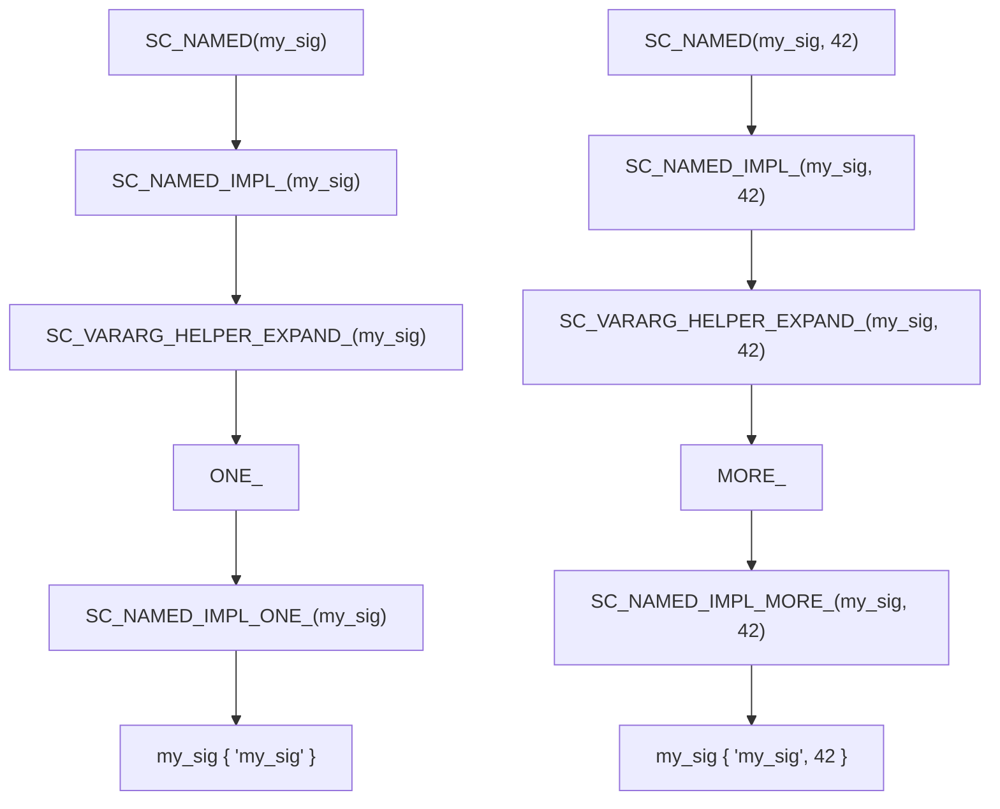

# sc_macros.h - 通用巨集與輔助函式

## 概觀

`sc_macros.h` 定義了 SystemC 在各處使用的通用巨集和模板輔助函式。它包含兩大部分：`sc_dt` 命名空間中的數學函式模板，以及預處理器巨集工具。

## 為什麼需要這個檔案？

這個檔案提供的是「基礎工具」，就像工具箱裡的螺絲起子和鉗子——它們本身不是最終產品，但幾乎所有其他程式碼都會用到。

## 數學函式模板（`sc_dt` 命名空間）

### `sc_min(a, b)`

回傳兩個值中較小的那個。

### `sc_max(a, b)`

回傳兩個值中較大的那個。

### `sc_abs(a)`

回傳絕對值。實作上比較特別——它不是簡單地 `a >= 0 ? a : -a`，而是先建立一個零值 `z`，然後比較。這是為了支援所有 SystemC 的算術資料型別（如 `sc_int`、`sc_fixed` 等），因為這些型別可能不支援直接與整數 0 比較。

## 預處理器巨集

### Token 字串化

```cpp
#define SC_STRINGIFY_HELPER_(Arg)                  // "Arg"
#define SC_STRINGIFY_HELPER_DEFERRED_(Arg)          // delay expansion
#define SC_STRINGIFY_HELPER_MORE_DEFERRED_(Arg) #Arg // actual stringify
```

三層巨集的原因：確保 `Arg` 被完全展開後再字串化。例如：

```cpp
#define VERSION 3
SC_STRINGIFY_HELPER_(VERSION)   // -> "3" (not "VERSION")
```

### Token 連接

```cpp
#define SC_CONCAT_HELPER_(a, b)           // a##b (with expansion)
#define SC_CONCAT_UNDERSCORE_(a, b)       // a_b
```

同樣使用多層延遲展開，確保巨集參數先被展開。

### Token 展開

```cpp
#define SC_EXPAND_HELPER_(x) x
```

強制展開巨集參數，用於一些特殊的巨集組合場景。

## 偵錯輔助巨集

### `SC_WAIT()`

```cpp
#define SC_WAIT()                                       \
    ::sc_core::sc_set_location( __FILE__, __LINE__ );   \
    ::sc_core::wait();                                  \
    ::sc_core::sc_set_location( NULL, 0 )
```

包裝 `wait()` 呼叫，在等待前記錄檔案名和行號。這樣當模擬器卡住時，可以知道是哪個 `wait()` 呼叫導致的。

### `SC_WAITN(n)`

類似 `SC_WAIT()`，但等待 `n` 個時脈週期。

### `SC_WAIT_UNTIL(expr)`

```cpp
#define SC_WAIT_UNTIL(expr)  do { SC_WAIT(); } while( !(expr) )
```

重複等待直到條件成立。

## `SC_NAMED` 巨集系統

### `SC_NAMED(...)`

自動為 SystemC 物件設定與變數同名的實例名稱：

```cpp
// Without SC_NAMED:
sc_signal<int> my_signal {"my_signal"};

// With SC_NAMED:
SC_NAMED(my_signal);  // expands to: my_signal {"my_signal"}
SC_NAMED(my_signal, 42);  // expands to: my_signal {"my_signal", 42}
```

### 可變參數巨集實作

`SC_NAMED` 使用了一套精巧的巨集來偵測參數數量：



`SC_VARARG_HELPER_EXPAND_SEQ_` 利用 C 預處理器的參數位移特性，當只有 1 個參數時選擇 `ONE_`，多個參數時選擇 `MORE_`。

## 相關檔案

- `sc_cmnhdr.h` - 被此檔案包含，提供基本定義
- `sc_initializer_function.h` - 使用 `SC_CONCAT_HELPER_` 和 `SC_STRINGIFY_HELPER_`
- `sc_ver.h` - 使用 `SC_CONCAT_UNDERSCORE_` 和 `SC_STRINGIFY_HELPER_`
- `sc_module.h` - `SC_NAMED` 巨集用於模組內的物件命名
