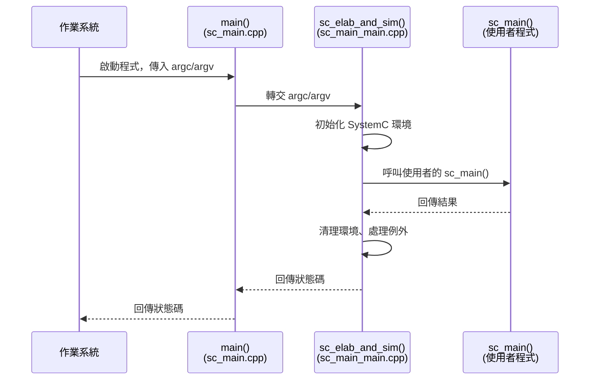

# sc_main.cpp -- SystemC 程式的起跑線

## 概述

`sc_main.cpp` 是 SystemC 程式的真正進入點。它定義了 C++ 的 `main()` 函式，作為作業系統與 SystemC 世界之間的橋樑。這個檔案極其簡短，只做一件事：把控制權交給 `sc_elab_and_sim()`。

**原始碼位置：** `ref/systemc/src/sysc/kernel/sc_main.cpp`

---

## 日常生活類比

想像你去一間高級餐廳用餐：

| 餐廳流程 | sc_main.cpp |
|---------|-------------|
| 餐廳大門 | `main()` 函式 |
| 門口的接待員 | `sc_elab_and_sim()` |
| 接待員帶你入座、點餐、上菜 | elaboration + simulation |
| 你自己的用餐體驗 | 使用者定義的 `sc_main()` |

你（作業系統）走進大門（`main()`），接待員（`sc_elab_and_sim()`）負責安排一切，而你的用餐體驗（`sc_main()`）是你自己決定的。

---

## 完整原始碼解析

整個檔案的核心就是：

```cpp
#include "sysc/kernel/sc_cmnhdr.h"
#include "sysc/kernel/sc_externs.h"

int
main( int argc, char* argv[] )
{
    return sc_core::sc_elab_and_sim( argc, argv );
}
```

### 逐行說明

1. **`#include "sc_cmnhdr.h"`** -- 引入 SystemC 的通用標頭（平台相容性、匯出巨集等）
2. **`#include "sc_externs.h"`** -- 引入 `sc_elab_and_sim()` 的宣告
3. **`main()`** -- 標準 C++ 程式進入點，接收命令列參數
4. **`sc_core::sc_elab_and_sim()`** -- 將控制權完全轉交給 SystemC 框架

---

## 程式啟動流程



---

## 設計原理

### 為什麼分成兩個檔案？

`main()` 和 `sc_elab_and_sim()` 分開在不同檔案中，有幾個重要理由：

1. **連結彈性**：有些使用者可能想要自己定義 `main()`（例如在嵌入式系統或測試框架中）。將 `main()` 放在獨立的編譯單元，讓使用者可以提供自己的 `main.cpp` 來替換。

2. **平台可攜性**：某些平台（如 Windows GUI 應用程式）不使用標準的 `main()`，而是用 `WinMain()`。分離讓調整更容易。

3. **職責分離**：`main()` 只負責「啟動」，所有真正的邏輯都在 `sc_elab_and_sim()` 中。

### 使用者的 sc_main()

使用者不需要（也不應該）自己寫 `main()`。SystemC 的慣例是讓使用者定義 `sc_main()`：

```cpp
// example: user code
int sc_main(int argc, char* argv[]) {
    // build your modules here
    MyModule top("top");
    sc_start(100, SC_NS);
    return 0;
}
```

SystemC 框架會自動呼叫它。

---

## 相關檔案

| 檔案 | 說明 |
|------|------|
| `sc_main_main.cpp` | `sc_elab_and_sim()` 的實作，真正的初始化與清理邏輯 |
| `sc_externs.h` | 宣告 `sc_elab_and_sim()` 和 `sc_main()` |
| `sc_simcontext.h/cpp` | 模擬引擎核心 |
