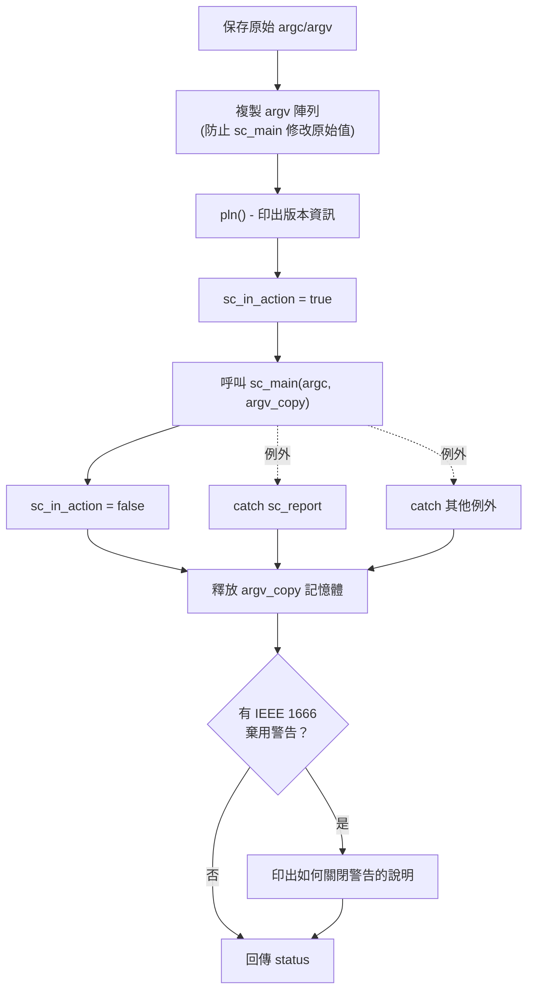

# sc_main_main.cpp -- SystemC 模擬的真正啟動器

## 概述

`sc_main_main.cpp` 實作了 `sc_elab_and_sim()` 函式，這是 SystemC 框架從 `main()` 到使用者 `sc_main()` 之間的關鍵橋梁。它負責：
1. 保存原始命令列參數
2. 建立參數副本防止被修改
3. 呼叫使用者的 `sc_main()`
4. 捕獲並處理所有例外
5. 輸出棄用警告訊息

**原始碼位置：** `ref/systemc/src/sysc/kernel/sc_main_main.cpp`

---

## 日常生活類比

把 `sc_elab_and_sim()` 想成一位**專業活動總監**：

| 活動總監的工作 | sc_elab_and_sim() |
|-------------|-------------------|
| 記錄活動的原始邀請名單 | 保存 `argc_orig` / `argv_orig` |
| 影印一份名單給工作人員使用 | 複製 `argv` 為 `argv_copy` |
| 讓主持人上台（你的節目） | 呼叫 `sc_main()` |
| 處理突發狀況（有人跌倒、停電） | `try-catch` 捕獲例外 |
| 活動結束後清理場地 | 釋放記憶體、印出警告 |
| 回報活動是否成功 | 回傳 `status` |

---

## 關鍵函式解析

### sc_elab_and_sim()

```cpp
int sc_elab_and_sim( int argc, char* argv[] )
```

這是整個 SystemC 程式的「真正入口」。以下是它的完整流程：



### 例外處理機制

```cpp
try {
    status = sc_main( argc, &argv_call[0] );
}
catch( const sc_report& x ) {
    // 處理 SystemC 專用的報告例外
    sc_report_handler::get_handler()( x, sc_report_handler::get_catch_actions() );
}
catch( ... ) {
    // 處理所有其他例外
    sc_report* err_p = sc_handle_exception();
    if( err_p )
        sc_report_handler::get_handler()( *err_p, sc_report_handler::get_catch_actions() );
    delete err_p;
}
```

三層保護：
1. **正常回傳**：`sc_main()` 正常結束，回傳使用者指定的狀態碼
2. **sc_report 例外**：SystemC 自己的報告系統產生的例外
3. **其他例外**：C++ 標準例外或其他未預期的例外

### sc_argc() / sc_argv()

```cpp
int sc_argc()           { return argc_orig; }
const char* const* sc_argv() { return argv_orig; }
```

讓使用者在 `sc_main()` 以外的地方也能存取命令列參數。注意這裡回傳的是**原始的** argv，不是副本。

### sc_in_action

```cpp
bool sc_in_action = false;
```

全域旗標，標示是否正在執行 `sc_main()`。某些 SystemC 內部邏輯會根據這個旗標決定行為。

---

## argv 複製的設計考量

為什麼要複製 `argv`？

```cpp
std::vector<char*> argv_copy(argc + 1, static_cast<char*>(NULL));
for ( int i = 0; i < argc; ++i ) {
    std::size_t size = std::strlen(argv[i]) + 1;
    argv_copy[i] = new char[size];
    std::copy(argv[i], argv[i] + size, argv_copy[i]);
}
```

**原因**：使用者的 `sc_main()` 可能會修改 `argv` 中的字串指標。為了讓 `sc_argv()` 永遠能回傳原始的命令列參數，必須保留一份不被動到的副本。

**技巧**：`argv_call` 是從 `argv_copy` 再複製的指標陣列，傳給 `sc_main()` 使用。即使 `sc_main()` 修改了 `argv_call` 中的指標，`argv_copy` 仍然持有原始分配的記憶體，可以正確釋放。

---

## 棄用警告處理

如果模擬過程中觸發了 IEEE 1666 棄用警告，會在結束時印出友善的提示：

```
You can turn off warnings about
IEEE 1666 deprecated features by placing this method call
as the first statement in your sc_main() function:
  sc_core::sc_report_handler::set_actions(
    "IEEE_Std_1666/deprecated",
    sc_core::SC_DO_NOTHING );
```

這是一種使用者友善的設計：不是在模擬過程中不斷干擾，而是在結束時統一告知。

---

## 設計原理

### 為什麼不直接在 sc_main.cpp 中做這些事？

**分離關注點**：
- `sc_main.cpp`：只負責提供 `main()` 函式（可被替換）
- `sc_main_main.cpp`：負責 SystemC 框架的初始化邏輯（不應被替換）

這樣的設計讓使用者可以替換 `main()` 的實作（例如在 GUI 框架中），但 SystemC 的初始化邏輯始終被保留。

### 為什麼 simcontext 沒有在這裡被刪除？

原始碼中有一段被 `#if 0` 註解掉的程式：

```cpp
#if 0
    delete sc_get_curr_simcontext();
#endif
```

註解說明：「在 `sc_main_main` 回傳後，仍有 thread 試圖呼叫 `sc_simcontext::remove_process()`」。這是一個已知的清理順序問題，目前的解法是不主動刪除 simcontext，讓作業系統在程式結束時自動回收。

---

## 相關檔案

| 檔案 | 說明 |
|------|------|
| `sc_main.cpp` | 定義 `main()` 函式 |
| `sc_externs.h` | 宣告 `sc_elab_and_sim()`、`sc_main()`、`sc_argc()`、`sc_argv()` |
| `sc_simcontext.h/cpp` | 模擬上下文，在 `sc_main()` 中被隱式使用 |
| `sc_ver.h` | 版本資訊（`pln()` 函式） |
| `sc_report.h` | 報告/例外處理系統 |
