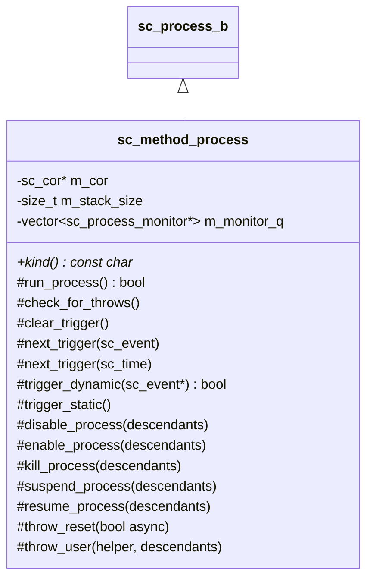
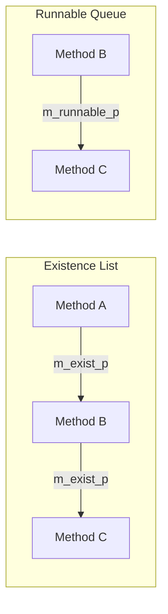

# sc_method_process -- Method Process Implementation

## Overview

`sc_method_process.h` / `sc_method_process.cpp` implement `sc_method_process`, the class for `SC_METHOD` processes. A method process runs its callback function to completion each time it is triggered -- it never suspends mid-execution.

---

## Analogy: The Answering Machine

Think of `SC_METHOD` as an **answering machine**:

- When the phone rings (event fires), the machine picks up, plays the message, and hangs up. The entire interaction happens in one shot.
- The machine doesn't "stay on the line" -- it completes immediately.
- It can change which phone line it listens to next time (`next_trigger()`).
- If the machine is broken (exception), the system logs the error.

Compare this to `SC_THREAD`, which is like a **human receptionist** who can put you on hold (`wait()`) and come back later.

---

## Key Characteristics

| Feature | SC_METHOD |
|---------|-----------|
| Runs to completion | Yes, cannot call `wait()` |
| Uses `next_trigger()` | Yes, for dynamic sensitivity |
| Has its own stack | No (runs on simulator's stack) |
| Cost to trigger | Very low (function call) |
| Can be suspended | Yes, but only between invocations |

---

## Class Structure



---

## Important Methods

### `run_process()` (inline)

This is the core execution method. It calls `semantics()` (the user's callback) and handles exceptions:

```cpp
inline bool sc_method_process::run_process()
{
    bool restart = false;
    do {
        try {
            semantics();       // call the user's function
            restart = false;
        }
        catch( sc_unwind_exception& ex ) {
            ex.clear();
            restart = ex.is_reset(); // restart if reset, not kill
        }
        catch( ... ) {
            sc_report* err_p = sc_handle_exception();
            simcontext()->set_error( err_p );
            return false;
        }
    } while( restart );
    return true;
}
```

Key points:
- If a reset exception occurs and `is_reset()` is true, the method restarts (loops back).
- If a kill exception occurs, it does not restart.
- Any other exception is caught, reported, and causes a return of `false`.

### `next_trigger()` variants

These methods set the **dynamic sensitivity** for the next invocation. They override the static sensitivity for one cycle.

| Variant | What it does |
|---------|-------------|
| `next_trigger(event)` | Wait for a single event |
| `next_trigger(event_or_list)` | Wait for any event in the list |
| `next_trigger(event_and_list)` | Wait for all events in the list |
| `next_trigger(time)` | Wait for a timeout |
| `next_trigger(time, event)` | Wait for event with timeout |
| `next_trigger(time, or_list)` | Wait for or-list with timeout |
| `next_trigger(time, and_list)` | Wait for and-list with timeout |

Each variant first calls `clear_trigger()` to clean up the previous dynamic sensitivity.

### `trigger_static()` (inline)

Called when a static event fires. It checks:
1. Process is not disabled.
2. Process is not already on the runnable queue.
3. Process is expecting a static trigger (not waiting on dynamic event).
4. Process is not the currently executing process (self-notification guard).

If suspended, it marks the state as `ps_bit_ready_to_run` instead of queuing.

### `trigger_dynamic(sc_event*)`

Called when a dynamic event fires. Handles all trigger types (EVENT, OR_LIST, AND_LIST, timeouts). Returns `true` if the process should be scheduled.

For AND_LIST: decrements the event count. Only triggers when all events have fired.

### Process Control Methods

#### `disable_process()` / `enable_process()`

Disabling a method removes it from the runnable queue. Enabling restores normal operation.

#### `suspend_process()` / `resume_process()`

Suspending keeps the method from executing. When resumed, if the process was `ready_to_run`, it is pushed onto the runnable queue.

#### `kill_process()`

Sets `THROW_KILL` status. If the method is currently not running, it immediately disconnects. If it's running, the kill is handled at the next execution boundary.

#### `throw_reset(bool async)`

Handles reset by setting the appropriate throw status. For methods, if the process is currently running, it cannot throw immediately (unlike threads), so the reset is deferred.

#### `throw_user(helper, descendants)`

Throws a user-defined exception into the process. Recursively applies to descendants if requested.

---

## Constructor

```cpp
sc_method_process::sc_method_process(
    const char* name_p,
    bool free_host,
    sc_entry_func method_p,
    sc_process_host* host_p,
    const sc_spawn_options* opt_p
)
```

The constructor:
1. Calls the base class constructor.
2. Sets `m_process_kind = SC_METHOD_PROC_`.
3. Applies spawn options (sensitivity, `dont_initialize`, resets).
4. If not `dont_initialize`, pushes itself onto the runnable queue.

---

## Linked List Structure

Method processes form two linked lists using `m_exist_p` and `m_runnable_p`:



- **Existence list**: all method processes ever created.
- **Runnable queue**: methods ready to execute this delta cycle.

---

## Design Rationale

### Why No Stack?

Method processes run on the simulator's main stack, making them extremely lightweight. A simulation with thousands of `SC_METHOD` processes uses almost no extra memory compared to threads which each need their own coroutine stack.

### RTL Background

In hardware RTL, a `method` is analogous to a **combinational always block** (`always @(*)` in Verilog or `always_comb` in SystemVerilog). It re-evaluates completely whenever any input changes. There is no notion of "pausing mid-computation."

---

## Related Files

- `sc_process.h/.cpp` -- Base class `sc_process_b`.
- `sc_thread_process.h/.cpp` -- Thread process (can suspend).
- `sc_cthread_process.h/.cpp` -- Clocked thread process.
- `sc_spawn_options.h` -- Options applied during construction.
- `sc_simcontext.h` -- Kernel that schedules method execution.
- `sc_wait.h` -- `next_trigger()` free functions that delegate to method.
