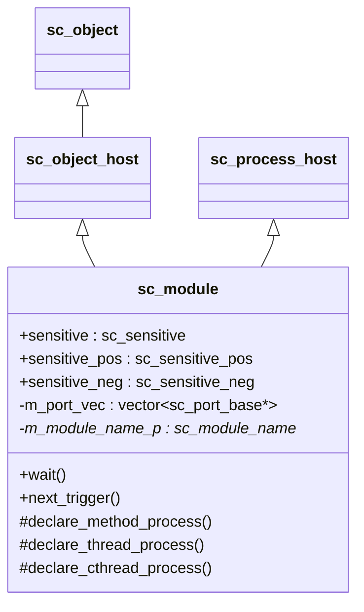
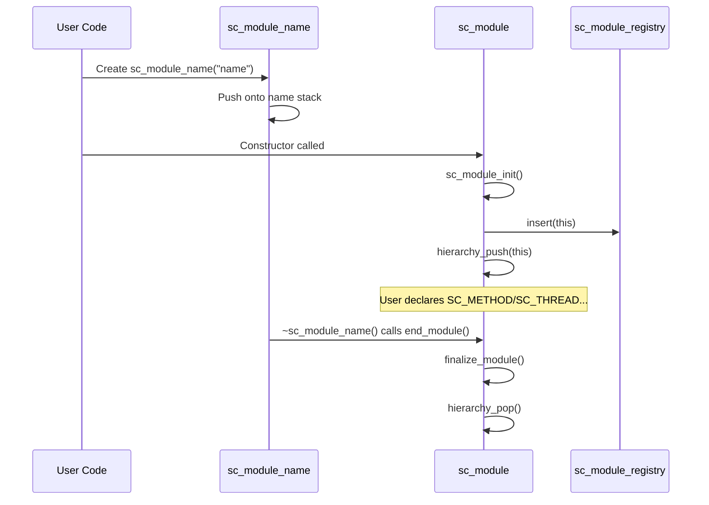
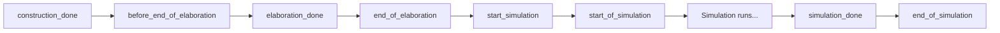

# sc_module -- 所有階層式模組與通道的基礎類別

## 概觀

`sc_module` 是 SystemC 中所有硬體模組的基礎類別。在真實硬體世界中，一塊電路板上有許多晶片，每個晶片裡面又有許多功能區塊；`sc_module` 就是用來描述這些「功能區塊」的 C++ 類別。

**生活比喻：** 想像你在組裝一台電腦。主機板是最上層的模組，上面插著 CPU 模組、記憶體模組、顯卡模組。每個模組都有自己的「接腳」（port），透過主機板上的「線路」（signal）互相連接。`sc_module` 就是每一個這樣的模組的藍圖。

## 檔案角色

- **標頭檔 `sc_module.h`**：宣告 `sc_module` 類別、`sc_bind_proxy` 結構，以及一系列便捷巨集（`SC_MODULE`、`SC_CTOR`、`SC_METHOD`、`SC_THREAD`、`SC_CTHREAD`）。
- **實作檔 `sc_module.cpp`**：實作建構、解構、行程宣告、端口繫結、生命週期回呼等邏輯。

## 關鍵概念

### 繼承結構



`sc_module` 同時繼承自 `sc_object_host`（提供物件階層管理）和 `sc_process_host`（提供行程託管能力）。

### 模組生命週期



### 建構機制

`sc_module` 有一個精巧的建構協定：

1. 使用者建立 `sc_module_name` 物件（通常透過 `SC_CTOR` 巨集自動完成）。
2. `sc_module_name` 的建構子將名稱推入模組名稱堆疊。
3. `sc_module` 的建構子從堆疊頂端取得名稱。
4. 當 `sc_module_name` 被解構時，自動呼叫 `end_module()` 完成模組建構。

這個設計讓使用者不必手動呼叫 `end_module()`。

## 重要類別與結構

### `sc_bind_proxy`

臨時儲存介面或端口指標的結構，用於位置式繫結（positional binding）。

```cpp
struct sc_bind_proxy {
    sc_interface* iface;
    sc_port_base* port;
};
```

### `sc_module` 主要成員

| 成員 | 說明 |
|------|------|
| `sensitive` | 敏感度列表物件，用於註冊行程對哪些訊號敏感 |
| `sensitive_pos` | 正邊緣敏感度列表 |
| `sensitive_neg` | 負邊緣敏感度列表 |
| `m_port_vec` | 此模組的所有端口列表 |
| `m_module_name_p` | 指向對應的 `sc_module_name` 物件 |
| `m_end_module_called` | 是否已呼叫 `end_module()` 的旗標 |

### 行程宣告方法

| 方法 | 對應巨集 | 說明 |
|------|---------|------|
| `declare_method_process()` | `SC_METHOD` | 宣告組合邏輯行程（無自己的執行緒，每次被觸發就執行一次） |
| `declare_thread_process()` | `SC_THREAD` | 宣告循序邏輯行程（有自己的執行緒，可以呼叫 `wait()`） |
| `declare_cthread_process()` | `SC_CTHREAD` | 宣告時脈驅動的執行緒行程 |

**比喻：**
- `SC_METHOD` 就像門鈴 -- 每按一次就執行一次動作，做完就結束。
- `SC_THREAD` 就像一個持續運行的工人 -- 可以做一點事然後暫停等待（`wait()`），被叫醒後繼續做。
- `SC_CTHREAD` 就像工廠流水線上的工人 -- 只在每個時脈的特定邊緣才動作。

### `wait()` 與 `next_trigger()` 方法群

`sc_module` 提供了大量的 `wait()` 重載（給 `SC_THREAD`/`SC_CTHREAD` 使用）和 `next_trigger()` 重載（給 `SC_METHOD` 使用），支援：

- 無參數等待（靜態敏感度）
- 等待特定事件
- 等待事件的 OR/AND 組合
- 等待一段時間
- 等待時間加事件的組合

### 重置訊號方法

| 方法 | 說明 |
|------|------|
| `reset_signal_is()` | 設定同步重置訊號 |
| `async_reset_signal_is()` | 設定非同步重置訊號 |

**比喻：** 同步重置像是微波爐的定時器到了才停止；非同步重置像是直接拔掉微波爐的電源插頭。

### 生命週期回呼



這些虛擬方法讓使用者在模擬的不同階段插入自訂邏輯。

### 端口繫結

支援三種繫結方式：

1. **顯式繫結**（推薦）：`module.port.bind(signal)`
2. **位置式繫結**（已棄用）：`module(sig1, sig2, sig3)`
3. **串流式繫結**（已棄用）：`module << sig1 << sig2`

位置式繫結的 `operator()` 最多支援 64 個端口。

## 便捷巨集

| 巨集 | 展開結果 | 用途 |
|------|---------|------|
| `SC_MODULE(name)` | `struct name : ::sc_core::sc_module` | 快速定義模組 |
| `SC_CTOR(name)` | `name(::sc_core::sc_module_name)` | 快速定義建構子 |
| `SC_HAS_PROCESS(name)` | `static_assert(...)` | 舊式寫法，已棄用 |
| `SC_METHOD(func)` | 呼叫 `declare_method_process` | 註冊方法行程 |
| `SC_THREAD(func)` | 呼叫 `declare_thread_process` | 註冊執行緒行程 |
| `SC_CTHREAD(func, edge)` | 呼叫 `declare_cthread_process` | 註冊時脈執行緒行程 |

## 型別別名

```cpp
typedef sc_module sc_channel;
typedef sc_module sc_behavior;
```

這表示在 SystemC 中，通道（channel）和行為（behavior）本質上都是模組。

## 設計考量

### 為何需要 `sc_module_name` 機制？

早期 SystemC 要求使用者手動傳遞名稱並呼叫 `end_module()`，這容易遺漏。現在的設計利用 C++ 物件的建構/解構語意，讓 `sc_module_name` 的生命週期自動驅動模組的初始化與完成流程。

### 為何 `operator()` 支援到 64 個參數？

C++ 沒有可變引數模板（在 SystemC 最初設計時），所以用大量預設參數模擬。現代 SystemC 推薦使用顯式的 `port.bind()` 呼叫。

## RTL 背景

在硬體描述語言（如 Verilog/VHDL）中，`module` 是最基本的設計單元。每個 module 可以包含：
- 輸入/輸出端口（對應 SystemC 的 `sc_in`/`sc_out`）
- 內部訊號（對應 SystemC 的 `sc_signal`）
- 子模組實例（對應 SystemC 的子模組物件）
- 行為描述（對應 SystemC 的 `SC_METHOD`/`SC_THREAD`）

SystemC 的 `sc_module` 將這些概念統一到 C++ 物件模型中。

## 相關檔案

- `sc_module_name.h/cpp` -- 模組名稱管理
- `sc_module_registry.h/cpp` -- 模組註冊表
- `sc_object.h/cpp` -- 基礎物件類別
- `sc_sensitive.h` -- 敏感度列表
- `sc_process.h` -- 行程基礎類別
- `sc_reset.h/cpp` -- 重置訊號支援
