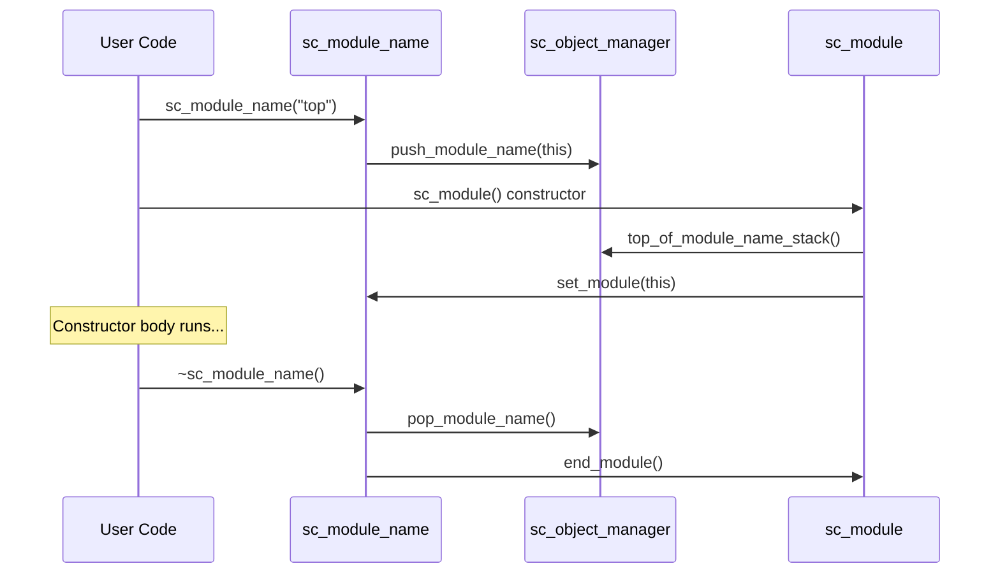

# sc_module_name -- 模組名稱與階層管理的輔助物件

## 概觀

`sc_module_name` 是一個用來管理 SystemC 模組名稱和建構流程的輔助類別。它不只是一個名稱字串的包裝器，更是模組建構協定中不可或缺的一環 -- 它控制著模組的初始化開始與完成。

**生活比喻：** 想像你去政府機關辦事，需要先抽號碼牌（建構 `sc_module_name`），然後在櫃台辦理業務（建構 `sc_module`），辦完後號碼牌會自動回收並觸發結案流程（`~sc_module_name` 呼叫 `end_module()`）。號碼牌本身就是你的「身份識別」和「流程控制器」。

## 檔案角色

- **標頭檔 `sc_module_name.h`**：宣告 `sc_module_name` 類別及其內聯方法。
- **實作檔 `sc_module_name.cpp`**：實作建構子、解構子和初始化函數執行邏輯。

## 關鍵概念

### 名稱堆疊機制



`sc_module_name` 物件在建構時將自己推入全域的模組名稱堆疊；`sc_module` 的建構子從堆疊頂端取得名稱。當 `sc_module_name` 被解構時，它會自動呼叫模組的 `end_module()` 方法。

### 類別定義

```cpp
class sc_module_name {
    friend class sc_module;
    friend class sc_object_manager;
    friend class sc_initializer_function;

public:
    sc_module_name( const char* );
    sc_module_name( const sc_module_name& );
    ~sc_module_name() noexcept(false);
    operator const char*() const;

private:
    const char*     m_name;             // module name string
    sc_module*      m_module_p;         // associated module
    sc_module_name* m_next;             // linked list for stack
    sc_simcontext*  m_simc;             // simulation context
    bool            m_pushed;           // whether pushed onto stack
    std::vector<std::function<void()>> m_initializer_fn_vec;  // initializer functions
};
```

### 成員說明

| 成員 | 說明 |
|------|------|
| `m_name` | 模組名稱的 C 字串指標 |
| `m_module_p` | 與此名稱關聯的模組指標 |
| `m_next` | 形成鏈結串列的指標（用於實作名稱堆疊） |
| `m_simc` | 模擬環境上下文指標 |
| `m_pushed` | 是否被推入堆疊（複製建構的不推入） |
| `m_initializer_fn_vec` | 初始化函數向量（模組完成建構時執行） |

## 建構行為

### 主要建構子

```cpp
sc_module_name::sc_module_name( const char* name_ )
  : m_name(name_), m_module_p(0), m_next(0),
    m_simc(sc_get_curr_simcontext()), m_pushed(true)
{
    m_simc->get_object_manager()->push_module_name(this);
}
```

建構時立即將自己推入 `sc_object_manager` 的模組名稱堆疊。

### 複製建構子

```cpp
sc_module_name::sc_module_name( const sc_module_name& name_ )
  : m_name(name_.m_name), m_module_p(0), m_next(0),
    m_simc(name_.m_simc), m_pushed(false)
{}
```

複製建構不推入堆疊（`m_pushed = false`），因此解構時也不會觸發 `end_module()`。

### 解構子

```cpp
sc_module_name::~sc_module_name() noexcept(false)
{
    if( m_pushed ) {
        sc_module_name* smn = m_simc->get_object_manager()->pop_module_name();
        if( this != smn ) {
            SC_REPORT_ERROR( SC_ID_SC_MODULE_NAME_USE_, 0 );
        }
        if ( m_module_p )
            m_module_p->end_module();
    }
}
```

解構子標記為 `noexcept(false)` -- 這很不尋常，因為它需要在初始化函數拋出例外時傳播例外。

### `clear_module()` 與 `set_module()`

```cpp
inline void sc_module_name::clear_module( sc_module* module_p ) {
    sc_assert( m_module_p == module_p );
    m_module_p = module_p = 0;
    m_initializer_fn_vec.clear();
}

inline void sc_module_name::set_module( sc_module* module_p ) {
    m_module_p = module_p;
}
```

`clear_module()` 在模組解構時被呼叫，用來防止「模組已刪除但 `sc_module_name` 還試圖呼叫 `end_module()`」的問題。這修復了一個動態分配模組在建構子中拋出例外時的記憶體錯誤。

### 初始化函數

```cpp
void sc_module_name::execute_initializers() {
    for (auto& initializer_fn : m_initializer_fn_vec)
        initializer_fn();
    m_initializer_fn_vec.clear();
}
```

初始化函數在 `end_module()` 中被執行，允許使用者在模組建構完成時執行額外的初始化邏輯。

## 設計考量

### 為何解構子會拋出例外？

一般 C++ 最佳實踐禁止解構子拋出例外，但 `sc_module_name` 是特例。它需要在 `end_module()` 的初始化函數拋出例外時，讓例外傳播到使用者程式碼。因此解構子標記為 `noexcept(false)`。

### 為何使用鏈結串列而非 `std::stack`？

`m_next` 指標形成的鏈結串列實作了模組名稱堆疊。這種設計是因為 `sc_module_name` 物件本身就在呼叫堆疊上，利用它們自己的生命週期管理堆疊順序比額外維護一個容器更自然。

### 動態分配模組的例外安全問題

原始碼的修訂歷史中記錄了一個重要的 bug 修復：當動態分配的 `sc_module` 在建構子中拋出例外時，例外處理器會先刪除模組的記憶體，然後堆疊展開導致 `~sc_module_name()` 試圖存取已刪除的模組。解決方案是在 `~sc_module` 中呼叫 `clear_module()` 清除 `sc_module_name` 中的模組指標。

## 相關檔案

- `sc_module.h/cpp` -- 模組基礎類別（使用 `sc_module_name` 進行建構）
- `sc_object_manager.h/cpp` -- 管理模組名稱堆疊
- `sc_simcontext.h` -- 模擬環境上下文
