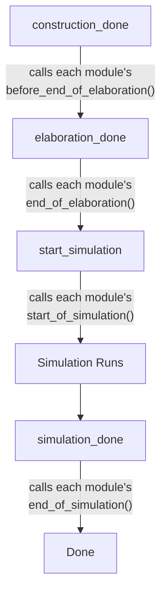

# sc_module_registry -- 模組註冊表

## 概觀

`sc_module_registry` 是 SystemC 內部使用的模組註冊表，負責追蹤所有已建立的模組，並在模擬的各個階段（建構、精化、模擬開始、模擬結束）呼叫每個模組的對應回呼方法。

**生活比喻：** 想像學校的學生名冊。每個學生（模組）入學時登記到名冊上，畢業時從名冊上移除。學校（模擬引擎）在每個學期開始和結束時，會按照名冊逐一通知每個學生參加開學典禮或畢業典禮。

## 檔案角色

- **標頭檔 `sc_module_registry.h`**：宣告 `sc_module_registry` 類別（僅供內部使用）。
- **實作檔 `sc_module_registry.cpp`**：實作模組的插入、移除和各階段回呼。

## 類別定義

```cpp
class sc_module_registry {
    friend class sc_simcontext;

public:
    void insert( sc_module& );
    void remove( sc_module& );
    int size() const;

private:
    explicit sc_module_registry( sc_simcontext& simc_ );
    ~sc_module_registry();

    bool construction_done();
    void elaboration_done();
    void start_simulation();
    void simulation_done();

private:
    int                     m_construction_done;
    std::vector<sc_module*> m_module_vec;
    sc_simcontext*          m_simc;
};
```

## 成員說明

| 成員 | 說明 |
|------|------|
| `m_module_vec` | 儲存所有已註冊模組指標的向量 |
| `m_construction_done` | 已完成建構回呼的模組數量索引 |
| `m_simc` | 所屬的模擬環境上下文 |

## 關鍵方法

### `insert()`

在模組建構時（`sc_module_init()` 中）被呼叫。有兩個安全檢查：
- 不允許在模擬運行時插入模組
- 不允許在精化完成後插入模組

```cpp
void sc_module_registry::insert( sc_module& module_ ) {
    if( sc_is_running() ) {
        SC_REPORT_ERROR( SC_ID_INSERT_MODULE_, "simulation running" );
        return;
    }
    if( m_simc->elaboration_done() ) {
        SC_REPORT_ERROR( SC_ID_INSERT_MODULE_, "elaboration done" );
        return;
    }
    m_module_vec.push_back( &module_ );
}
```

### `remove()`

在模組解構時被呼叫。使用「用最後一個元素替換被刪除元素」的技巧來避免大量元素搬移：

```cpp
void sc_module_registry::remove( sc_module& module_ ) {
    // ... find index i ...
    m_module_vec[i] = m_module_vec.back();
    m_module_vec.pop_back();
}
```

### 階段回呼



#### `construction_done()`

特殊設計：使用 `m_construction_done` 計數器追蹤進度，允許在 `before_end_of_elaboration()` 中建立新模組。如果有新模組被加入，回傳 `false` 表示需要再次呼叫。

```cpp
bool sc_module_registry::construction_done() {
    if( size() == m_construction_done )
        return true;  // nothing new
    for( ; m_construction_done < size(); ++m_construction_done ) {
        m_module_vec[m_construction_done]->construction_done();
    }
    return false;
}
```

#### `elaboration_done()`

檢查每個模組是否正確呼叫了 `end_module()`，並呼叫 `end_of_elaboration()` 回呼。

#### `start_simulation()` / `simulation_done()`

簡單地遍歷所有模組，呼叫對應的回呼方法。

## 設計考量

### 為何是 `sc_simcontext` 的 friend？

只有模擬環境上下文可以建構和操作註冊表，確保了模組生命週期管理的集中控制。

### 為何 `construction_done()` 回傳 `bool`？

在精化過程中，`before_end_of_elaboration()` 回呼可能會建立新的模組。回傳值讓 `sc_simcontext` 知道是否需要重複呼叫，直到所有模組都完成建構。

## 相關檔案

- `sc_module.h/cpp` -- 被註冊管理的模組類別
- `sc_simcontext.h` -- 擁有此註冊表的模擬環境上下文
