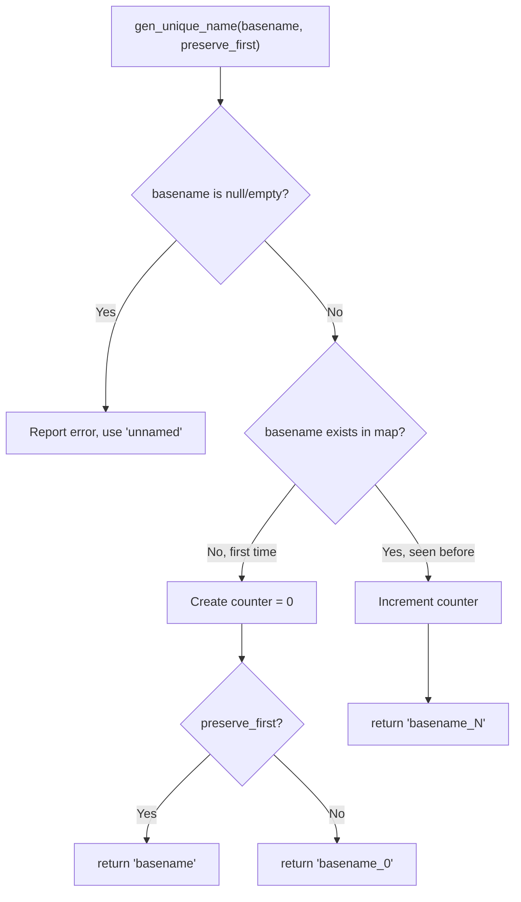
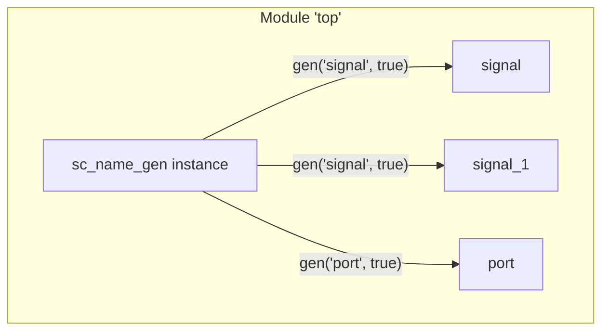

# sc_name_gen -- 唯一名稱生成器

## 概觀

`sc_name_gen` 是 SystemC 中用於生成唯一名稱的輔助類別。當物件沒有被明確命名、或多個物件使用相同的基礎名稱時，它會自動加上遞增的數字後綴來確保名稱的唯一性。

**生活比喻：** 就像一間學校裡有三個叫「小明」的學生，老師會把他們叫做「小明_0」、「小明_1」、「小明_2」。`sc_name_gen` 就是負責這個工作的「命名管理員」。

## 檔案角色

- **標頭檔 `sc_name_gen.h`**：宣告 `sc_name_gen` 類別。
- **實作檔 `sc_name_gen.cpp`**：實作唯一名稱生成邏輯。

## 類別定義

```cpp
class sc_name_gen {
public:
    sc_name_gen();
    ~sc_name_gen();
    const char* gen_unique_name( const char* basename_,
                                 bool preserve_first = false );
private:
    sc_strhash<int*> m_unique_name_map;  // basename -> counter
    std::string      m_unique_name;      // buffer for generated name
};
```

### 成員說明

| 成員 | 說明 |
|------|------|
| `m_unique_name_map` | 雜湊表，將基礎名稱映射到計數器指標 |
| `m_unique_name` | 暫存最近生成的名稱字串 |

## 核心方法：`gen_unique_name()`



### 運作邏輯

```cpp
const char* sc_name_gen::gen_unique_name(
    const char* basename_, bool preserve_first)
{
    if( basename_ == 0 || *basename_ == 0 ) {
        SC_REPORT_ERROR( SC_ID_GEN_UNIQUE_NAME_, 0 );
        basename_ = "unnamed";
    }
    int* c = m_unique_name_map[basename_];
    if( c == 0 ) {
        // First time seeing this basename
        c = new int( 0 );
        m_unique_name_map.insert( const_cast<char*>(basename_), c );
        if (preserve_first) {
            m_unique_name = basename_;   // "signal"
        } else {
            // "signal_0"
            std::stringstream sstr;
            sstr << basename_ << "_" << *c;
            sstr.str().swap( m_unique_name );
        }
    } else {
        // Seen before, increment counter
        // "signal_1", "signal_2", ...
        std::stringstream sstr;
        sstr << basename_ << "_" << ++ (*c);
        sstr.str().swap( m_unique_name );
    }
    return m_unique_name.c_str();
}
```

### `preserve_first` 參數

| `preserve_first` | 第一次 | 第二次 | 第三次 |
|:-:|:-:|:-:|:-:|
| `true` | `"signal"` | `"signal_1"` | `"signal_2"` |
| `false` | `"signal_0"` | `"signal_1"` | `"signal_2"` |

`preserve_first = true` 讓第一個物件保持原始名稱，只有後續重名物件才加後綴。

## 使用場景

`sc_name_gen` 被使用在兩個地方：

1. **`sc_object_host` 中**：每個模組/行程都有一個 `sc_name_gen` 實例，為其子物件生成唯一名稱。
2. **全域名稱生成**：`sc_gen_unique_name()` 函數為沒有父物件的頂層物件生成名稱。



## 記憶體管理

解構子需要清理雜湊表中動態分配的計數器：

```cpp
sc_name_gen::~sc_name_gen() {
    sc_strhash<int*>::iterator it( m_unique_name_map );
    for( ; ! it.empty(); it ++ ) {
        delete it.contents();  // delete each int* counter
    }
    m_unique_name_map.erase();
}
```

## 設計考量

### 為何用 `sc_strhash` 而非 `std::unordered_map`？

`sc_strhash` 是 SystemC 自己的字串雜湊表實作，歷史上先於 C++ 標準容器。它提供了以 C 字串為鍵的高效查找。

### 執行緒安全

雖然原始碼註解提到「MT-Safe」（多執行緒安全），但實際實作並沒有使用鎖或原子操作。這在單執行緒的 SystemC 模擬環境中不是問題。

### 回傳值的生命週期

`gen_unique_name()` 回傳的指標指向 `m_unique_name` 內部緩衝區。每次呼叫都會覆蓋上一次的結果，呼叫者必須在下次呼叫前使用或複製回傳的字串。

## 相關檔案

- `sc_object.h/cpp` -- `sc_object_host` 使用 `sc_name_gen` 生成子物件名稱
- `sc_object_manager.h/cpp` -- 全域物件管理器
- `sc_utils/sc_hash.h` -- `sc_strhash` 雜湊表實作
