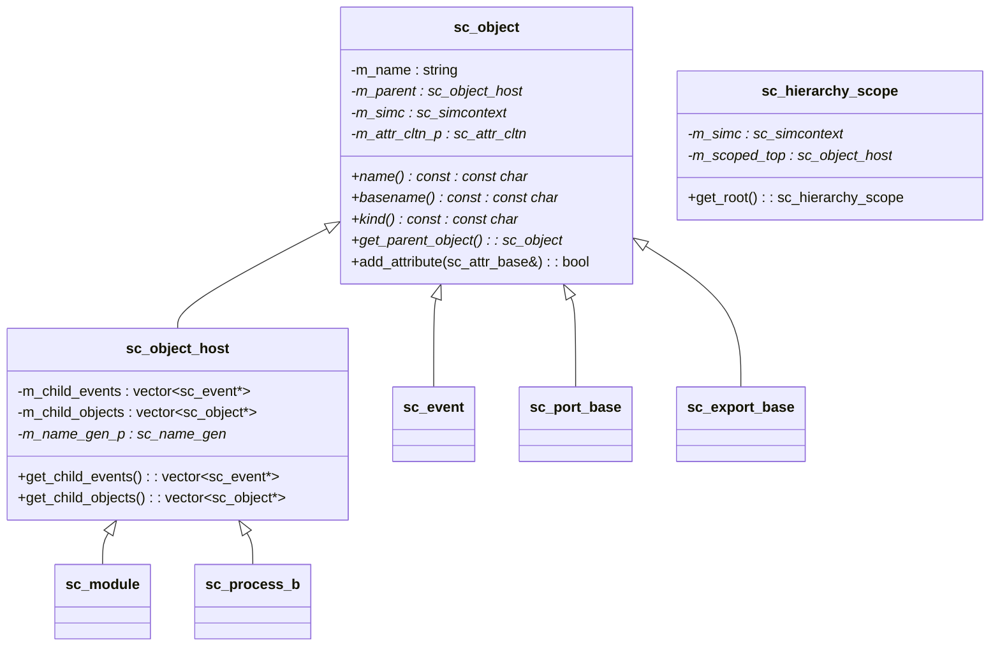
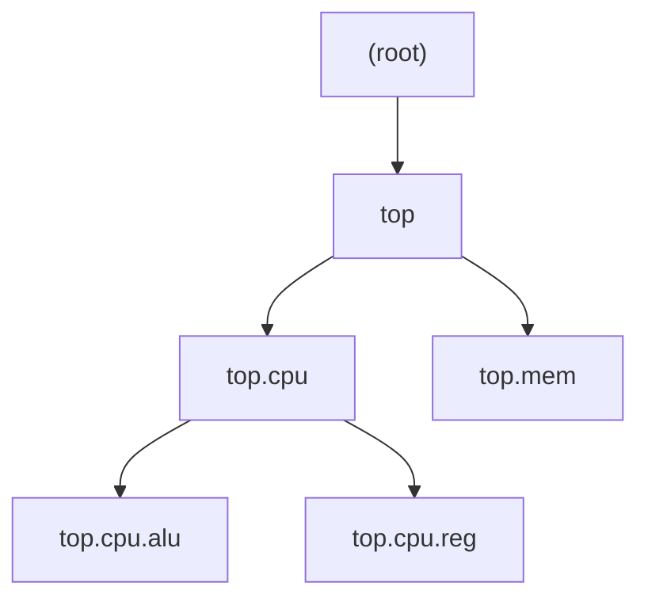
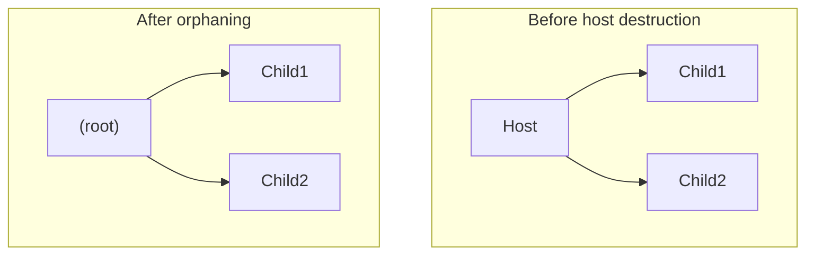

# sc_object -- 所有 SystemC 模擬物件的抽象基礎類別

## 概觀

`sc_object` 是 SystemC 中所有模擬物件的根基類別。每個模組、行程、訊號、端口在 SystemC 內部都是 `sc_object`。它提供了統一的命名系統、階層結構、屬性管理和偵錯輸出功能。

**生活比喻：** 想像一間大公司的組織架構圖。每個部門和員工都有唯一的「全名」（如「技術部.軟體組.小明」），都能被公司的人事系統找到，都可以有附加的標籤（如技能認證）。`sc_object` 就是這個「人事系統」的基礎，它確保每個東西都有名字、知道自己的上級、可以被系統管理。

## 檔案角色

- **`sc_object.h`**：宣告 `sc_object`、`sc_object_host` 和 `sc_hierarchy_scope` 類別。
- **`sc_object_int.h`**：內部使用的內聯函數定義（`sc_object_host` 建構子、`sc_hierarchy_scope` 建構子）。
- **`sc_object.cpp`**：實作物件初始化、階層管理、屬性操作等核心邏輯。

## 類別階層



## `sc_object` 類別

### 命名系統

每個 `sc_object` 都有一個階層式全名，用 `.` 分隔（例如 `top.cpu.alu`）：

- **`name()`**：回傳完整的階層式名稱（如 `"top.cpu.alu"`）
- **`basename()`**：回傳最後一段名稱（如 `"alu"`）



### 物件初始化 (`sc_object_init`)

這是物件建立的核心流程：

1. 取得當前的模擬環境（`sc_simcontext`）
2. 找到當前的父物件（階層堆疊的頂端）
3. 透過 `sc_object_manager` 建立階層式名稱
4. 將物件插入全域實例表
5. 將物件加入父物件的子物件列表

```cpp
void sc_object::sc_object_init(const char* nm) {
    m_simc = sc_get_curr_simcontext();
    m_attr_cltn_p = 0;
    sc_object_manager* object_manager = m_simc->get_object_manager();
    m_parent = m_simc->active_object();
    m_name = object_manager->create_name(nm);
    object_manager->insert_object(m_name, this);
    if ( m_parent )
        m_parent->add_child_object( this );
    else
        m_simc->add_child_object( this );
}
```

### 名稱檢查

建構子會檢查名稱中的非法字元（階層分隔符 `.` 和空白字元），並用底線 `_` 替換：

```cpp
static bool object_name_illegal_char(char ch) {
    return (ch == SC_HIERARCHY_CHAR) || std::isspace(ch);
}
```

### 屬性管理

`sc_object` 支援動態附加屬性（key-value 對），屬性集合採用**延遲建立**策略 -- 只有在第一次使用時才分配 `sc_attr_cltn` 物件，節省了 100 位元組的記憶體。

| 方法 | 說明 |
|------|------|
| `add_attribute()` | 新增屬性（名稱必須唯一） |
| `get_attribute()` | 按名稱查找屬性 |
| `remove_attribute()` | 按名稱移除屬性 |
| `remove_all_attributes()` | 移除所有屬性 |
| `num_attributes()` | 回傳屬性數量 |
| `attr_cltn()` | 回傳屬性集合 |

### `detach()` 方法

將物件從階層中分離：
1. 從 `sc_object_manager` 的實例表中移除
2. 從父物件的子物件列表中移除

## `sc_object_host` 類別

`sc_object_host` 是可以「容納子物件」的 `sc_object`，只有模組和行程需要這個能力。

### 主要功能

- **管理子物件和子事件列表**
- **提供唯一名稱生成器**（透過 `sc_name_gen`）
- **孤兒化處理**（`orphan_child_events/objects`）：當 `sc_object_host` 被銷毀時，其子物件/事件不會被刪除，而是移交給模擬環境根層級



## `sc_hierarchy_scope` 類別

RAII（Resource Acquisition Is Initialization）模式的階層範圍管理器。在建構時推入指定的階層範圍，在解構時自動恢復。

```cpp
// Usage:
{
    sc_hierarchy_scope scope( get_hierarchy_scope() );
    // ... within this scope, objects created belong to current module
} // automatically restored when scope ends
```

### 特殊行為

- 如果目標範圍已經是當前範圍，不做任何事（設 `m_simc = NULL`）
- 支援 move 語意（`sc_hierarchy_scope(sc_hierarchy_scope&&)`）
- 解構時檢查範圍是否被破壞（`SC_UNLIKELY_` 路徑），如果被破壞則報告致命錯誤

### `sc_object_int.h` 中的內聯建構子

```cpp
inline
sc_hierarchy_scope::sc_hierarchy_scope( kernel_tag, sc_object* obj )
  : m_simc( (obj) ? obj->simcontext() : sc_get_curr_simcontext() )
  , m_scoped_top()
{
    if( obj == m_simc->hierarchy_curr() ) {
        m_simc = NULL;  // scope already matches, do nothing
        return;
    }
    // ... push new scope
}
```

## 全域常量與設定

| 名稱 | 說明 |
|------|------|
| `SC_HIERARCHY_CHAR` (`'.'`) | 階層名稱分隔符 |
| `sc_enable_name_checking` | 是否啟用名稱合法性檢查 |

## 設計考量

### 為何屬性集合延遲建立？

大多數 `sc_object` 不使用屬性功能。延遲建立（只在第一次存取時才 `new sc_attr_cltn`）為每個普通物件節省了記憶體。

### 為何子物件/事件列表在 `sc_object_host` 而不在 `sc_object`？

只有模組和行程可以作為其他物件的「容器」。將子物件管理功能提取到 `sc_object_host` 中，讓簡單的物件（如訊號、端口）不需要承擔這些開銷。

### `operator=` 為何什麼都不做？

```cpp
inline sc_object& sc_object::operator=( sc_object const & ) {
    return *this;  // deliberately do nothing
}
```

賦值不應該改變物件的名稱或階層位置。這些屬性在建構時確定，之後不應改變。

## 相關檔案

- `sc_object_manager.h/cpp` -- 全域物件管理與命名
- `sc_name_gen.h/cpp` -- 唯一名稱生成器
- `sc_attribute.h/cpp` -- 屬性系統
- `sc_module.h/cpp` -- 模組（繼承自 `sc_object_host`）
- `sc_simcontext.h` -- 模擬環境上下文
