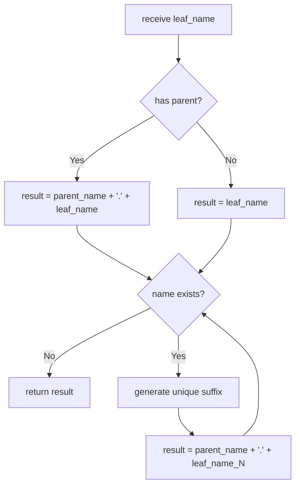
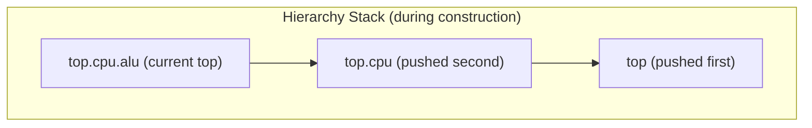

# sc_object_manager -- 物件管理器（命名與階層管理）

## 概觀

`sc_object_manager` 是 SystemC 內部的核心管理器，負責三大任務：
1. **全域實例表**：維護所有已命名物件和事件的查找表
2. **階層堆疊**：管理物件建構時的階層關係
3. **模組名稱堆疊**：管理 `sc_module_name` 的建構/解構順序

**生活比喻：** 想像一個大型圖書館的目錄系統。每本書（物件）都有唯一的編號（階層式名稱），登記在目錄卡片（實例表）裡。圖書管理員（`sc_object_manager`）負責安排書架位置（階層堆疊）、處理新書登記和舊書下架、確保沒有兩本書用相同的編號。

## 檔案角色

- **標頭檔 `sc_object_manager.h`**：宣告 `sc_object_manager` 類別及其資料結構。
- **實作檔 `sc_object_manager.cpp`**：實作名稱建立、物件查找、階層管理等邏輯。

## 資料結構

### 實例表

```cpp
enum sc_name_origin {
    SC_NAME_NONE,      // entry has been removed
    SC_NAME_OBJECT,    // entry is an sc_object
    SC_NAME_EVENT,     // entry is an sc_event
    SC_NAME_EXTERNAL   // entry is an external name reservation
};

struct table_entry {
    void*          m_element_p;    // pointer to sc_object or sc_event
    sc_name_origin m_name_origin;  // type of entry
};

typedef std::map<std::string, table_entry> instance_table_t;
```

使用 `std::map` 以名稱字串為鍵，支援快速按名稱查找。`void*` 指標依 `m_name_origin` 的值被轉型為 `sc_object*` 或 `sc_event*`。

### 內部成員

| 成員 | 說明 |
|------|------|
| `m_instance_table` | 全域實例表（名稱 -> 物件/事件映射） |
| `m_object_stack` | 物件階層堆疊（`vector<sc_object_host*>`） |
| `m_module_name_stack` | `sc_module_name` 鏈結串列堆疊 |
| `m_object_it` | 物件迭代器（用於遍歷） |
| `m_event_it` | 事件迭代器（用於遍歷） |
| `m_object_walk_ok` | 物件遍歷是否有效的旗標 |
| `m_event_walk_ok` | 事件遍歷是否有效的旗標 |

## 關鍵方法

### 名稱建立 (`create_name`)



名稱建立的流程：
1. 取得當前活躍物件作為父物件
2. 拼接父物件名稱 + `'.'` + 葉名稱
3. 若名稱已存在，透過 `sc_gen_unique_name()` 生成唯一後綴
4. 如果有衝突，發出 `SC_ID_INSTANCE_EXISTS_` 警告

### 物件/事件查找

```cpp
sc_object* find_object(const char* name);
sc_event*  find_event(const char* name);
```

兩者都是在 `m_instance_table` 中按名稱查找，並檢查 `m_name_origin` 確保類型正確。

### 物件遍歷

提供 `first_object()` / `next_object()` 迭代器模式，跳過非物件類型的條目：

```cpp
sc_object* first_object();  // reset iterator, return first object
sc_object* next_object();   // advance iterator, return next object
```

### 階層堆疊管理



| 方法 | 說明 |
|------|------|
| `hierarchy_push(obj)` | 將物件推入階層堆疊 |
| `hierarchy_pop()` | 彈出堆疊頂端物件 |
| `hierarchy_curr()` | 取得當前堆疊頂端物件 |
| `hierarchy_size()` | 取得堆疊大小 |

### 模組名稱堆疊管理

`sc_module_name` 物件形成單向鏈結串列，由 `m_module_name_stack` 指向頂端：

```cpp
void push_module_name(sc_module_name* mod_name_p) {
    mod_name_p->m_next = m_module_name_stack;
    m_module_name_stack = mod_name_p;
}

sc_module_name* pop_module_name() {
    sc_module_name* mod_name = m_module_name_stack;
    m_module_name_stack = m_module_name_stack->m_next;
    mod_name->m_next = 0;
    return mod_name;
}
```

### 插入與移除

| 方法 | 說明 |
|------|------|
| `insert_object()` | 將物件插入實例表 |
| `insert_event()` | 將事件插入實例表 |
| `insert_external_name()` | 保留外部名稱（防止衝突） |
| `remove_object()` | 從表中移除物件（設 origin 為 `SC_NAME_NONE`） |
| `remove_event()` | 從表中移除事件 |
| `remove_external_name()` | 移除外部名稱保留 |

注意：移除操作不從 map 中刪除條目，而是將 `m_name_origin` 設為 `SC_NAME_NONE`。這意味著名稱條目永遠保留在表中，但被標記為無效。

### 解構子

```cpp
sc_object_manager::~sc_object_manager() {
    for ( it = m_instance_table.begin(); it != m_instance_table.end(); it++) {
        if(it->second.m_name_origin == SC_NAME_OBJECT) {
            sc_object* obj_p = static_cast<sc_object*>(it->second.m_element_p);
            obj_p->m_simc = 0;
        }
    }
}
```

解構時將所有殘留物件的 `m_simc` 設為 NULL，防止之後存取已銷毀的模擬環境。

## 設計考量

### 為何移除不真正刪除 map 條目？

保留「墓碑」（`SC_NAME_NONE`）條目可以防止被刪除物件的名稱被意外重用，同時簡化了移除邏輯。

### 為何模組名稱堆疊用鏈結串列？

`sc_module_name` 物件本身就在 C++ 呼叫堆疊上，用它們自身的 `m_next` 指標形成堆疊結構，不需要額外的容器，且與 C++ 物件生命週期自然對齊。

### 名稱衝突處理

當偵測到名稱衝突時，系統不會報錯而是自動重新命名並發出警告。這種「盡量修復」的策略避免了因小錯誤導致模擬中斷。

## 相關檔案

- `sc_object.h/cpp` -- 基礎物件類別（使用此管理器進行初始化）
- `sc_module_name.h/cpp` -- 模組名稱物件（推入/彈出名稱堆疊）
- `sc_name_gen.h/cpp` -- 唯一名稱生成器
- `sc_simcontext.h` -- 模擬環境上下文（擁有此管理器的實例）
