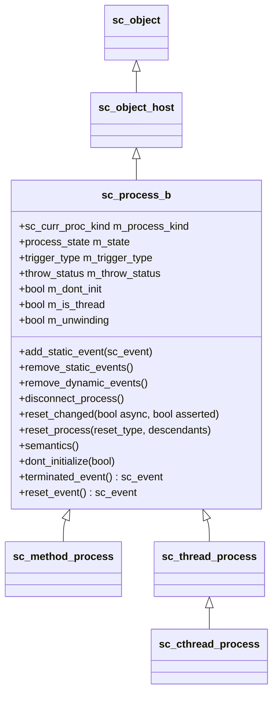

# sc_process -- Process Base Class Support

## Overview

`sc_process.h` / `sc_process.cpp` defines `sc_process_b`, the base class for all SystemC process types. It is the foundation upon which method, thread, and clocked-thread processes are built.

---

## Analogy: The Employee Card

Think of `sc_process_b` as an **employee badge** in a company:

- Every employee (method/thread/cthread) carries a badge.
- The badge records the employee's name, department (parent module), current status (working, on leave, terminated).
- The badge has a "sensitivity list" -- a set of events that tell the employee "it's your turn to work."
- An HR system (the simulation kernel) checks the badge to decide who runs next.

---

## Key Concepts

### Process Types

SystemC defines three process types, all inheriting from `sc_process_b`:

| Type | Enum Value | Description |
|------|-----------|-------------|
| `SC_METHOD_PROC_` | Method process | Runs to completion, no suspension |
| `SC_THREAD_PROC_` | Thread process | Can suspend via `wait()` |
| `SC_CTHREAD_PROC_` | Clocked thread | Thread sensitive to clock edge |
| `SC_NO_PROC_` | No process | Initial/uninitialized state |

### Process States (Bitmask)

Process state is tracked via a bitmask in `m_state`:

| State Bit | Meaning |
|-----------|---------|
| `ps_normal` (0) | Normal, ready to execute |
| `ps_bit_disabled` | Process is disabled, won't execute |
| `ps_bit_suspended` | Process is suspended |
| `ps_bit_ready_to_run` | Suspended but ready when resumed |
| `ps_bit_zombie` | Process is terminated (dead) |

### Trigger Types

The `trigger_type` enum defines what a process is currently waiting for:

| Trigger | Description |
|---------|-------------|
| `STATIC` | Waiting on static sensitivity list |
| `EVENT` | Waiting on a single dynamic event |
| `OR_LIST` | Waiting on any event in a list |
| `AND_LIST` | Waiting on all events in a list |
| `TIMEOUT` | Waiting for a timeout |
| `EVENT_TIMEOUT` | Event with timeout |
| `OR_LIST_TIMEOUT` | OR-list with timeout |
| `AND_LIST_TIMEOUT` | AND-list with timeout |

### Throw Status

Controls exception propagation during reset/kill:

| Status | Description |
|--------|-------------|
| `THROW_NONE` | No exception pending |
| `THROW_KILL` | Process is being killed |
| `THROW_USER` | User-defined exception via `throw_it()` |
| `THROW_ASYNC_RESET` | Asynchronous reset in progress |
| `THROW_SYNC_RESET` | Synchronous reset in progress |

---

## Class Hierarchy



## Important Member Variables

| Variable | Type | Description |
|----------|------|-------------|
| `m_process_kind` | `sc_curr_proc_kind` | Process type (method/thread/cthread) |
| `m_state` | `int` (bitmask) | Current process state |
| `m_trigger_type` | `trigger_type` | What the process is waiting for |
| `m_static_events` | `vector<sc_event*>` | Static sensitivity list |
| `m_event_p` | `sc_event*` | Current dynamic event |
| `m_event_list_p` | `sc_event_list*` | Current dynamic event list |
| `m_timeout_event_p` | `sc_event*` | Timeout event |
| `m_dont_init` | `bool` | If true, skip initial execution |
| `m_free_host` | `bool` | If true, delete host when process dies |
| `m_references_n` | `int` | Reference count for memory management |
| `m_resets` | `vector<sc_reset*>` | Associated reset signals |
| `m_active_areset_n` | `int` | Active async reset count |
| `m_active_reset_n` | `int` | Active sync reset count |
| `m_sticky_reset` | `bool` | Sticky sync reset via `sync_reset_on()` |
| `m_semantics_host_p` | `sc_process_host*` | Object with the callback method |
| `m_semantics_method_p` | `sc_entry_func` | The callback method pointer |
| `m_exist_p` | `sc_process_b*` | Next process in existence list |
| `m_runnable_p` | `sc_process_b*` | Next process in runnable queue |

---

## Key Methods Explained

### `add_static_event(const sc_event& e)`

Adds an event to the process's static sensitivity list. If the event is already registered, it is skipped (no duplicates). The event is told to callback this process when it fires.

### `disconnect_process()`

Called when a process terminates. It:
1. Signals any monitors waiting for the process to exit.
2. Removes all dynamic and static event registrations.
3. Removes itself from all reset signals.
4. Fires the termination event (`m_term_event_p`).
5. Sets the state to `ps_bit_zombie`.
6. Decrements the reference count (may trigger deletion).

### `reset_changed(bool async, bool asserted)`

Called when a reset signal changes value. If asserted, it increments the active reset counter and throws a reset exception. If deasserted, it decrements the counter. When all resets are cleared, the throw status returns to `THROW_NONE`.

### `reset_process(reset_type rt, descendants)`

Handles three reset types:
- `reset_asynchronous`: one-shot immediate reset.
- `reset_synchronous_on`: enables sticky synchronous reset.
- `reset_synchronous_off`: disables sticky synchronous reset.

If `SC_INCLUDE_DESCENDANTS` is specified, it recursively resets child processes.

### `semantics()`

Inline method that calls the actual user-defined callback function:

```cpp
inline void sc_process_b::semantics()
{
    (m_semantics_host_p->*m_semantics_method_p)();
}
```

### `delete_process()`

Two-step deletion: if no process is currently running, delete immediately. Otherwise, defer deletion to the simulation context's garbage collection phase (to avoid deleting the running process).

---

## Design Rationale

### Why Reference Counting?

Processes can be referenced by:
- The simulation kernel (runnable queue).
- `sc_process_handle` objects held by user code.
- Event sensitivity lists.

Reference counting ensures a process is not deleted while any of these references exist. This is similar to `std::shared_ptr` but hand-rolled for performance.

### Why Bitmask States?

Using a bitmask allows a process to be in multiple states simultaneously (e.g., both `suspended` and `ready_to_run`). This is more flexible than a simple enum.

### Static vs. Dynamic Sensitivity

- **Static sensitivity**: declared at elaboration time via `sensitive <<`. The process is always re-triggered by these events after it completes.
- **Dynamic sensitivity**: set at runtime via `wait()` / `next_trigger()`. Overrides static sensitivity for one execution cycle.

---

## Spawn Phase

The `spawn_t` enum tracks when a process was created:

| Value | Meaning |
|-------|---------|
| `SPAWN_ELAB` | During elaboration (normal `SC_METHOD`/`SC_THREAD`) |
| `SPAWN_START` | During `start_of_simulation` callback |
| `SPAWN_SIM` | During simulation (dynamic `sc_spawn`) |

---

## Related Files

- `sc_process_handle.h` -- User-facing handle to a process.
- `sc_method_process.h/.cpp` -- Method process implementation.
- `sc_thread_process.h/.cpp` -- Thread process implementation.
- `sc_cthread_process.h/.cpp` -- Clocked thread process implementation.
- `sc_event.h` -- Event system used for sensitivity.
- `sc_reset.h/.cpp` -- Reset mechanism.
- `sc_simcontext.h/.cpp` -- Simulation kernel that schedules processes.
