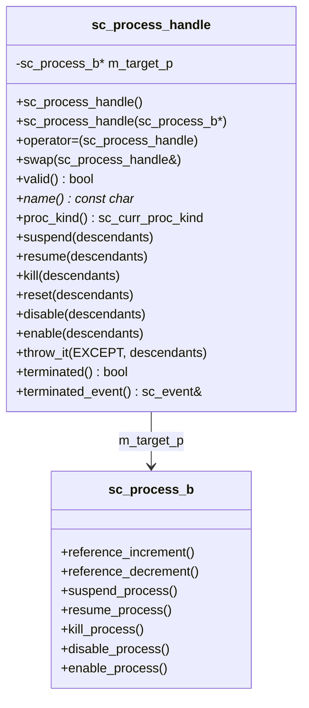

# sc_process_handle -- Process Handle (User-Facing API)

## Overview

`sc_process_handle.h` defines `sc_process_handle`, the public API for users to interact with processes. It wraps a raw `sc_process_b*` pointer with reference counting and provides a safe, persistent way to control processes even after they are terminated.

---

## Analogy: The Remote Control

Think of `sc_process_handle` as a **TV remote control**:

- The TV (process) is the real thing doing the work.
- The remote (handle) lets you control it from a distance: pause, resume, turn off.
- You can have multiple remotes for the same TV.
- If the TV is unplugged (process terminated), the remote still exists but pressing buttons does nothing (it prints a warning).
- When no remotes exist and the TV is off, the TV gets thrown away (deleted).

---

## Key Concepts

### Reference Counting

Every `sc_process_handle` increments the target process's reference count on construction and decrements it on destruction. This prevents the process from being deleted while handles still exist.

```cpp
// Construction: ++ref_count
sc_process_handle h(some_process);

// Copy: ++ref_count
sc_process_handle h2 = h;

// Destruction: --ref_count
// When ref_count hits 0, process memory is freed
```

### Copy-and-Swap Assignment

The assignment operator uses the copy-and-swap idiom for exception safety:

```cpp
sc_process_handle& operator=(sc_process_handle src) {
    swap(src);    // swap targets
    return *this; // old target decremented when 'src' is destroyed
}
```

---

## Class API

### Construction / Destruction

| Method | Description |
|--------|-------------|
| `sc_process_handle()` | Default: creates empty handle (no target) |
| `sc_process_handle(sc_object*)` | From object pointer, uses `dynamic_cast` |
| `sc_process_handle(sc_process_b*)` | From process pointer, no cast needed |
| `sc_process_handle(const sc_process_handle&)` | Copy constructor |
| `~sc_process_handle()` | Decrements reference count |

### Process Control

| Method | Description |
|--------|-------------|
| `suspend(descendants)` | Suspend execution |
| `resume(descendants)` | Resume execution |
| `disable(descendants)` | Disable process (won't execute even if triggered) |
| `enable(descendants)` | Re-enable process |
| `kill(descendants)` | Terminate process permanently |
| `reset(descendants)` | Asynchronous one-shot reset |
| `sync_reset_on(descendants)` | Enable synchronous reset mode |
| `sync_reset_off(descendants)` | Disable synchronous reset mode |
| `throw_it(exception, descendants)` | Throw user exception into process |

The `descendants` parameter defaults to `SC_NO_DESCENDANTS`. When set to `SC_INCLUDE_DESCENDANTS`, the operation is applied recursively to child processes.

### Query Methods

| Method | Description |
|--------|-------------|
| `name()` | Return the process name |
| `basename()` | Return the process base name |
| `proc_kind()` | Return kind: `SC_METHOD_PROC_`, `SC_THREAD_PROC_`, etc. |
| `valid()` | Return true if handle has a target |
| `terminated()` | Return true if process has terminated |
| `dynamic()` | Return true if process was dynamically spawned |
| `is_unwinding()` | Return true if process is in unwind phase |
| `dump_state()` | Return string describing current state |

### Event Access

| Method | Description |
|--------|-------------|
| `terminated_event()` | Event notified when process terminates |
| `reset_event()` | Event notified when process is reset |

### Hierarchy Access

| Method | Description |
|--------|-------------|
| `get_child_events()` | Return child events |
| `get_child_objects()` | Return child objects |
| `get_parent_object()` | Return parent in hierarchy |
| `get_process_object()` | Return the process as `sc_object*` |

### Comparison Operators

```cpp
bool operator==(const sc_process_handle& left, const sc_process_handle& right);
bool operator!=(const sc_process_handle& left, const sc_process_handle& right);
bool operator<(const sc_process_handle& left, const sc_process_handle& right);
```

Two handles are equal only if both are non-null and point to the same process. A null handle is not equal to any handle (including another null handle).

### Type Conversions

The handle can be implicitly converted to the underlying process type:

```cpp
operator sc_process_b*();
operator sc_cthread_handle();
operator sc_method_handle();
operator sc_thread_handle();
```

---

## Usage Patterns

### Getting the Current Process Handle

```cpp
sc_process_handle current = sc_get_current_process_handle();
std::cout << "I am: " << current.name() << std::endl;
```

### Getting the Last Created Process

```cpp
SC_THREAD(my_thread);
sc_process_handle h = sc_get_last_created_process_handle();
h.dont_initialize();
```

### Controlling Another Process

```cpp
sc_process_handle worker;

void manager_thread() {
    wait(10, SC_NS);
    worker.suspend();    // pause worker
    wait(10, SC_NS);
    worker.resume();     // resume worker
    wait(10, SC_NS);
    worker.kill();       // terminate worker
}
```

### Waiting for Termination

```cpp
void monitor_thread() {
    wait(worker.terminated_event());
    std::cout << "Worker has terminated!" << std::endl;
}
```

---

## Class Diagram



---

## Design Rationale

### Why a Separate Handle Class?

1. **Persistence**: The handle can outlive the process itself. It safely returns defaults for terminated processes.
2. **Safety**: Users cannot accidentally delete or corrupt the process internals.
3. **Reference Counting**: Automatic memory management without explicit `new`/`delete`.

### Why Copy-and-Swap?

The copy-and-swap idiom provides:
- Exception safety (strong guarantee).
- Correct self-assignment handling.
- Clean reference count management (copy increments, swap is no-op on counts, destructor decrements).

---

## Related Files

- `sc_process.h/.cpp` -- The base process class this handle wraps.
- `sc_method_process.h` -- Method process type.
- `sc_thread_process.h` -- Thread process type.
- `sc_cthread_process.h` -- Clocked thread process type.
- `sc_simcontext.h` -- `sc_get_current_process_handle()` implementation.
