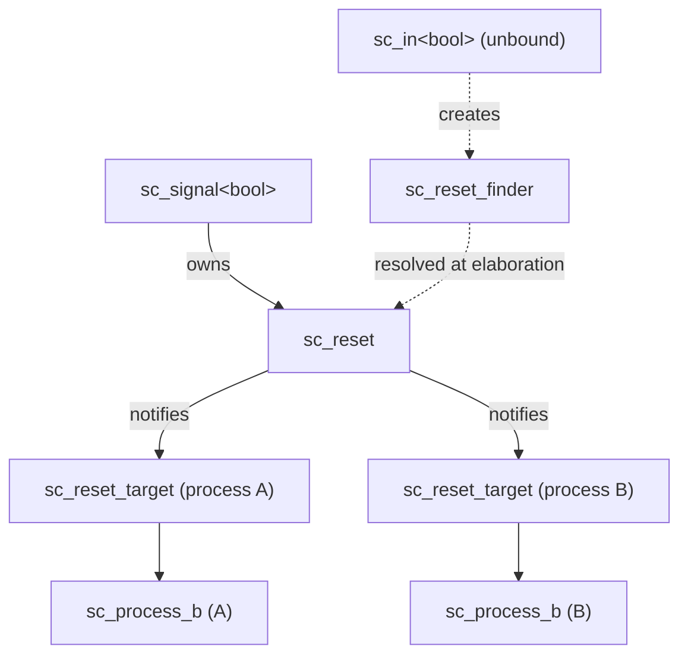
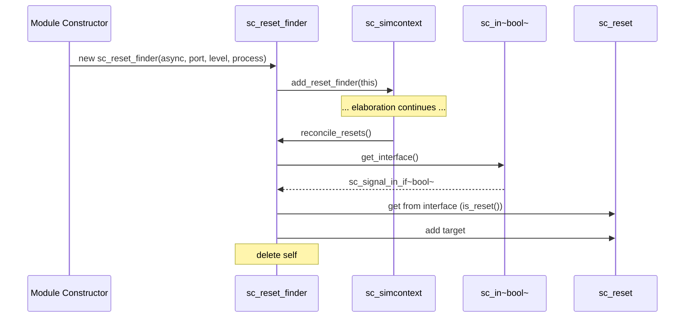
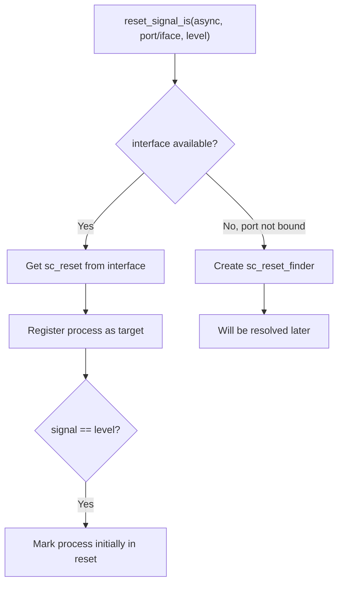

# sc_reset -- 行程重置訊號支援

## 概觀

`sc_reset` 提供了 SystemC 中行程（process）的重置機制。它讓行程可以關聯一個或多個布林訊號作為重置源，當重置訊號達到指定的有效電平時，行程會被重置回初始狀態。

**生活比喻：** 想像一台自動販賣機。它正常運作時依序接受投幣、選擇飲料、出貨。但按下「退幣/重置」按鈕後，販賣機會回到初始的等待投幣狀態。`sc_reset` 就是管理這個「重置按鈕」和「誰該被重置」之間的關聯。

- **同步重置**（`reset_signal_is`）：像是微波爐的定時器到了才會停止 -- 行程在下次喚醒時才檢查重置狀態。
- **非同步重置**（`async_reset_signal_is`）：像是直接拔掉電源插頭 -- 行程立即被重置，不等待下次喚醒。

## 檔案角色

- **標頭檔 `sc_reset.h`**：宣告 `sc_reset`、`sc_reset_target` 和 `sc_reset_finder` 類別。
- **實作檔 `sc_reset.cpp`**：實作重置訊號的通知、協調和註冊機制。

## 重置機制的整體架構



### 運作流程（如 `sc_reset.cpp` 頂部註解所述）

1. 每個用作重置的 `sc_signal<bool>` 會附帶一個 `sc_reset` 實例。
2. 每個對重置訊號敏感的行程會被註冊到該 `sc_reset` 實例中。
3. 當重置訊號的值改變時，`sc_reset` 呼叫 `notify_processes()` 通知所有註冊的行程。
4. 行程可能有多個重置訊號，所以行程內部維護非同步和同步重置的活躍計數器。
5. 行程的 `semantics()` 方法在被調度時檢查重置狀態。

## 類別詳解

### `sc_reset_target` -- 重置目標描述

```cpp
class sc_reset_target {
public:
    bool          m_async;      // true = asynchronous, false = synchronous
    bool          m_level;      // active reset level (true or false)
    sc_process_b* m_process_p;  // target process
};
```

描述一個行程的重置條件。例如，`{async=true, level=false, process=P}` 表示「當訊號為 `false` 時，非同步重置行程 P」。

### `sc_reset_finder` -- 延遲重置配對



在精化階段，端口尚未繫結到訊號。`sc_reset_finder` 是一個暫存物件，記錄「哪個端口、哪個行程、什麼條件」，等到端口繫結完成後再建立實際的重置連接。

```cpp
class sc_reset_finder {
protected:
    bool                   m_async;
    bool                   m_level;
    sc_reset_finder*       m_next_p;     // linked list
    const sc_in<bool>*     m_in_p;
    const sc_inout<bool>*  m_inout_p;
    const sc_out<bool>*    m_out_p;
    sc_process_b*          m_target_p;
};
```

支援三種端口類型（`sc_in`、`sc_inout`、`sc_out`），但最終都會解析為 `sc_signal_in_if<bool>` 介面。

### `sc_reset` -- 重置訊號管理

```cpp
class sc_reset {
protected:
    const sc_signal_in_if<bool>*  m_iface_p;  // reset signal interface
    std::vector<sc_reset_target>  m_targets;  // processes to notify

    void notify_processes();
    void remove_process( sc_process_b* );

    static void reconcile_resets(sc_reset_finder* reset_finder_q);
    static void reset_signal_is(bool async, ...);  // multiple overloads
};
```

## 關鍵方法

### `notify_processes()`

當重置訊號的值改變時被呼叫：

```cpp
void sc_reset::notify_processes() {
    bool value = m_iface_p->read();
    for (auto& target : m_targets) {
        bool active = ( target.m_level == value );
        target.m_process_p->reset_changed( target.m_async, active );
    }
}
```

每個目標行程比較訊號值與其設定的有效電平，決定重置是否活躍。

### `reconcile_resets()`

在精化結束後呼叫，處理所有 `sc_reset_finder`：

1. 遍歷 `sc_reset_finder` 鏈結串列
2. 從端口取得實際的訊號介面
3. 從介面取得或建立 `sc_reset` 實例
4. 註冊重置目標
5. 如果重置訊號當前值就是有效電平，設定行程初始就在重置狀態
6. 刪除 `sc_reset_finder` 物件

### `reset_signal_is()` 靜態方法

多個重載版本，支援不同的端口/介面類型。核心邏輯：



### `remove_process()`

當行程被終止時，從重置目標列表中移除：

```cpp
void sc_reset::remove_process( sc_process_b* process_p ) {
    // Uses swap-with-last-and-pop technique
    for ( int i = 0; i < process_n; ) {
        if ( m_targets[i].m_process_p == process_p ) {
            m_targets[i] = m_targets[process_n-1];
            process_n--;
            m_targets.resize(process_n);
        } else {
            process_i++;
        }
    }
}
```

## `sc_module` 中的重置 API

```cpp
// Synchronous reset
void reset_signal_is( const sc_in<bool>& port, bool level );
void reset_signal_is( const sc_inout<bool>& port, bool level );
void reset_signal_is( const sc_out<bool>& port, bool level );
void reset_signal_is( const sc_signal_in_if<bool>& iface, bool level );

// Asynchronous reset
void async_reset_signal_is( const sc_in<bool>& port, bool level );
void async_reset_signal_is( const sc_inout<bool>& port, bool level );
void async_reset_signal_is( const sc_out<bool>& port, bool level );
void async_reset_signal_is( const sc_signal_in_if<bool>& iface, bool level );
```

## RTL 背景

在 Verilog 中，重置有兩種常見模式：

```verilog
// Synchronous reset
always @(posedge clk) begin
    if (reset) begin
        // reset logic
    end else begin
        // normal logic
    end
end

// Asynchronous reset
always @(posedge clk or posedge reset) begin
    if (reset) begin
        // reset logic
    end else begin
        // normal logic
    end
end
```

SystemC 的 `reset_signal_is()` 和 `async_reset_signal_is()` 分別對應這兩種模式。

## 設計考量

### 為何需要 `sc_reset_finder`？

在模組建構時，端口尚未繫結到訊號，無法取得實際的介面。`sc_reset_finder` 作為延遲解析的橋樑，在所有端口繫結完成後才建立實際的重置連接。

### 為何重置只支援 `bool` 訊號？

硬體中的重置訊號本質上是單位元（高有效或低有效）。使用 `bool` 是自然且足夠的抽象。

### 多重重置

一個行程可以有多個重置訊號（同步和非同步混合），行程內部用計數器追蹤活躍的重置訊號數量。

## 相關檔案

- `sc_module.h/cpp` -- 提供使用者級別的重置 API
- `sc_process.h` -- 行程基礎類別（持有重置計數器）
- `sc_signal.h` -- 訊號類別（持有 `sc_reset` 實例）
- `sc_signal_ports.h` -- 訊號端口類別
