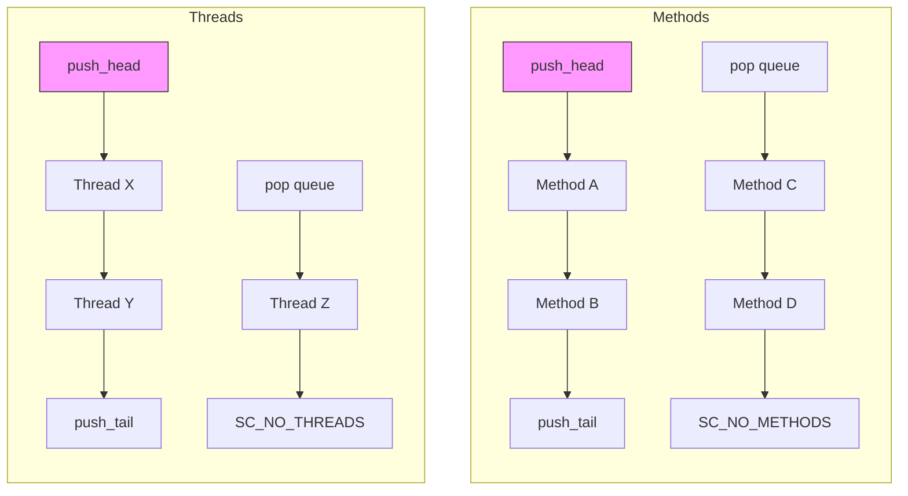
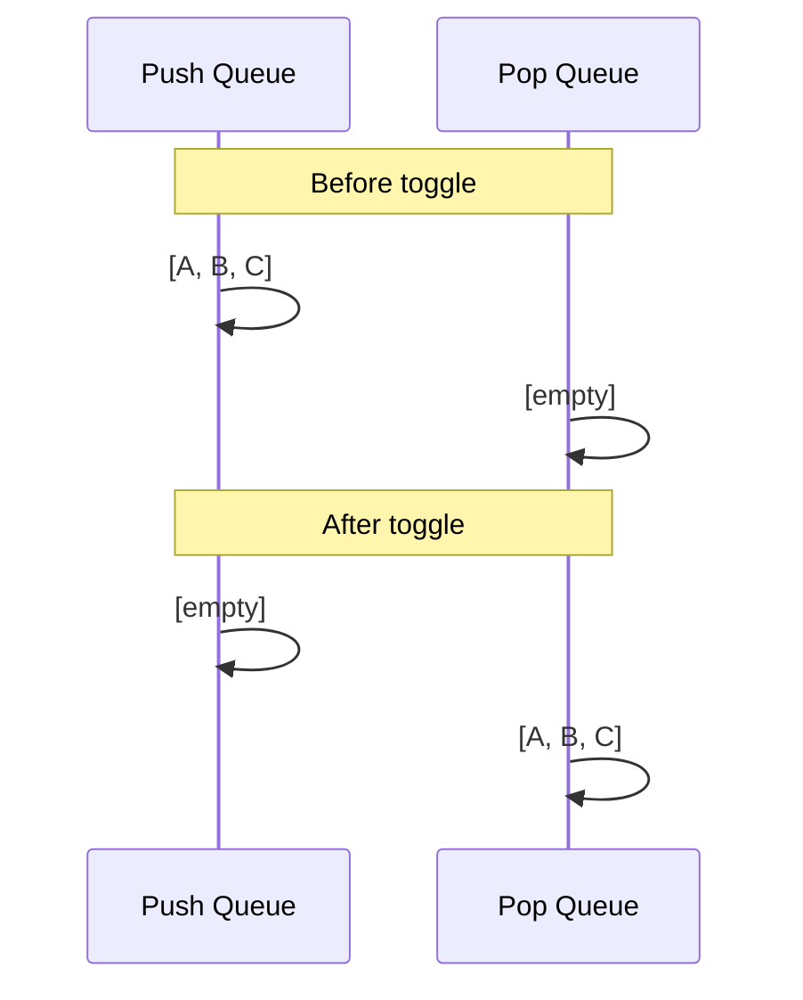
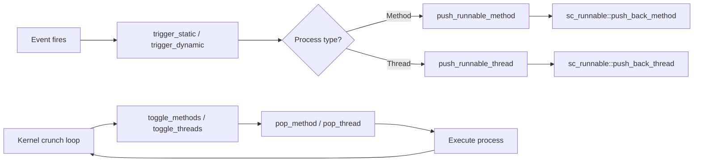

# sc_runnable -- Runnable Process Queue Management

## Overview

`sc_runnable.h` / `sc_runnable_int.h` define the `sc_runnable` class, which manages the **ready-to-run queues** for both method and thread processes. This is the scheduler's workhorse -- it decides which processes are ready for execution.

---

## Analogy: The Restaurant Kitchen Order System

Think of `sc_runnable` as the **order ticket system** in a restaurant kitchen:

- There are two ticket rails: one for appetizers (methods) and one for main courses (threads).
- Each rail has two sections: a "new orders" section (push queue) and a "cooking now" section (pop queue).
- When a waiter brings a new order, it goes on the "new orders" rail.
- The chef picks orders from the "cooking now" rail.
- When "cooking now" is empty, all "new orders" slide over to "cooking now" (toggle).
- This double-buffering ensures the chef always processes a complete batch before starting new ones.

---

## Queue Architecture



### Key Design Decisions

1. **Separate queues for methods and threads**: Methods and threads are scheduled differently in the simulation kernel.
2. **Double-buffered (push/pop)**: New processes are pushed to the push queue. The kernel pops from the pop queue. `toggle()` moves push to pop.
3. **Sentinel nodes**: Empty queues use sentinel nodes (`push_head`) instead of `NULL`. This eliminates null checks in hot paths.
4. **Linked list via process fields**: Instead of a separate linked list node, processes use their `m_runnable_p` field as the "next" pointer. A `NULL` `m_runnable_p` means the process is NOT in any queue.

---

## Queue Pointers

| Pointer | Description |
|---------|-------------|
| `m_methods_push_head` | Sentinel head of methods push queue |
| `m_methods_push_tail` | Tail of methods push queue |
| `m_methods_pop` | Head of methods pop queue |
| `m_threads_push_head` | Sentinel head of threads push queue |
| `m_threads_push_tail` | Tail of threads push queue |
| `m_threads_pop` | Head of threads pop queue |

---

## Key Operations

### `init()`

Allocates sentinel nodes for both queues. Sentinels are dummy process objects that serve as queue anchors:

```cpp
m_methods_push_head = new sc_method_process("methods_push_head", ...);
m_threads_push_head = new sc_thread_process("threads_push_head", ...);
```

### `push_back_method(sc_method_handle)` / `push_back_thread(sc_thread_handle)`

Adds a process to the **back** of the push queue. This is the normal path for triggered processes.

```
[head] -> [existing A] -> [existing B] -> [new C]
                                            ^ tail
```

### `push_front_method(sc_method_handle)` / `push_front_thread(sc_thread_handle)`

Adds a process to the **front** of the push queue. Used for high-priority scheduling.

### `execute_method_next(sc_method_handle)` / `execute_thread_next(sc_thread_handle)`

Pushes a process to the **front of the pop queue**, so it executes before anything else currently queued. Used for asynchronous notifications and process control operations.

### `pop_method()` / `pop_thread()`

Removes and returns the first process from the pop queue. Returns `NULL` if the queue is empty. Clears the process's `m_runnable_p` to indicate it is no longer queued.

### `toggle_methods()` / `toggle_threads()`

Moves the push queue contents to the pop queue. Only performs the move if the pop queue is currently empty.



### `remove_method(sc_method_handle)` / `remove_thread(sc_thread_handle)`

Removes a specific process from whichever queue it's in (push or pop). Linear scan through both queues. Used when a process is disabled, killed, or suspended.

### `is_empty()`

Returns true if ALL four queue segments (push and pop for both methods and threads) are empty.

---

## Sentinel Node Pattern

The sentinel (or dummy head) pattern eliminates special-case handling:

**Without sentinel:**
```
if (head == NULL) {
    head = new_item;
    tail = new_item;
} else {
    tail->next = new_item;
    tail = new_item;
}
```

**With sentinel:**
```
tail->next = new_item;
tail = new_item;
```

The sentinel always exists, so `tail` is never NULL. This optimization matters because push operations happen millions of times during simulation.

---

## Queue vs. Not-Queued Detection

A process knows it's in a runnable queue if `m_runnable_p != NULL`. A process that is not queued has `m_runnable_p == NULL`.

The `SC_NO_METHODS` and `SC_NO_THREADS` macros are defined as the push head sentinel addresses. A process whose next pointer equals the sentinel is the **last** element in the queue.

```cpp
#define SC_NO_METHODS m_methods_push_head
#define SC_NO_THREADS m_threads_push_head
```

---

## Integration with Simulation Kernel



---

## Design Rationale

### Why Double-Buffered?

During a delta cycle, executing processes may trigger new events, which may queue new processes. Double-buffering separates "currently executing" from "newly triggered":

- Pop queue: processes being executed this iteration.
- Push queue: processes triggered during this iteration (for the next iteration).
- `toggle()` swaps them between iterations.

### Why Intrusive Linked Lists?

Using the process's own `m_runnable_p` field as the list link (intrusive list) avoids:
- Heap allocation for list nodes.
- Extra indirection.
- Cache misses from scattered memory.

This is critical for simulation performance.

---

## Related Files

- `sc_simcontext.h/.cpp` -- Uses `sc_runnable` for process scheduling.
- `sc_method_process.h` -- `set_next_runnable()`, `next_runnable()`.
- `sc_thread_process.h` -- `set_next_runnable()`, `next_runnable()`.
- `sc_process.h` -- Base class with `m_runnable_p` field.
