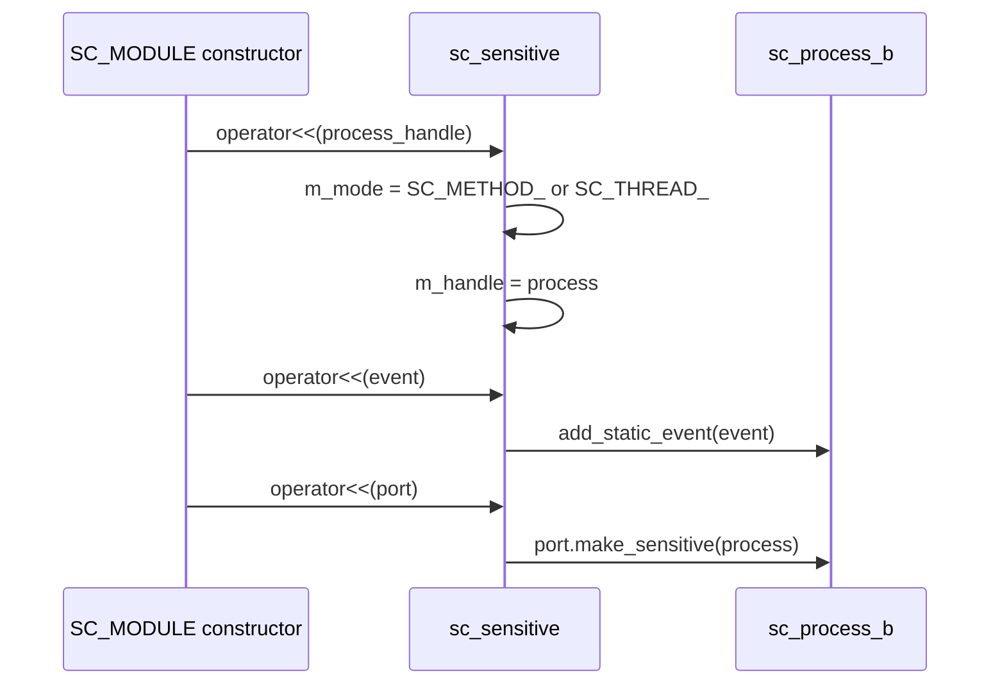
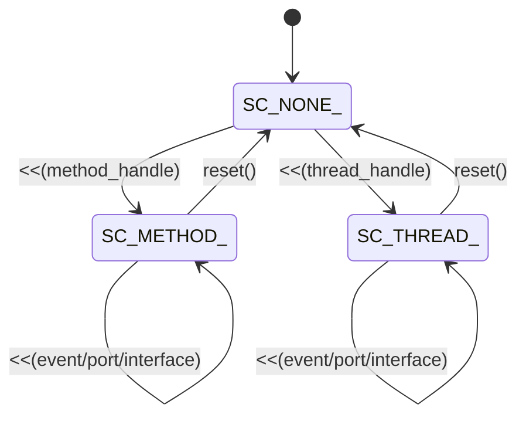

# sc_sensitive -- Static Sensitivity Configuration

## Overview

`sc_sensitive.h` / `sc_sensitive.cpp` define the `sc_sensitive`, `sc_sensitive_pos`, and `sc_sensitive_neg` classes. These provide the mechanism for declaring **static sensitivity** -- the events that a process is always sensitive to.

---

## Analogy: The Notification Subscription

Think of `sc_sensitive` as a **notification subscription system**:

- Each employee (process) subscribes to certain mailing lists (events).
- `sc_sensitive` is the general subscription: "notify me when anything happens on this channel."
- `sc_sensitive_pos` is like subscribing to "only notify me when the traffic light turns GREEN."
- `sc_sensitive_neg` is like subscribing to "only notify me when the traffic light turns RED."
- Once subscribed, the notifications are permanent (static) -- no need to re-subscribe each time.

---

## Three Classes

### `sc_sensitive` -- General Sensitivity

The main class. Supports sensitivity to:
- Events (`sc_event`)
- Interfaces (`sc_interface` -- uses `default_event()`)
- Ports (`sc_port_base`)
- Event finders (`sc_event_finder`)
- Collections of the above (template `operator<<`)

### `sc_sensitive_pos` -- Positive Edge Sensitivity (Deprecated)

Specialized for **positive edge** events on `bool` or `sc_logic` signals. Maps to `posedge_event()`.

### `sc_sensitive_neg` -- Negative Edge Sensitivity (Deprecated)

Specialized for **negative edge** events. Maps to `negedge_event()`.

Both `sc_sensitive_pos` and `sc_sensitive_neg` are **deprecated** in IEEE 1666-2011. The recommended replacement is:

```cpp
// Old (deprecated):
sensitive_pos << clk;

// New (recommended):
sensitive << clk.pos();
```

---

## How It Works

### The `<<` Operator Chain

The `sensitive` object in `sc_module` uses a streaming pattern:

```cpp
// In SC_MODULE constructor:
SC_METHOD(my_method);
sensitive << event1 << port1 << interface1;
```

The first `<<` with a process handle sets the mode and target:



### Internal State Machine



The `m_mode` field tracks whether we're adding sensitivity for a method or thread. This matters because ports need different internal calls for methods vs. threads.

---

## Class API

### `sc_sensitive`

| Method | Description |
|--------|-------------|
| `operator<<(sc_process_handle)` | Set current process target |
| `operator<<(const sc_event&)` | Add event to static sensitivity |
| `operator<<(const sc_interface&)` | Add interface's default event |
| `operator<<(const sc_port_base&)` | Add port (delegates to port) |
| `operator<<(sc_event_finder&)` | Add event finder (for specific port events) |
| `operator<<(const C& collection)` | Add all elements of a collection |
| `reset()` | Reset mode to `SC_NONE_` |

### Static Helper Methods

```cpp
static void make_static_sensitivity(sc_process_b*, const sc_event&);
static void make_static_sensitivity(sc_process_b*, const sc_interface&);
static void make_static_sensitivity(sc_process_b*, const sc_port_base&);
static void make_static_sensitivity(sc_process_b*, sc_event_finder&);
```

These are used by `sc_spawn_options` to set up sensitivity for dynamically spawned processes, bypassing the `<<` operator chain.

---

## Special Handling for SC_CTHREAD

`sc_sensitive` has dedicated `operator()` overloads for clocked threads:

```cpp
sc_sensitive& operator()(sc_cthread_handle, sc_event_finder&);
sc_sensitive& operator()(sc_cthread_handle, const in_if_b_type&);
sc_sensitive& operator()(sc_cthread_handle, const in_port_b_type&);
// ... etc.
```

For `bool` signals, the cthread is always made sensitive to the **positive edge** (`posedge_event()`). This is because clocked threads are driven by clock edges.

---

## Safety Checks

Sensitivity can only be configured during **elaboration**. If called during simulation:

```cpp
if (sc_is_running()) {
    SC_REPORT_ERROR(SC_ID_MAKE_SENSITIVE_, "simulation running");
}
```

---

## Usage Examples

### Basic Method Sensitivity

```cpp
SC_MODULE(MyModule) {
    sc_in<bool> clk;
    sc_in<int> data;

    void compute() { /* ... */ }

    SC_CTOR(MyModule) {
        SC_METHOD(compute);
        sensitive << clk << data;
    }
};
```

### Thread with Edge Sensitivity

```cpp
SC_CTOR(MyModule) {
    SC_THREAD(my_thread);
    sensitive << clk.pos();  // positive edge of clock
}
```

### Clocked Thread

```cpp
SC_CTOR(MyModule) {
    SC_CTHREAD(my_cthread, clk.pos());
    // sensitivity is set automatically by SC_CTHREAD macro
}
```

---

## Design Rationale

### Why Operator Overloading?

The `<<` operator provides a fluent, readable syntax:
```cpp
sensitive << clk << data << enable;
```
This is much cleaner than:
```cpp
sensitive.add(clk);
sensitive.add(data);
sensitive.add(enable);
```

### Why Separate pos/neg Classes?

Historically, `sc_sensitive_pos` and `sc_sensitive_neg` were the only way to specify edge sensitivity. With the introduction of `pos()` and `neg()` event finders on ports, the specialized classes became redundant and were deprecated.

### Why `sc_module` Is a Friend?

`sc_sensitive` is constructed privately by `sc_module`. Users never create it directly -- they access it through the module's `sensitive` member.

---

## RTL Background

In Verilog/SystemVerilog, the sensitivity list is:
```verilog
always @(posedge clk or negedge rst_n) begin
    // ...
end
```

In SystemC, the equivalent is:
```cpp
SC_METHOD(my_method);
sensitive << clk.pos() << rst_n.neg();
```

The `sc_sensitive` class bridges the C++ world and the RTL concept of sensitivity lists.

---

## Related Files

- `sc_module.h/.cpp` -- Owner of `sensitive`, `sensitive_pos`, `sensitive_neg`.
- `sc_process.h` -- `add_static_event()` called by `sc_sensitive`.
- `sc_event.h` -- Events that processes are sensitive to.
- `sc_spawn_options.h` -- Uses `make_static_sensitivity()` for dynamic processes.
- `sc_signal_ports.h` -- `sc_in`, `sc_inout` with `pos()`, `neg()` finders.
