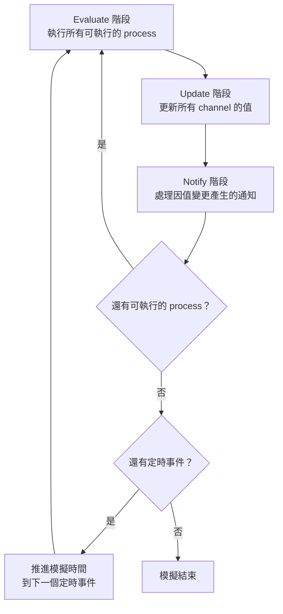
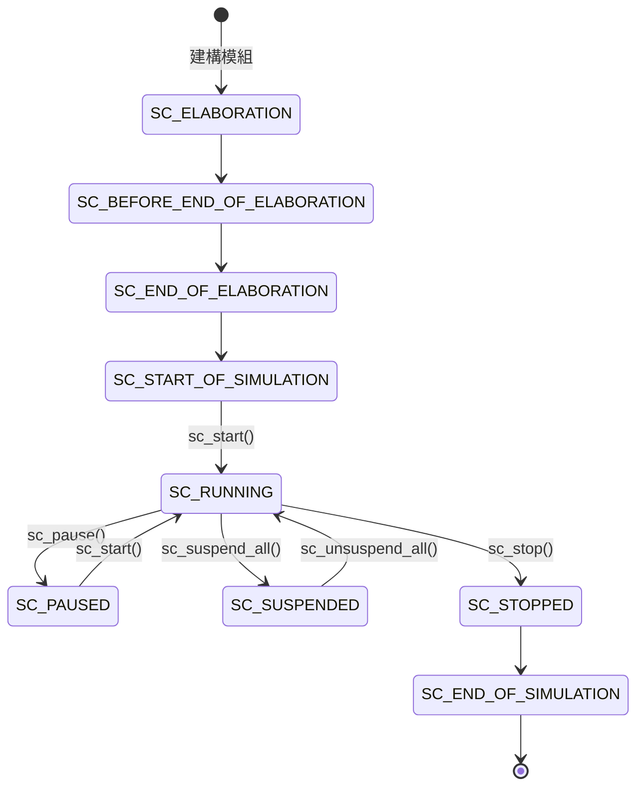
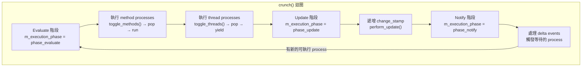

# sc_simcontext -- SystemC 模擬引擎的核心大腦

## 概述

`sc_simcontext` 是整個 SystemC 模擬器的「中央控制台」。它管理模擬的所有面向：時間推進、流程排程、事件通知、物件階層等。整個模擬器通常只有一個 `sc_simcontext` 實例（全域單例），所有模組、通道、事件都向它註冊。

**原始碼位置：**
- 標頭檔：`ref/systemc/src/sysc/kernel/sc_simcontext.h`
- 實作檔：`ref/systemc/src/sysc/kernel/sc_simcontext.cpp`

---

## 日常生活類比

想像一座大型機場的**航空管制塔台**：

| 機場塔台 | sc_simcontext |
|---------|---------------|
| 管理所有航班的起降排程 | 管理所有 process 的執行排程 |
| 追蹤目前時間 | 維護模擬時間 (`m_curr_time`) |
| 接收來自各航班的通訊 | 處理事件通知 (delta events, timed events) |
| 記錄所有航班資訊 | 管理物件階層 (object manager) |
| 控制跑道的使用順序 | 決定 method/thread process 的執行順序 |
| 宣布「暫停起降」 | `sc_stop()`, `sc_pause()` |

---

## 核心概念

### 1. Delta Cycle（增量循環）

模擬器的核心運作原理就是不斷執行「delta cycle」。每個 delta cycle 包含三個階段：



**生活類比：** 想像一間教室的考試流程：
1. **Evaluate（評估）**：所有學生同時作答（process 執行）
2. **Update（更新）**：老師收卷並記錄成績（channel 更新值）
3. **Notify（通知）**：公佈成績，需要補考的學生得到通知（事件觸發）
4. 如果有學生需要補考，就重新開始

### 2. 模擬狀態機



### 3. 全域單例模式

```cpp
// sc_simcontext 使用全域指標實現單例
extern sc_simcontext* sc_curr_simcontext;

inline sc_simcontext* sc_get_curr_simcontext()
{
    if( sc_curr_simcontext == 0 ) {
        sc_default_global_context = new sc_simcontext;
        sc_curr_simcontext = sc_default_global_context;
    }
    return sc_curr_simcontext;
}
```

只要呼叫 `sc_get_curr_simcontext()`，如果還沒有模擬上下文，就會自動建立一個。這確保整個程式共用同一個模擬引擎。

---

## 類別結構與關鍵成員

### sc_simcontext 類別

#### 管理器與註冊表

| 成員 | 說明 |
|------|------|
| `m_object_manager` | 管理所有 SystemC 物件的名稱與階層 |
| `m_module_registry` | 註冊所有模組 (`sc_module`) |
| `m_port_registry` | 註冊所有連接埠 (`sc_port`) |
| `m_export_registry` | 註冊所有匯出介面 (`sc_export`) |
| `m_prim_channel_registry` | 註冊所有原始通道 (`sc_prim_channel`) |
| `m_stage_cb_registry` | 管理階段回呼函式 |
| `m_stub_registry` | 管理 stub 連接 |

#### 時間與排程

| 成員 | 說明 |
|------|------|
| `m_curr_time` | 目前模擬時間 |
| `m_time_params` | 時間解析度與預設時間單位 |
| `m_delta_count` | 累計的 delta cycle 數量 |
| `m_change_stamp` | 變更戳記，用於判斷事件是否發生 |
| `m_delta_events` | 等待在下一個 delta 觸發的事件列表 |
| `m_timed_events` | 定時事件的優先佇列（按時間排序） |
| `m_runnable` | 可執行的 process 佇列 |

#### 狀態控制

| 成員 | 說明 |
|------|------|
| `m_simulation_status` | 目前模擬狀態（elaboration、running、paused 等） |
| `m_execution_phase` | 目前執行階段（evaluate、update、notify） |
| `m_forced_stop` | 是否呼叫了 `sc_stop()` |
| `m_paused` | 是否呼叫了 `sc_pause()` |
| `m_ready_to_simulate` | elaboration 是否完成 |

#### 協程管理

| 成員 | 說明 |
|------|------|
| `m_cor_pkg` | 協程套件（QuickThreads、pthread 或 fiber） |
| `m_cor` | 模擬器本身的協程 |
| `m_method_invoker_p` | 用於從 thread 中呼叫 method 的輔助模組 |

### 關鍵公開方法

#### 模擬控制

```cpp
void initialize( bool = false );  // 初始化模擬
void simulate( const sc_time& );  // 執行模擬指定時間
void stop();                      // 停止模擬
void end();                       // 結束模擬
void reset();                     // 重設模擬
```

#### Process 建立

```cpp
sc_process_handle create_method_process(...);   // 建立 SC_METHOD
sc_process_handle create_thread_process(...);   // 建立 SC_THREAD
sc_process_handle create_cthread_process(...);  // 建立 SC_CTHREAD
```

#### 時間與狀態查詢

```cpp
const sc_time& time_stamp() const;       // 取得目前時間
sc_dt::uint64 delta_count() const;       // 取得累計 delta 數
sc_status get_status() const;            // 取得模擬狀態
bool evaluation_phase() const;           // 是否在評估階段
bool update_phase() const;              // 是否在更新階段
```

---

## 重要內部機制

### crunch() -- 模擬引擎的心跳

`crunch()` 是整個模擬器最核心的方法，它實現了 delta cycle 的三階段迴圈：



### init() -- 初始化一切

`init()` 方法負責建立所有子系統：
1. 分配各種 manager 和 registry
2. 檢查環境變數 `SC_SIGNAL_WRITE_CHECK`
3. 初始化時間參數、事件佇列
4. 設定初始狀態為 `SC_ELABORATION`

### sc_process_table -- Process 管理

內部類別 `sc_process_table` 使用鏈結串列分別管理 method process 和 thread process。提供 push_front（加入）和 remove（移除）操作。

### sc_invoke_method -- Method 調用器

這是一個特殊的 `sc_module`，用於支援 `preempt_with()` 功能。它維護一組 invoker thread，當需要從 thread context 中執行 method 時，就透過這些 invoker 來完成。

---

## 重要的全域函式

### 模擬控制函式

```cpp
void sc_start();                              // 開始執行直到無事可做
void sc_start( const sc_time& duration, ... ); // 執行指定時長
void sc_stop();                               // 停止模擬
void sc_pause();                              // 暫停模擬
```

### 狀態查詢函式

```cpp
sc_status sc_get_status();                    // 取得目前狀態（執行緒安全）
bool sc_is_running();                         // 是否正在執行
sc_dt::uint64 sc_delta_count();              // 目前 delta 計數
const sc_time& sc_time_stamp();              // 目前模擬時間
bool sc_pending_activity();                   // 是否還有待處理活動
```

### Suspend/Unsuspend

```cpp
void sc_suspend_all();    // 暫停所有 process（async-safe）
void sc_unsuspend_all();  // 恢復所有 process
void sc_suspendable();    // 標記目前 process 為可暫停
void sc_unsuspendable();  // 標記目前 process 為不可暫停
```

---

## 輔助結構

### sc_curr_proc_info

```cpp
struct sc_curr_proc_info {
    sc_process_b*     process_handle;  // 目前正在執行的 process
    sc_curr_proc_kind kind;            // process 的類型 (METHOD/THREAD/CTHREAD)
};
```

### sc_stop_mode

| 值 | 說明 |
|----|------|
| `SC_STOP_FINISH_DELTA` | 完成目前 delta cycle 後停止 |
| `SC_STOP_IMMEDIATE` | 立即停止 |

### sc_starvation_policy

| 值 | 說明 |
|----|------|
| `SC_EXIT_ON_STARVATION` | 無事可做時立即返回 |
| `SC_RUN_TO_TIME` | 即使無事可做也等到指定時間 |

---

## 設計原理

### 為什麼需要 simcontext？

在硬體世界中，所有電路元件都在同一個物理環境（晶片）中運作，共享同一個時鐘。`sc_simcontext` 就是這個「虛擬晶片」的軟體實現。它確保：

1. **時間一致性**：所有元件看到的時間是一致的
2. **因果正確性**：透過 delta cycle 確保信號更新的順序正確
3. **確定性**：相同的輸入產生相同的結果

### 為什麼使用全域單例？

SystemC 的設計假設整個程式只有一個模擬環境。全域單例避免了傳遞 context 指標的麻煩，讓 `sc_start()`、`sc_time_stamp()` 等全域函式可以直接使用。

### 執行緒安全考量

`m_simulation_status` 的存取透過 `m_simulation_status_mutex` 保護。外部執行緒應使用 `get_thread_safe_status()` 而非 `get_status()`。

---

## 相關檔案

| 檔案 | 說明 |
|------|------|
| `sc_main.cpp` | 程式進入點，呼叫 `sc_elab_and_sim()` |
| `sc_main_main.cpp` | `sc_elab_and_sim()` 的實作 |
| `sc_time.h/cpp` | 時間類別 `sc_time` |
| `sc_event.h/cpp` | 事件類別 `sc_event` |
| `sc_process.h` | Process 基底類別 |
| `sc_method_process.h/cpp` | SC_METHOD 實作 |
| `sc_thread_process.h/cpp` | SC_THREAD 實作 |
| `sc_runnable.h` | 可執行 process 佇列 |
| `sc_prim_channel.h` | 原始通道（含 update 機制） |
| `sc_status.h` | 模擬狀態列舉 |
| `sc_stage_callback_if.h` | 階段回呼介面 |
